# A-MSRR 構造構築知能 Version 1 実装仕様書 v0.4 日本語版

**Project:** 構造構築知能 / Aerial Modular Self-Reconfigurable Robots  
**Document version:** v0.4 Codex-ready standalone specification 日本語版  
**Target reader:** Codex multi-agent implementation system and human researchers  
**Assumed prior knowledge of this project:** none  
**Primary implementation target:** Ubuntu 22.04 native, NVIDIA GPU, Python 3.10+, PyTorch, Isaac Sim / Isaac Lab, optional C++ QP backend  
**Design status:** implementation specification for Version 1  

---

## 0. Document Contract for Codex

本書は、**A-MSRR 構造構築知能 Version 1** を実装するための standalone な source of truth である。Codex は、過去のチャットログ、旧設計書、暗黙のプロジェクト文脈にアクセスできることを前提にしてはならない。

実装目標は、単一の monolithic neural network を作ることではない。システムは、schema-first、modular、contact-wrench-aware な hierarchical co-design framework として実装すること。structured task specification を受け取り、interaction requirements を導出し、A-MSRR morphology を設計し、assembly を計画し、hierarchical policies と deterministic safety controllers によってタスクを実行する。

Normative keywords:

- **MUST**: Version 1 で必須。
- **SHOULD**: 推奨。逸脱する場合は理由を文書化すること。
- **MAY**: 任意拡張。
- **MUST NOT**: Version 1 で明示的に禁止。

Developer reference asset:

```text
./module_urdf/holon.urdf
```

この URDF file は、Codex が実装時に具体的な A-MSRR module geometry、links、joints、rotor-related frames、docking mechanism frames、inertial data、visual meshes、collision meshes を理解するために提供される developer reference である。runtime system は、この相対パスを **MUST NOT hard-code**。runtime robot model paths は **MUST** configurable であること。

Recommended runtime config:

```yaml
robot_model:
  module_urdf_path: assets/robots/holon/holon.urdf
  thrust_model_path: configs/robot/thrust_model.yaml
```

実装は、作業ディレクトリに `./module_urdf/holon.urdf` が存在する場合に、この developer reference URDF を parse できる unit tests を **MUST** 含む。

---

## 1. Project Goal and Problem Definition

### 1.1 What is A-MSRR?

A-MSRR は **Aerial Modular Self-Reconfigurable Robot** を意味する。A-MSRR system は、互いに dock / separate し、task-specific connected structures を形成できる複数の aerial robot modules から構成される。各 module は飛行し、thrust を生成し、vectoring や docking mechanisms などの internal joints を actuation し、より大きな connected morphology の一部として機能できる。

想定するシステムは、次のような構造を構築できる。

- object transport のための grasping body
- manipulation のための arm-like structure
- environment contact を使う support / perch structure
- contact-mediated locomotion structure
- wrench と thrust を再配分する multi-module aerial structure

### 1.2 What is 構造構築知能?

構造構築知能は、与えられたタスクに対して **what structure to build**、**how to build it**、**how to use it** を決める intelligence layer である。

structured task specification と利用可能な A-MSRR modules の集合が与えられたとき、システムは次を実行しなければならない。

1. interaction requirements としてタスクを理解する。
2. contact, wrench, state, safety requirements を導出する。
3. それらの requirements を実現できる connected A-MSRR morphology を設計する。
4. morphology を構築するための deterministic assembly sequence を計画する。
5. task execution のための contact-wrench trajectories を生成する。
6. low-level control intents を生成する。
7. deterministic controller / QP / safety layers によって、それらの intent を physically feasible actuator commands に変換する。

### 1.3 Core formulation

Version 1 の問題は次のように定義する。

```text
Input:
  Structured TaskSpec
  Scene / object geometry references
  Available module inventory
  Robot module URDF and thrust model
  Training / evaluation config

Output:
  InteractionRequirementGraph IRG
  InteractionEnvelope
  Target MorphologyGraph G_static
  AssemblyPlan
  Contact-Wrench Trajectory
  Low-level PolicyCommand
  ControllerCommand
  EpisodeArchive and metrics
```

主たる設計原理は次である。

```text
TaskSpec
  -> interaction requirements
  -> morphology design
  -> assembly plan
  -> contact-wrench trajectory
  -> low-level control intent
  -> deterministic controller / allocator
```

システムは、不透明な neural network によって task string から rotor thrusts や final actuator torques へ直接写像しては **MUST NOT** ならない。

### 1.4 Research position

本 framework は embodied co-design system である。task、environment、morphology、control を同時に reasoning する。設計の動機は、robot performance が body morphology と control policy の両方で決まり、automatic robot design には structured search spaces、reusable representations、physically grounded evaluation が必要であるという点にある。

Version 1 は open-ended generation よりも implementability を重視する。hard safety には deterministic compilers と feasibility checkers を使い、design / planning / control components には適切な箇所で learning を使う。

---

## 2. Version 1 Scope and Development Phases

### 2.1 Version 1 task families

Version 1 は、schema と IRGBuilder のレベルで以下の task families を **MUST** support する。

```text
free_flight_navigation
object_grasp_carry
valve_operation
perching_manipulation
contact_mediated_locomotion
```

Training と evaluation は phase 分割する。すべての task families は早期から representable でなければならないが、すべてを同時に training する必要はない。

### 2.2 Version 1 training/evaluation phases

```text
P0: schemas, URDF parser, GeometryProcessor, IRGBuilder, tests
P1: diverse object grasp & carry with fixed/simple morphology
P2: π_D + FeasibilityChecker for diverse object grasp & carry
P3: π_A deterministic assembly integration
P4.0: simplified full-pipeline integration
P4-control / P4a: low-level flight validation in Isaac Lab
P4.1: Isaac Lab backend smoke
P4.2: Isaac deterministic full grasp & carry rollout
P4.3: Isaac learning bootstrap
P4 full completion: Isaac-backed rollout + minimum learning run + acceptance
P5: valve operation
P6: perching manipulation
P7: contact-mediated locomotion
P8: joint fine-tuning and ablations
```

最初の task target は **diverse object grasp & carry** である。これは、shape、size、mass、friction、target pose が異なる objects を grasp して transport することを意味する。

P4 は単一の acceptance phase ではない。`P4.0` は simplified backend 上で既存 P2/P3/H/I/J/K scaffolds を full-pipeline wiring するための必要段階であるが、Isaac Lab 上の物理的 full grasp/carry completion ではない。P4 full completion は、Isaac Lab backend、controller bridge / actuator mapping、Isaac rollout、minimum learning run、checkpoint、metrics、reward curve、rollout archive を含む。

### 2.3 Version 1 inclusions

Version 1 は以下を **MUST** implement する。

- schema-first data models
- structured TaskSpec parsing
- geometry references and GeometryProcessor
- shape tokens and ContactRegionGraph
- InteractionRequirementGraph and IRGBuilder
- all task families 向けの InteractionTemplate library
- InteractionEnvelope extraction
- MorphologyGraph and DesignOutput schemas
- π_D design policy interface and initial implementations
- deterministic FeasibilityChecker
- deterministic π_A GraphEditAssemblyPlanner
- morphology design 後の morphology-conditioned ContactCandidateSampler
- π_H Contact-Wrench Trajectory Planner interface
- π_L low-level policy interface
- QP/PID controller interface
- controller bridge / actuator mapping for Isaac Lab execution
- Isaac Lab backend for module, morphology, object, and floor rollout
- logging, datasets, metrics, and acceptance tests

### 2.4 Version 1 exclusions

Version 1 は以下を必要としては **MUST NOT** ならない。

- natural-language task parsing
- LLM-based grounding
- accepted physical structures としての closed-loop morphology designs
- assembly の唯一の方法としての learned assembly flight control
- first simulator target としての high-fidelity real grasp mechanics
- π_L による direct final actuator command generation
- NN features としての raw mesh paths
- morphology が設計される前の ContactCandidate enumeration

closed-loop graph schema は存在してもよいが、Version 1 design feasibility は、explicit experimental override が有効でない限り、closed-loop physical docking topologies を **MUST reject** する。

---

## 3. Repository Layout and Required External Assets

Recommended repository layout:

```text
project_root/
  DESIGN_SPEC.md                         # this document or successor
  module_urdf/
    holon.urdf                            # developer reference module model for Codex
  configs/
    env/
      isaac_lab.yaml
      torch.yaml
    robot/
      robot_model.yaml
      thrust_model.yaml
    task/
      grasp_carry/
      valve_operation/
      perching/
      contact_locomotion/
      free_flight/
    training/
      p0_schema_tests.yaml
      p1_grasp_carry_fixed.yaml
      p2_design_grasp_carry.yaml
  assets/
    objects/
      primitives/
      meshes/
      sdf/
    scenes/
    robots/
      holon/
  amsrr/
    schemas/
    geometry/
    irg/
    robot_model/
    morphology/
    feasibility/
    assembly/
    policies/
    controllers/
    simulation/
    training/
    datasets/
    logging/
    utils/
  tests/
    unit/
    integration/
    acceptance/
```

### 3.1 Developer reference URDF

`./module_urdf/holon.urdf` は developer reference file である。Codex はこれを inspect して具体的な module structure を理解するべきである。実装は configurable URDF loader を提供しなければならない。

loader は以下を extract しなければならない。

```text
link names
joint names and types
parent-child frame tree
joint axes
joint limits
link inertial data
visual mesh references
collision mesh references
candidate rotor frames
candidate docking mechanism frames
```

実装は、runtime に同じ file path が使われることを仮定してはならない。

### 3.2 Thrust model YAML

Rotor thrust limits と reaction torque coefficients は URDF で信頼性高く表現できないため、別 config に保存する。

```yaml
rotors:
  - rotor_id: thrust_1
    thrust_min_n: 0.0
    thrust_max_n: 20.0
    reaction_torque_coeff_nm_per_n: 0.0
  - rotor_id: thrust_2
    thrust_min_n: 0.0
    thrust_max_n: 20.0
    reaction_torque_coeff_nm_per_n: 0.0
  - rotor_id: thrust_3
    thrust_min_n: 0.0
    thrust_max_n: 20.0
    reaction_torque_coeff_nm_per_n: 0.0
  - rotor_id: thrust_4
    thrust_min_n: 0.0
    thrust_max_n: 20.0
    reaction_torque_coeff_nm_per_n: 0.0
```

上記の値は placeholders であり、configurable でなければならない。

---

## 4. System Inputs and Outputs

### 4.1 Inputs

```text
TaskSpec YAML/JSON:
  structured task family, objects, scene references, goals, safety constraints

Geometry assets:
  primitive parameters, mesh files, SDF files, point clouds, collision models

Robot model:
  module URDF, thrust model YAML, runtime module inventory

Training/evaluation config:
  simulator settings, curriculum, randomization, reward weights, policy config
```

### 4.2 Outputs

```text
IRG:
  typed heterogeneous graph of interaction requirements

InteractionEnvelope:
  compact summary of contact, wrench, precision, support, and duration requirements

DesignOutput:
  target MorphologyGraph, robot anchors, role assignments, slot-anchor binding prior

FeasibilityResult:
  hard validity, soft scores, violation codes, margins

AssemblyPlan:
  deterministic graph-edit assembly sequence

ContactCandidateSet:
  morphology-conditioned finite contact proposal pool after morphology is known, with unary scores, masks, pairwise compatibility, optional group proposals, and selected-assignment feasibility cache

ContactWrenchTrajectory:
  horizon-level contact assignment, contact wrench bounds, centroidal/posture/object targets

PolicyCommand:
  low-level intent from π_L

ControllerCommand:
  actuator-level command from QP/PID/controller layer

EpisodeArchive:
  replayable episode record with all configs and hashes
```

---

## 5. Core Concepts and Glossary

### 5.1 TaskSpec

Structured task input。task family、scene objects、geometry references、goals、constraints、safety parameters を含む。raw natural-language command ではない。

### 5.2 GeometryDescriptor

GeometryProcessor の出力。global shape features、surface patch tokens、SurfacePatchGraph、ContactRegionGraph、collision model references、physics metadata を含む。

### 5.3 ContactRegion

object または environment surface 上の、contact を支えうる continuous region。final contact point ではない。

Example:

```text
box side surface
valve rim
pipe exterior surface
floor support patch
wall patch
```

### 5.4 ContactSlot

IRG 内の abstract task-side contact requirement。指定された target ContactRegion 上に、ある mode の contact が成立する必要があることを表す。

Example:

```text
object surface requires 2 to 4 grasp/support contacts
floor requires 1 to N support contacts
pipe requires latch/perch contact
```

### 5.5 ContactCandidate

morphology と robot anchors が既知になった **後** に ContactRegion から sampled される有限の contact proposal。ContactCandidate generation は morphology-conditioned である。

ContactCandidate は単体で task feasibility を保証するものではない。ContactCandidateSet は π_H が選択するための finite proposal pool であり、unary feasibility screens、pairwise compatibility、optional group proposals、selected assignment feasibility results を保持してよい。任意の candidate subset が feasible であることを意味してはならない。

### 5.6 RobotAnchor

object や environment と interaction できる robot-side point、frame、link、tool、または docking-related structure。π_D は ContactSlots を満たせる RobotAnchors を create または identify しなければならない。

### 5.7 InteractionRequirementGraph (IRG)

task-level interaction requirements を表す typed heterogeneous factor graph。phases、contact regions、contact slots、wrench requirements、state targets、constraints、capability requirements を含む。

### 5.8 InteractionEnvelope

IRG から抽出される compact summary。π_D は morphology を design するために使い、π_H は contact-wrench trajectories を instantiate するために使う。

NN へ入力する場合、InteractionEnvelope は raw dict ではなく envelope summary tokens として encoding する。実装は `InteractionEnvelopeEncoder` を提供しなければならない。

### 5.9 MorphologyGraph

connected A-MSRR structure の graph。nodes は modules、edges は docked connections。additional typed sub-elements として ports、robot anchors、control groups、roles を表す。

### 5.10 π_D, π_A, π_H, π_L

```text
π_D: Design Policy. Creates target morphology and robot anchors.
π_A: Assembly Planner. Deterministic in v1. Creates assembly sequence.
π_H: Contact-Wrench Trajectory Planner. Creates horizon-level interaction trajectory.
π_L: Low-Level Policy. Creates short-period tracking intent, not final actuator commands.
```

### 5.11 FeasibilityChecker

hard safety decisions を所有する deterministic checker。learned feasibility heads は training を補助してよいが、deterministic checker を置き換えてはならない。

### 5.12 QP/PID safety layer

final actuator authority。π_L intent を physical constraints の下で thrust、vectoring、joint commands に変換する。

---

## 6. End-to-End System Pipeline

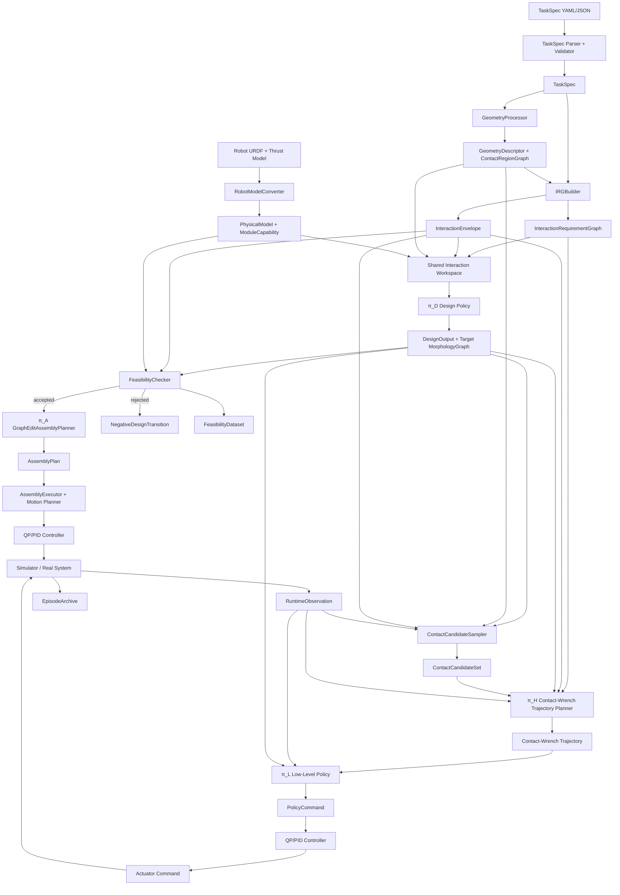

Key constraints:

```text
IRGBuilder produces abstract interaction requirements, not final contact points.
π_D designs morphology and robot anchors.
ContactCandidateSampler runs after π_D.
π_H selects/refines contact assignments over a finite horizon.
ContactCandidateSet is a finite proposal pool, not a proof that every subset is feasible.
Assignment-level wrench/friction/collision/QP feasibility is evaluated after π_H selects a contact assignment set.
π_L outputs intent only.
QP/PID/controller layer outputs actuator commands.
```

---

## 7. TaskSpec, SceneSpec, ObjectSpec

### 7.1 General principle

TaskSpec は structured task data と geometry assets への references のみを含む。巨大 mesh、dense map、raw point cloud を埋め込んではならない。そのような assets は `geometry_ref` または `asset_path` で参照してよいが、file paths は NN features になってはならない。

```text
TaskSpec YAML/JSON
  -> parser
  -> schema object
  -> GeometryProcessor resolves refs
  -> shape tokens / region tokens for NN
  -> exact mesh/SDF/collision geometry for simulator/checkers
```

Data lifecycle rule:

```text
TaskSpec + GeometrySpec + InteractionTemplate = source data / compiler inputs
GeometryDescriptor + ContactRegionGraph = geometry-derived intermediate representations
IRG = compiled detailed interaction requirement graph
InteractionEnvelope = cached compact summary extracted from IRG
NN tokens = encoded features derived from the above
Exact geometry / PhysicalModel = simulator and deterministic checker inputs
```

NN は source data 全体を直接再解釈してはならない。GeometryProcessor、IRGBuilder、EnvelopeExtractor の deterministic outputs を入力 token 化して使う。

### 7.2 TaskSpec schema

```python
class TaskSpec:
    task_id: str
    task_type: TaskType
    scene: SceneSpec
    goals: list[GoalSpec]
    robot_constraints: RobotConstraints
    safety: SafetySpec
    curriculum_tags: list[str] = []
    metadata: dict = {}
```

### 7.3 TaskType enum

```python
class TaskType(str, Enum):
    FREE_FLIGHT_NAVIGATION = "free_flight_navigation"
    OBJECT_GRASP_CARRY = "object_grasp_carry"
    VALVE_OPERATION = "valve_operation"
    PERCHING_MANIPULATION = "perching_manipulation"
    CONTACT_MEDIATED_LOCOMOTION = "contact_mediated_locomotion"
```

### 7.4 SceneSpec

```python
class SceneSpec:
    world_frame: str = "world"
    geometry_library: list[GeometrySpec]
    objects: list[ObjectSpec]
    environment: EnvironmentSpec
```

### 7.5 GeometrySpec

```python
class GeometrySpec:
    geometry_id: str
    geometry_type: Literal["box", "sphere", "cylinder", "capsule", "mesh", "sdf", "point_cloud"]
    primitive_params: dict | None
    asset_path: str | None
    scale: tuple[float, float, float] = (1.0, 1.0, 1.0)
    collision_model: Literal["primitive", "convex", "mesh", "sdf"]
    units: Literal["m"] = "m"
```

`asset_path` は GeometryProcessor、simulator、checkers のみが使用する。neural feature としては使用しない。

### 7.6 ObjectSpec

```python
class ObjectSpec:
    object_id: str
    geometry_id: str
    pose_world: Pose7D
    movable: bool
    mass_kg: float | None
    inertia_kgm2: list[float] | None
    friction: float | None
    material_tag: str | None
    contact_allowed: bool = True
    allowed_contact_modes: list[ContactMode]
    semantic_tags: list[str] = []
    kinematic_model: ObjectKinematicModel | None = None
```

manipulation objects では、task template による明示 override がない限り `mass_kg` は required である。

### 7.7 EnvironmentSpec

```python
class EnvironmentSpec:
    support_surfaces: list[SurfaceSpec]
    obstacles: list[ObstacleSpec]
    wind: WindSpec | None
    gravity: tuple[float, float, float] = (0.0, 0.0, -9.80665)
```

### 7.8 GoalSpec

```python
class GoalSpec:
    goal_id: str
    target_entity_id: str | None
    goal_type: Literal[
        "robot_pose", "object_pose", "object_displacement", "object_joint_state",
        "contact_state", "centroidal_state", "free_flight_pose"
    ]
    target_pose_world: Pose7D | None
    target_twist_world: list[float] | None
    target_q: list[float] | None
    tolerance_pos_m: float | None
    tolerance_rot_rad: float | None
    tolerance_q: list[float] | None
    time_limit_s: float
```

### 7.9 RobotConstraints

```python
class RobotConstraints:
    min_modules: int = 1
    max_modules: int = 8
    allowed_module_types: list[str] = ["holon"]
    allow_closed_loop: bool = False
    max_docked_edges: int | None = None
    max_robot_anchors: int = 16
```

### 7.10 SafetySpec

```python
class SafetySpec:
    collision_margin_m: float = 0.03
    max_contact_force_n: float = 30.0
    max_contact_torque_nm: float = 5.0
    max_tilt_rad: float = 1.2
    min_thrust_margin_ratio: float = 0.15
    min_qp_margin: float = 0.0
    allow_object_drop: bool = False
```

### 7.11 Example TaskSpec YAML: object grasp & carry

```yaml
task_id: grasp_carry_box_001
task_type: object_grasp_carry
scene:
  world_frame: world
  geometry_library:
    - geometry_id: box_geom
      geometry_type: box
      primitive_params:
        size_m: [0.30, 0.20, 0.15]
      asset_path: null
      scale: [1.0, 1.0, 1.0]
      collision_model: primitive
  objects:
    - object_id: box_01
      geometry_id: box_geom
      pose_world: [0.8, 0.0, 0.4, 0.0, 0.0, 0.0, 1.0]
      movable: true
      mass_kg: 1.0
      inertia_kgm2: null
      friction: 0.6
      material_tag: cardboard
      contact_allowed: true
      allowed_contact_modes: [grasp, support, push]
  environment:
    support_surfaces:
      - surface_id: floor
        geometry_id: floor_geom
        pose_world: [0, 0, 0, 0, 0, 0, 1]
        friction: 0.8
        contact_allowed: true
        allowed_contact_modes: [support]
    obstacles: []
    wind: null
goals:
  - goal_id: place_box
    target_entity_id: box_01
    goal_type: object_pose
    target_pose_world: [2.0, 0.0, 0.4, 0.0, 0.0, 0.0, 1.0]
    tolerance_pos_m: 0.05
    tolerance_rot_rad: 0.20
    time_limit_s: 30.0
robot_constraints:
  min_modules: 2
  max_modules: 6
  allow_closed_loop: false
safety:
  collision_margin_m: 0.03
  max_contact_force_n: 30.0
  min_thrust_margin_ratio: 0.15
```

---

## 8. GeometryProcessor and Shape Representation

### 8.1 Purpose

GeometryProcessor は geometry references を learning features、contact regions、collision models、physics metadata に変換する。

2つの representations を生成しなければならない。

```text
Learning representation:
  global shape features
  surface patch tokens
  SurfacePatchGraph
  ContactRegionGraph

Physics/checking representation:
  raw mesh / SDF / primitive / convex hull / collision model
```

### 8.2 File paths are not NN features

実装は次を **MUST** enforce する。

```text
geometry_ref / asset_path -> GeometryProcessor input only
GeometryDescriptor / SurfacePatchTokens / ContactRegionTokens -> NN input
```

NN inputs は `assets/objects/foo.obj` のような raw path strings を含んではならない。

### 8.3 GeometryDescriptor schema

```python
class GeometryDescriptor:
    geometry_id: str
    global_shape_features: GlobalShapeFeatures
    surface_patch_graph: SurfacePatchGraph
    contact_region_graph: ContactRegionGraph
    collision_ref: str
    exact_geometry_ref: str
```

### 8.4 GlobalShapeFeatures

```python
class GlobalShapeFeatures:
    bbox_m: tuple[float, float, float]
    volume_m3: float
    surface_area_m2: float
    approximate_com_object: tuple[float, float, float]
    approximate_inertia_diag: tuple[float, float, float]
    principal_axes_flat: list[float]     # 9 values
    compactness: float
    symmetry_features: list[float]
```

### 8.5 SurfacePatchToken

各 surface patch token は surface 上の local patch を表す。final contact point ではない。

```python
class SurfacePatchToken:
    patch_id: int
    entity_id: str
    position_object: tuple[float, float, float]
    normal_object: tuple[float, float, float]
    tangent_u_object: tuple[float, float, float]
    tangent_v_object: tuple[float, float, float]
    patch_area_m2: float
    mean_curvature: float
    gaussian_curvature: float
    local_thickness_m: float | None
    friction: float | None
    contact_allowed: bool
    allowed_contact_modes: list[ContactMode]
```

### 8.6 SurfacePatchGraph

```python
class SurfacePatchGraph:
    nodes: list[SurfacePatchToken]
    edges: list[SurfacePatchEdge]
```

Edges は patch adjacency、similar normal clusters、rim/edge relation、semantic grouping を表す。

```python
class SurfacePatchEdge:
    src_patch_id: int
    dst_patch_id: int
    edge_type: Literal["adjacent", "same_region", "rim_neighbor", "opposite_patch", "normal_cluster"]
    distance_m: float
    normal_angle_rad: float
```

### 8.7 ContactRegion

```python
class ContactRegion:
    region_id: str
    entity_id: str
    region_type: Literal["face", "rim", "edge", "pipe", "floor", "wall", "curved_patch", "mesh_patch_cluster"]
    patch_ids: list[int]
    pose_object: Pose7D | None
    normal_summary_object: tuple[float, float, float]
    area_m2: float
    curvature_summary: list[float]
    friction: float | None
    allowed_contact_modes: list[ContactMode]
    task_relevance_features: list[float]
```

### 8.8 ContactRegionGraph

```python
class ContactRegionGraph:
    nodes: list[ContactRegion]
    edges: list[ContactRegionEdge]
```

Typical region edges:

```text
adjacent_region
opposite_region
same_object
spatially_near
supports_moment_arm
mutually_exclusive_contact
```

### 8.9 GeometryProcessor algorithms

For primitives:

```text
box:
  create face regions: +x, -x, +y, -y, +z, -z
  create edge/rim regions if task template requires rim/edge reasoning

cylinder:
  create side surface region, top/bottom regions, rim regions

sphere:
  sample normal clusters and contactable patches

capsule:
  create cylindrical side + hemispherical end regions
```

For mesh:

```text
load mesh
repair if possible
normalize scale
compute normals and curvature
segment into connected patch clusters by normal/curvature/area
extract rims and high-curvature features
build SurfacePatchGraph
aggregate ContactRegions
compute collision primitive or convex decomposition
```

For SDF:

```text
sample zero-level surface
estimate normals from SDF gradient
cluster patches
build ContactRegionGraph
```

For point cloud:

```text
estimate normals
optional surface reconstruction
cluster patches
build approximate ContactRegionGraph
```

### 8.10 GeometryProcessor diagram

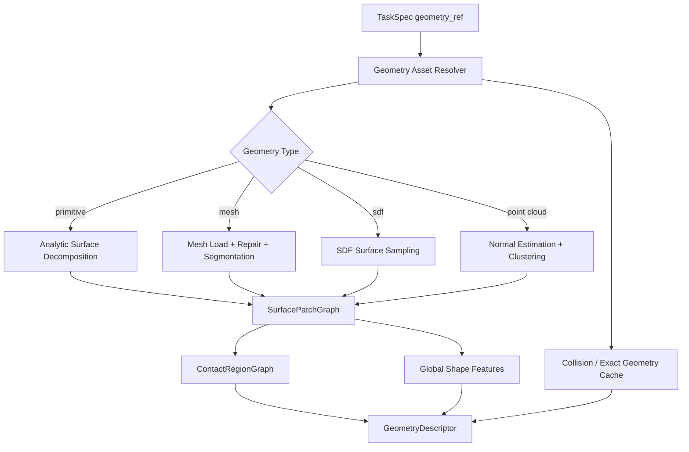

---

## 9. Robot Module Model and PhysicalModel

### 9.1 Purpose

robot model layer は URDF と thrust model configuration を次に変換する。

```text
PhysicalModel:
  exact link/joint/rotor/dock/geometry data for simulation, checkers, controllers

ModuleCapability:
  compact learning features for π_D, π_H, π_L
```

### 9.2 Developer reference module

提供される `./module_urdf/holon.urdf` は tests の中で parse されるべきである。実装は、この URDF だけが存在するという仮定を encode してはならない。

parser test は次を report するべきである。

```text
number of links
number of joints
joint type counts
link masses and total mass
candidate rotor frames
candidate docking mechanism frames
frame tree validity
```

### 9.3 PhysicalModel schema

```python
class PhysicalModel:
    model_id: str
    urdf_path: str
    links: list[LinkModel]
    joints: list[JointModel]
    rotors: list[RotorModel]
    dock_ports: list[DockPortSpec]
    collision_primitives: list[CollisionPrimitive]
    aggregate_mass_kg: float
    aggregate_inertia_body: list[float]
    metadata: dict
```

### 9.4 LinkModel

```python
class LinkModel:
    link_id: str
    parent_joint_id: str | None
    mass_kg: float
    inertia_kgm2: list[float]          # [ixx, ixy, ixz, iyy, iyz, izz]
    local_com: tuple[float, float, float]
    visual_geometry_ref: str | None
    collision_geometry_ref: str | None
```

### 9.5 JointModel

```python
class JointModel:
    joint_id: str
    joint_type: Literal["fixed", "revolute", "continuous", "prismatic"]
    parent_link: str
    child_link: str
    origin_xyz: tuple[float, float, float]
    origin_rpy: tuple[float, float, float]
    axis_xyz: tuple[float, float, float]
    limit_lower: float | None
    limit_upper: float | None
    effort_limit: float | None
    velocity_limit: float | None
```

URDF effort/velocity values が zero の場合、config がそれを hard zero と明示しない限り unknown と扱うべきである。

### 9.6 RotorModel

```python
class RotorModel:
    rotor_id: str
    thrust_frame_link: str
    thrust_axis_local: tuple[float, float, float]
    thrust_min_n: float
    thrust_max_n: float
    reaction_torque_coeff_nm_per_n: float
    vectoring_joint_ids: list[str]
```

thrust model config は thrust limits と reaction torque を提供する。URDF は frames と joints を提供する。

### 9.7 DockPortSpec

Dock ports は URDF frame naming conventions または robot metadata config から derive されうる。実装は両方を support するべきである。

```python
class DockPortSpec:
    port_id: str
    parent_link: str
    local_pose: Pose7D
    port_type: Literal["pitch_dock", "yaw_dock", "generic_dock"]
    compatible_port_types: list[str]
    latch_axis_local: tuple[float, float, float] | None
    mechanical_limits: dict
```

### 9.8 ModuleCapabilityToken

これは learning feature であり、exact physical model ではない。

```python
class ModuleCapabilityToken:
    module_type: str
    aggregate_mass_norm: float
    aggregate_inertia_features: list[float]
    rotor_count: int
    port_count: int
    thrust_min_features: list[float]
    thrust_max_features: list[float]
    thrust_to_weight_ratio_est: float
    dock_port_type_counts: list[int]
    has_vectoring: bool
    has_dock_mechanism: bool
```

exact dynamics は ModuleCapabilityToken ではなく PhysicalModel を使わなければならない。

---

## 10. InteractionRequirementGraph Formal Specification

### 10.1 Definition

IRG は TaskSpec instance ごとに1つの typed heterogeneous factor graph である。

```text
IRG = one heterogeneous graph
  with typed node groups
  with typed edge groups
  with cross edges connecting subgraph views
```

IRG は independent graphs の集合ではない。Phase、contact、wrench、state target、constraint structures は、同一 integrated graph 内の subgraph views である。

### 10.2 IRG diagram

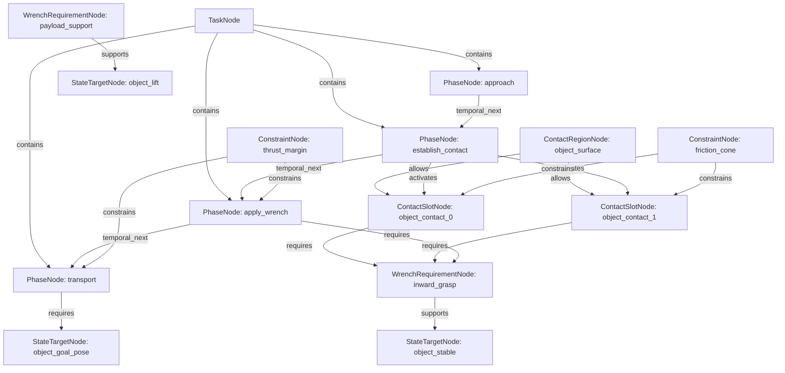

### 10.3 Node types

Version 1 node types:

```python
class IRGNodeType(str, Enum):
    TASK = "task"
    PHASE = "phase"
    CONTACT_REGION = "contact_region"
    CONTACT_SLOT = "contact_slot"
    WRENCH_REQUIREMENT = "wrench_requirement"
    STATE_TARGET = "state_target"
    CONSTRAINT = "constraint"
    CAPABILITY_REQUIREMENT = "capability_requirement"
```

### 10.4 Edge types

Version 1 edge types:

```python
class IRGEdgeType(str, Enum):
    TEMPORAL_NEXT = "temporal_next"
    CONTAINS = "contains"
    ACTIVATES = "activates"
    REQUIRES = "requires"
    SUPPORTS = "supports"
    CONSTRAINS = "constrains"
    APPLIES_TO = "applies_to"
    SIMULTANEOUS = "simultaneous"
    MUTUALLY_EXCLUSIVE = "mutually_exclusive"
    SPATIAL_RELATION = "spatial_relation"
    WRENCH_COMPOSITION = "wrench_composition"
    KINEMATIC_COUPLING = "kinematic_coupling"
    GUARD_TRANSITION = "guard_transition"
    FALLBACK = "fallback"
```

### 10.5 Common node fields

```python
class IRGNode:
    node_id: int
    node_type: IRGNodeType
    ref_id: str | None
    priority: float
    is_hard: bool
    active_phase_id: int | None
    feature: dict
```

### 10.6 TaskNode

```python
TaskNode.feature = {
    "task_id": str,
    "task_type": str,
    "success_conditions": list[Condition],
    "failure_conditions": list[Condition],
    "time_limit_s": float,
}
```

### 10.7 PhaseNode

```python
PhaseNode.feature = {
    "phase_type": Literal[
        "free_motion", "approach", "establish_contact", "maintain_contact",
        "apply_wrench", "shift_support", "transport", "place", "release_contact",
        "recovery"
    ],
    "phase_label": str | None,     # template-local readable name, not an enum
    "phase_index": int,
    "entry_condition": Condition | None,
    "exit_condition": Condition | None,
    "failure_condition": Condition | None,
    "nominal_duration_s": float | None,
    "max_duration_s": float | None,
}
```

`phase_type` は上記 enum の値だけを許可する。`approach_object`, `establish_perch_contact`, `rotate_valve` などの task/template 固有名は `phase_label` または common field `ref_id` に保存しなければならない。IRGBuilder はすべての template-local phase labels を valid `phase_type` へ map し、schema validator は unknown `phase_type` を reject しなければならない。

### 10.8 ContactRegionNode

```python
ContactRegionNode.feature = {
    "region_id": str,
    "target_entity_id": str,
    "region_type": str,
    "allowed_contact_modes": list[str],
    "area_m2": float,
    "normal_summary": list[float],
    "curvature_summary": list[float],
    "friction": float | None,
}
```

### 10.9 ContactSlotNode

ContactSlotNode は abstract である。final contact point coordinates を含んではならない。

```python
ContactSlotNode.feature = {
    "slot_id": int,
    "target_entity_type": Literal["object", "environment", "robot"],
    "target_entity_id": str,
    "allowed_region_ids": list[str],
    "contact_mode": ContactMode,
    "required": bool,
    "min_count_group": int,
    "max_count_group": int,
    "normal_constraint": dict | None,
    "approach_direction_constraint": dict | None,
    "separation_constraint": dict | None,
    "required_anchor_capability": dict,
}
```

### 10.10 WrenchRequirementNode

Version 1 は wrench を exact mandatory command ではなく、range / inequality / priority として表現しなければならない。

```python
WrenchRequirementNode.feature = {
    "requirement_id": str,
    "applies_to": Literal["contact_slot", "object_effect", "centroidal"],
    "frame": Literal["world", "object", "contact_region", "com", "joint_axis"],
    "required_effect": str,
    "wrench_lower": list[float] | None,   # [fx, fy, fz, tx, ty, tz]
    "wrench_upper": list[float] | None,
    "target_wrench": list[float] | None,
    "slack_weight": float,
    "hard_or_soft": Literal["hard", "soft"],
}
```

### 10.11 StateTargetNode

```python
StateTargetNode.feature = {
    "target_type": Literal[
        "object_pose", "object_twist", "object_joint_state",
        "centroidal", "body_pose", "joint_state", "contact_state"
    ],
    "target_entity_id": str | None,
    "pose_target_world": Pose7D | None,
    "twist_target_world": list[float] | None,
    "q_target": list[float] | None,
    "tolerance": dict,
}
```

### 10.12 ConstraintNode

```python
ConstraintNode.feature = {
    "constraint_type": Literal[
        "friction_cone", "no_slip", "collision_margin", "max_contact_force",
        "thrust_margin", "payload_margin", "support_ratio", "vertical_thrust_ratio",
        "time_limit", "joint_limit", "workspace", "closed_loop_reject"
    ],
    "parameters": dict,
    "violation_code": str,
}
```

### 10.13 CapabilityRequirementNode

```python
CapabilityRequirementNode.feature = {
    "capability_type": Literal["grasp", "support", "push", "latch", "perch", "slide", "free_flight"],
    "min_force_n": float | None,
    "min_torque_nm": float | None,
    "pose_accuracy_m": float | None,
    "pose_accuracy_rad": float | None,
    "stiffness_requirement": float | None,
}
```

### 10.14 Common edge fields

```python
class IRGEdge:
    src_id: int
    dst_id: int
    edge_type: IRGEdgeType
    priority: float
    condition: Condition | None
    params: dict
```

### 10.15 HeteroData representation

PyTorch Geometric style representation を推奨する。

```python
IRGData = {
    "nodes": {
        "task": TaskNodeTensor,
        "phase": PhaseNodeTensor,
        "contact_region": ContactRegionNodeTensor,
        "contact_slot": ContactSlotNodeTensor,
        "wrench_requirement": WrenchRequirementNodeTensor,
        "state_target": StateTargetNodeTensor,
        "constraint": ConstraintNodeTensor,
        "capability_requirement": CapabilityRequirementNodeTensor,
    },
    "edges": {
        ("phase", "temporal_next", "phase"): EdgeTensor,
        ("phase", "activates", "contact_slot"): EdgeTensor,
        ("contact_region", "allows", "contact_slot"): EdgeTensor,
        ("contact_slot", "requires", "wrench_requirement"): EdgeTensor,
        ("wrench_requirement", "supports", "state_target"): EdgeTensor,
        ("constraint", "constrains", "phase"): EdgeTensor,
        ("constraint", "constrains", "contact_slot"): EdgeTensor,
    }
}
```

---

## 11. IRGBuilder v1: Deterministic Compiler

### 11.1 Role

IRGBuilder は deterministic compiler である。

```text
TaskSpec + GeometryDescriptor
  -> InteractionRequirementGraph + InteractionEnvelope
```

IRGBuilder は以下を **MUST NOT** 行う。

```text
choose final contact points
choose robot anchors
generate morphology
generate assembly sequence
generate contact-wrench trajectories
generate actuator commands
```

IRGBuilder は以下を **MUST** 行う。

```text
validate TaskSpec
construct SceneGraph
use GeometryDescriptor and ContactRegionGraph
select InteractionTemplate by task_type
generate PhaseNodes
create abstract ContactSlots
generate WrenchRequirements
create StateTargets
create Constraints
create typed cross edges
validate IRG
extract InteractionEnvelope
```

### 11.2 IRGBuilder pipeline

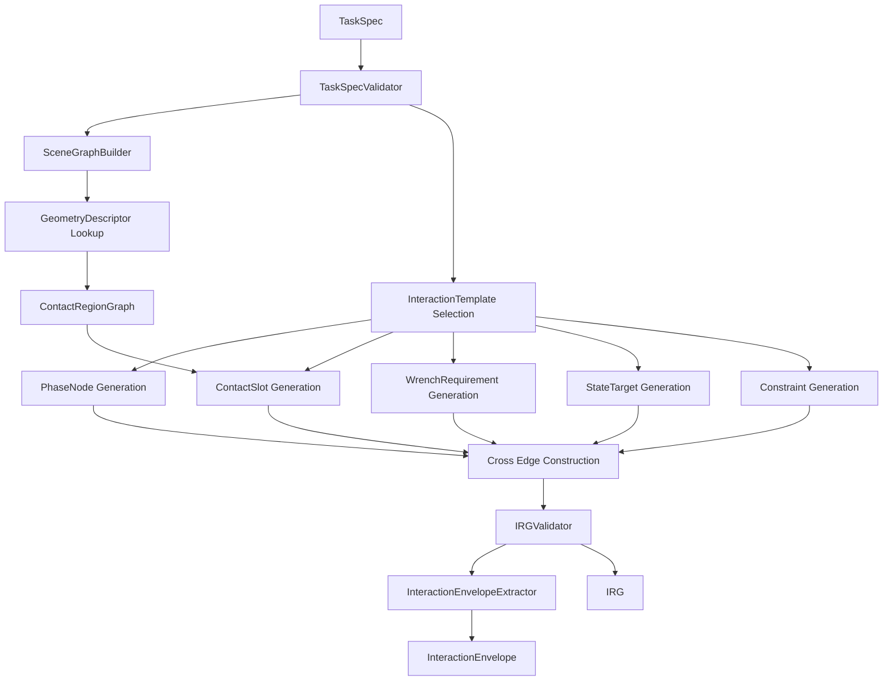

### 11.3 Determinism requirement

同じ TaskSpec、geometry cache、config が与えられた場合、IRGBuilder は同じ IRG node IDs、edge IDs、envelope values を生成しなければならない。stochastic sampling は後段の ContactCandidateSampler に属し、IRGBuilder には属さない。

### 11.4 SceneGraph construction

SceneGraph は entities と references を normalize する。

```python
class SceneGraph:
    entities: list[SceneEntity]
    geometry_descriptors: dict[str, GeometryDescriptor]
    entity_edges: list[SceneEdge]
```

Entity types:

```text
object
environment_surface
obstacle
support_surface
valve
pipe
wall
floor
```

### 11.5 ContactRegion extraction

IRGBuilder は GeometryProcessor から得た ContactRegionGraph を使う。required regions が存在しない場合は、task-aware region extraction options 付きで GeometryProcessor を呼び出さなければならない。

Example:

```text
object_grasp_carry:
  require object surface contact regions

valve_operation:
  require valve rim or handle contact regions

contact_mediated_locomotion:
  require environment support regions

perching_manipulation:
  require perch/latch/support environment regions
```

### 11.6 WrenchRequirement generation rules

IRGBuilder は final exact wrench commands ではなく、physical inequalities と soft target ranges を生成するべきである。

Generic formulas:

Object support force lower bound:

```text
F_support_total >= m_object * (g + a_lift_margin)
```

Frictional no-slip proxy for grasp:

```text
Σ_i μ_i * f_normal_i >= F_tangential_required
```

Valve/contact torque effect:

```text
τ_q = Σ_i J_contact_i(q)^T * w_contact_i
```

Centroidal dynamics relation:

```text
h_dot = W_thrust + Σ_k Ad*_{COM<-contact_k} w_contact_k + W_gravity
```

IRG は requirements、bounds、references を保存する。actual contact frames は選ばない。

### 11.7 Cross-edge construction rules

IRGBuilder は subgraph views を明示的に接続しなければならない。

Examples:

```text
PhaseNode establish_contact --activates--> ContactSlot object_contact_0
ContactRegion box_side_surfaces --allows--> ContactSlot object_contact_0
ContactSlot object_contact_0 --requires--> WrenchRequirement inward_grasp_force
WrenchRequirement inward_grasp_force --supports--> StateTarget object_stable
Constraint friction_cone --constrains--> ContactSlot object_contact_0
PhaseNode lift --requires--> WrenchRequirement payload_support
PhaseNode carry --requires--> StateTarget object_goal_pose
```

### 11.8 IRG validation rules

IRGValidator は以下を reject しなければならない。

```text
missing TaskNode
missing PhaseNode sequence
ContactSlot without ContactRegion
WrenchRequirement without applies_to relation
StateTarget without corresponding goal or phase
Constraint without target
object_grasp_carry without movable target object mass
valve_operation without object kinematic model / axis
contact_mediated_locomotion without support surface
perching_manipulation without allowed perch/support region
```

---

## 12. InteractionTemplate Library

### 12.1 Definition

InteractionTemplate は IRG compiler rule であり、solution template ではない。TaskSpec から required IRG node and edge patterns を生成する。final contact points や robot morphology を選んではならない。

```python
class InteractionTemplateBase:
    task_type: TaskType
    def validate_required_fields(self, task_spec: TaskSpec) -> None: ...
    def build(self, task_spec: TaskSpec, scene_graph: SceneGraph, geometry: dict) -> IRGPartial: ...
```

以下の template sections に出てくる phase names は、特記がない限り template-local `phase_label` である。実装時には必ず valid `PhaseNode.feature["phase_type"]` へ写像すること。

### 12.2 Template diagram

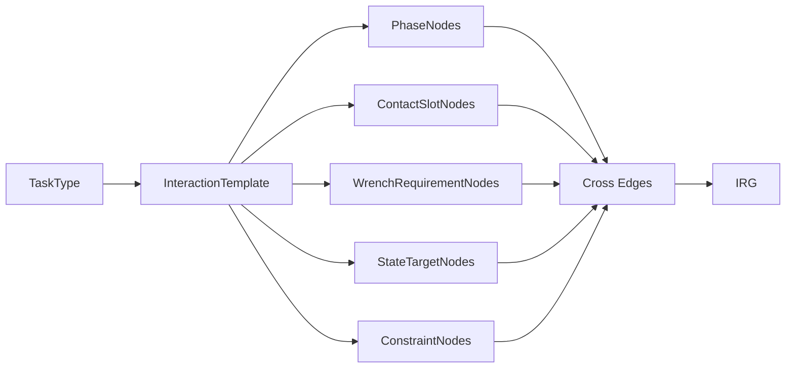

### 12.3 free_flight_navigation template

Required TaskSpec fields:

```text
goal robot_pose or free_flight_pose
time_limit
safety constraints
```

Generated nodes:

```text
PhaseNodes:
  takeoff_or_stabilize -> phase_type="free_motion"
  navigate -> phase_type="free_motion"
  hold_or_land -> phase_type="free_motion"

ContactSlotNodes:
  none

WrenchRequirementNodes:
  centroidal_wrench_for_free_flight

StateTargetNodes:
  robot_pose_target
  body_orientation_target

ConstraintNodes:
  collision_margin
  thrust_margin
  max_tilt
```

### 12.4 object_grasp_carry template

Required fields:

```text
target movable object
object geometry
object mass
object friction or default friction config
object target pose
```

Generated nodes:

```text
PhaseNodes:
  approach_object -> phase_type="approach"
  establish_object_contacts -> phase_type="establish_contact"
  apply_grasp_wrench -> phase_type="apply_wrench"
  lift_object -> phase_type="transport"
  transport_object -> phase_type="transport"
  place_object -> phase_type="place"
  release_contacts -> phase_type="release_contact"

ContactRegionNodes:
  object surface regions from GeometryProcessor

ContactSlotNodes:
  object_contact_slot_group with min_count=2, max_count=4
  optional support/push slots if template branch allows support transport

WrenchRequirementNodes:
  inward_grasp_force
  no_slip_requirement
  payload_support_force
  object_pose_tracking_effect

StateTargetNodes:
  object_lift_height
  object_goal_pose
  centroidal_stability
  release_contact_state

ConstraintNodes:
  friction_cone
  max_contact_force
  collision_margin
  thrust_margin
  payload_margin
```

Alternative branches inside one IRG:

```text
grip_branch
support_underneath_branch
push_slide_branch optional if task permits non-lift transport
```

これらの branches は `mutually_exclusive` edges で接続される。P1/P2 training では grip/support branches を優先し、明示的に configured されない限り push-slide は disable する。

### 12.5 valve_operation template

Required fields:

```text
valve object
valve axis or kinematic joint model
valve radius or handle geometry
required or estimated torque
angle target
```

Generated nodes:

```text
PhaseNodes:
  approach_valve -> phase_type="approach"
  establish_valve_contact -> phase_type="establish_contact"
  apply_tangential_wrench -> phase_type="apply_wrench"
  rotate_valve -> phase_type="apply_wrench"
  release_contact -> phase_type="release_contact"

ContactSlots:
  valve_rim_or_handle_contact, contact_mode=push/stick

WrenchRequirements:
  tangential_force
  valve_axis_torque >= tau_required

StateTargets:
  valve_q_target
  body_stabilization

Constraints:
  friction_cone
  maintain_contact
  collision_margin
  thrust_margin
```

### 12.6 perching_manipulation template

Required fields:

```text
perchable environment region
allowed contact modes support/perch/latch
optional manipulation target
```

Generated nodes:

```text
PhaseNodes:
  navigate_to_perch_region -> phase_type="approach"
  establish_perch_contact -> phase_type="establish_contact"
  hold_perch_wrench -> phase_type="maintain_contact"
  optional_manipulation -> phase_type="apply_wrench"
  release_perch -> phase_type="release_contact"

ContactSlots:
  environment_perch_slot, contact_mode=perch/latch/support
  optional object manipulation slots

WrenchRequirements:
  hold_wrench
  slip_resistance
  thrust_reduction_preference

StateTargets:
  body_pose_hold
  optional object target

Constraints:
  max_contact_force
  latch feasibility
  no_slip
  collision_margin
```

### 12.7 contact_mediated_locomotion template

これは walking-like behavior を contact-mediated locomotion として含む。以下の spectrum を表す。

```text
aerial_dominant_contact_support
hybrid_contact_locomotion
contact_dominant_legged_equivalent
```

Version 1 では full explicit footstep/gait planner を必要としない。Footstep planning は contact slot から contact candidate への時間方向 assignment として表現する。

Required fields:

```text
support surface or terrain
locomotion target or displacement
support constraints
allowed contact modes
```

Generated nodes:

```text
PhaseNodes:
  approach_support_region -> phase_type="approach"
  establish_support_contact -> phase_type="establish_contact"
  maintain_support -> phase_type="maintain_contact"
  shift_centroidal_state -> phase_type="shift_support"
  reposition_free_anchor -> phase_type="free_motion"
  reanchor_support -> phase_type="establish_contact"
  release_or_continue -> phase_type="release_contact" or "maintain_contact" depending on branch

ContactSlots:
  support contact slots on environment region

WrenchRequirements:
  contact_support_force
  friction-limited tangential force
  vertical_thrust_ratio <= threshold
  contact_support_ratio >= threshold

StateTargets:
  COM shift
  body pose stabilization
  joint/posture target
  locomotion progress target

Constraints:
  no_slip
  friction_cone
  support polygon / support ratio proxy
  collision_margin
```

Example config:

```yaml
locomotion_contact_mode:
  support_allocation: hybrid_contact_locomotion
support_constraints:
  max_vertical_thrust_ratio: 0.4
  min_contact_support_ratio: 0.5
  allow_thrust_for_stabilization: true
```

---

## 13. InteractionEnvelope

### 13.1 Purpose

InteractionEnvelope は π_D と π_H が共有する compact requirement summary である。

```text
IRG = detailed typed graph
InteractionEnvelope = compact design/control requirement summary
```

π_D は morphology and anchors を design するために使う。π_H は contact-wrench trajectories を instantiate するために使う。

### 13.2 Schema

```python
class InteractionEnvelope:
    envelope_id: str
    task_id: str
    required_contact_count_range: tuple[int, int]
    required_contact_modes: list[ContactMode]
    target_region_sets: list[TargetRegionSet]
    wrench_space_requirements: list[WrenchSpaceRequirement]
    support_ratio_requirements: SupportRatioRequirement | None
    vertical_thrust_ratio_limit: float | None
    precision_requirements: list[PrecisionRequirement]
    duration_requirements: list[DurationRequirement]
    capability_requirements: list[CapabilityRequirement]
    branch_options: list[EnvelopeBranchOption]
```

### 13.3 Example: grasp & carry envelope

```yaml
required_contact_count_range: [2, 4]
required_contact_modes: [grasp, support]
target_region_sets:
  - entity_id: box_01
    region_types: [face, mesh_patch_cluster]
wrench_space_requirements:
  - applies_to: object_contact_slots
    effect: inward_grasp_force
    lower_bound_description: no_slip_and_payload_support
  - applies_to: centroidal
    effect: maintain_stability
precision_requirements:
  - target: object_pose
    tolerance_pos_m: 0.05
    tolerance_rot_rad: 0.20
capability_requirements:
  - capability_type: grasp
    min_force_n: 5.0
```

### 13.4 Extraction rules

EnvelopeExtractor は以下を aggregate する。

```text
ContactSlot min/max counts
ContactSlot contact modes
ContactRegion targets
WrenchRequirement bounds and priorities
StateTarget tolerances
Constraint thresholds
CapabilityRequirement minimums
```

### 13.5 Data lifecycle and cache rule

InteractionEnvelope は IRG から deterministic に再生成可能でなければならない。runtime では `task_hash + geometry_hash + irg_builder_version` を key として cache してよい。IRG、TaskSpec、GeometryDescriptor、または InteractionTemplate version が変わった場合、Envelope は stale と見なして再抽出すること。

π_D、ContactCandidateSampler、π_H は cached Envelope を読んでよいが、Envelope を source of truth として IRG を上書きしてはならない。

---

## 14. MorphologyGraph, RobotAnchor, and DesignOutput

### 14.1 MorphologyGraph purpose

MorphologyGraph は target connected A-MSRR morphology を表す。π_D の主出力であり、π_A への target input である。

MorphologyGraph は接続 topology、dock port の選択、module role、RobotAnchor、control group、assembly / operation に必要な graph-level metadata を表す。可動関節の瞬間的な関節角度、または可動関節によって task execution 中に変化する module relative pose を、π_D の設計自由度として表してはならない。

### 14.2 MorphologyGraph schema

```python
class MorphologyGraph:
    graph_id: str
    modules: list[ModuleNode]
    ports: list[PortNode]
    dock_edges: list[DockEdge]
    robot_anchors: list[RobotAnchor]
    control_groups: list[ControlGroup]
    base_module_id: int
    is_closed_loop: bool
```

### 14.2.1 Pose and transform semantics

`ModuleNode.pose_in_design_frame` および `DockEdge.relative_pose_src_to_dst` は、π_D が連続値として最適化する設計変数ではない。

これらの pose / transform は、以下の用途に限定する。

```text
selected docking port geometry から決まる canonical transform
nominal assembly geometry の記録
visualization
coarse collision precheck
graph layout / debugging
simulator initialization reference pose
```

これらは、可動関節の現在角度や、task execution 中の module relative pose を表してはならない。

したがって、`pose_in_design_frame` や `relative_pose_src_to_dst` を用いて、π_D が「特定の関節姿勢込みの構造」を生成していると解釈してはならない。関節姿勢、関節角度、姿勢軌道は、π_D ではなく、π_H、π_L、QP/PID controller、および runtime state estimator / simulator が扱う。

### 14.3 ModuleNode

```python
class ModuleNode:
    module_id: int
    module_type: str
    pose_in_design_frame: Pose7D
    role_id: str
    is_base: bool
    health: float = 1.0
    capability_token: ModuleCapabilityToken
```

### 14.4 PortNode

```python
class PortNode:
    port_global_id: int
    module_id: int
    port_local_id: str
    local_pose: Pose7D
    port_type: str
    occupied: bool
    compatible_port_type_mask: list[int]
```

### 14.5 DockEdge

```python
class DockEdge:
    edge_id: int
    src_module_id: int
    src_port_id: int
    dst_module_id: int
    dst_port_id: int
    relative_pose_src_to_dst: Pose7D
    edge_role: Literal["structural", "grasp_arm", "support", "perch_anchor", "locomotion_support"]
    estimated_stiffness: list[float]
    latch_state: Literal["planned", "attached", "detached"]
```

### 14.6 RobotAnchor

RobotAnchor は interaction のための robot-side capability である。

```python
class RobotAnchor:
    anchor_id: int
    module_id: int
    link_id: str | None
    local_pose: Pose7D
    anchor_type: Literal["grasp", "support", "push", "latch", "perch", "tool", "body_contact"]
    capability: dict
    associated_contact_slot_ids: list[int]
```

### 14.7 DesignOutput

```python
class DesignOutput:
    task_id: str
    irg_id: str
    target_morphology: MorphologyGraph
    module_roles: dict[int, str]
    slot_anchor_binding_prior: list[SlotAnchorBindingPrior]
    design_actions: list[DesignAction]
    design_logprobs: list[float] | None
    design_scores: dict
```

```python
class SlotAnchorBindingPrior:
    slot_id: int
    anchor_id: int
    score: float
    reason_code: str | None
```

### 14.8 Shared identifiers

以下の IDs は stages をまたいで preserve しなければならない。

```text
ContactSlotID:
  abstract task-side contact requirement in IRG

RobotAnchorID:
  robot-side contact/action capability generated by π_D

ContactCandidateID:
  scene/object-side concrete contact candidate generated after morphology is known
```

π_H は次を assign する。

```text
ContactSlotID -> RobotAnchorID -> ContactCandidateID
```

---

## 15. π_D: Design Policy

### 15.1 Role

π_D は InteractionEnvelope を実現できる morphology を design する。

π_D は、A-MSRR の接続構造を設計する方策であり、可動関節の瞬間的な関節角度、または可動関節によって変化する module relative pose を設計自由度として扱ってはならない。

Input:

```text
TaskSpec tokens
GeometryDescriptor tokens
IRG embeddings
InteractionEnvelope
module inventory
ModuleCapability tokens
```

Output:

```text
DesignOutput:
  target MorphologyGraph
  RobotAnchors
  module roles
  control groups
  slot-anchor binding prior
```

π_D が出力してよい設計対象は、以下に限定する。

```text
使用する module 数
module 間の接続 topology
接続に用いる docking port の組
base module の選択
module role の割当
RobotAnchor の生成
ContactSlot と RobotAnchor の対応 prior
control group の割当
assembly / operation に必要な graph-level metadata
```

π_D は、以下を出力してはならない。

```text
可動関節の具体的な関節角度
動作中に変化する module relative pose
task execution 中の姿勢軌道
actuator-level command
rotor thrust
joint torque
vectoring joint target
```

可動関節の姿勢、関節角度、姿勢軌道は、π_D ではなく、π_H、π_L、QP/PID controller が扱う。

### 15.2 Action vocabulary

Version 1 design actions:

```python
class DesignActionType(str, Enum):
    ADD_MODULE = "add_module"
    CONNECT_PORT = "connect_port"
    DISCONNECT_PORT = "disconnect_port"
    ASSIGN_ROLE = "assign_role"
    CREATE_ANCHOR = "create_anchor"
    BIND_ANCHOR_TO_SLOT = "bind_anchor_to_slot"
    SET_CONTROL_GROUP = "set_control_group"
    SET_BASE_MODULE = "set_base_module"
    STOP = "stop"
```

π_D は巨大な raw categorical spaces ではなく candidate enumeration を使うべきである。

### 15.3 Candidate enumeration

```text
partial morphology G_partial
  -> enumerate valid add/connect/role/anchor actions
  -> apply action mask
  -> score candidates with policy head
  -> sample or choose action
  -> repeat until STOP
```

STOP は次を満たす場合にのみ valid である。

```text
minimum module count satisfied
all required ContactSlots have possible RobotAnchor coverage
base module assigned
morphology connected
no occupied port conflict
closed-loop rejected unless override
coarse feasibility passes
```

### 15.4 Design grammar / teacher generator

Version 1 は bootstrapping のために teacher generator を含むべきである。

```text
chain_grasp
symmetric_two_anchor_grasp
tri_anchor_support_grasp
central_base_plus_two_grasp_arms
perch_anchor_frame
valve_torque_arm
support_shift_frame
```

これは demonstration design action sequences の generator であり、永続的な hand-coded solution ではない。

### 15.5 π_D diagram

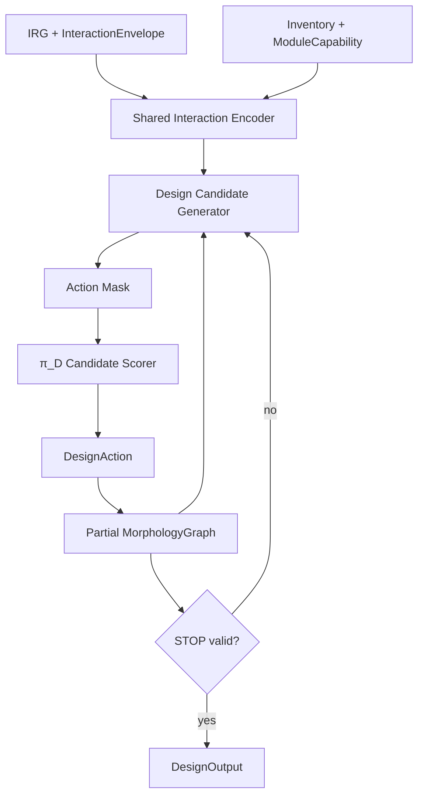

---

## 16. FeasibilityChecker

### 16.1 Role

FeasibilityChecker は hard validity and safety を所有する。Learned models は training acceleration のために feasibility を approximate / predict してよいが、deterministic hard checks を override してはならない。

### 16.2 FeasibilityResult schema

```python
class FeasibilityResult:
    feasible: bool
    hard_violations: list[Violation]
    soft_violations: list[Violation]
    margins: dict[str, float]
    proxy_scores: dict[str, float]
    checker_version: str
```

```python
class Violation:
    code: str
    severity: Literal["hard", "soft", "warning"]
    message: str
    node_or_edge_ref: str | None
    margin: float | None
    threshold: float | None
```

### 16.3 Hard checks

Version 1 hard checks:

```text
F_SCHEMA_VALID
F_CONNECTED_GRAPH
F_MODULE_COUNT
F_PORT_OCCUPANCY
F_COMPATIBLE_PORT_TYPES
F_CLOSED_LOOP_REJECT_V1
F_BASE_MODULE_ASSIGNED
F_REQUIRED_SLOT_COVERAGE
F_ROBOT_ANCHOR_CAPABILITY
F_COARSE_REACHABILITY
F_COARSE_COLLISION
F_THRUST_MARGIN
F_PAYLOAD_MARGIN
F_QP_HOVER_FEASIBILITY
```

### 16.4 Soft proxy scores

```text
S_COMPACTNESS
S_ASSEMBLY_COMPLEXITY
S_REACHABILITY_SCORE
S_GRASP_QUALITY_PROXY
S_WRENCH_MARGIN
S_ENERGY_PROXY
S_SYMMETRY_PRIOR
S_CONTACT_REGION_COVERAGE
```

### 16.5 Slot coverage check

すべての required ContactSlot について、以下を満たす RobotAnchor が存在すること。

```text
exists RobotAnchor such that:
  anchor_type compatible with contact_mode
  estimated max force/torque >= requirement
  coarse reachability to allowed ContactRegion exists
  no immediate collision with target/object/environment
```

### 16.6 Thrust margin

Approximate hover thrust margin:

```text
required_total_vertical_force = total_mass * g + payload_force_margin
available_total_vertical_force = Σ rotor thrust_max projected to vertical under nominal vectoring
thrust_margin_ratio = (available - required) / max(required, eps)
```

Hard valid if:

```text
thrust_margin_ratio >= safety.min_thrust_margin_ratio
```

### 16.7 Wrench feasibility

各 required wrench envelope について、robot anchors と rotors が required wrench を生成できるかを近似評価する。

```text
minimize || A u - w_required ||^2
subject to u_min <= u <= u_max
```

ここで `u` は check に応じて thrust と allowed joint/contact force proxy variables を含む。これは coarse checker であり、exact control は runtime QP が行う。

### 16.8 Feasibility levels

Feasibility checks は以下の levels に分ける。実装は violation code に level を含めるか、`Violation.node_or_edge_ref` / `message` で level を明示すること。

```text
design-level feasibility:
  MorphologyGraph, RobotAnchor, thrust/payload, graph validity, slot coverage を評価する。

  Design-level feasibility は、単一の nominal joint configuration に基づいて判定してはならない。特に、以下のような判定は禁止する。

  ```text
  この固定関節角で ContactRegion に到達できるか
  この固定 module pose で grasp point に届くか
  この nominal pose で required wrench を満たせるか
  ```

  design-level coarse reachability / wrench / collision checks は、接続 topology、dock port compatibility、RobotAnchor capability、allowed ContactRegion、module count、thrust/payload margin などの graph-level / capability-level 必要条件を評価する。可動関節の具体角度や task execution 中の pose trajectory は、π_H、π_L、assignment-level feasibility、runtime QP/PID controller、または simulator/controller state の責務である。

candidate-level unary screening:
  1つの ContactCandidate について capability, local reachability, local collision, normal alignment, friction plausibility を評価する。

pairwise/group candidate compatibility:
  candidate pairs or small groups について anchor conflict, module conflict, opposing normals, separation, local collision, support/grasp geometry を評価する。

assignment-level feasibility:
  π_H が選んだ ContactAssignment set について slot cardinality, wrench feasibility, friction cones, multi-contact collision, QP residual を評価する。

runtime controller feasibility:
  actual RuntimeObservation と controller state に対して QP/PID が actuator limits, joint limits, safety bounds を満たすか評価する。
```

ContactCandidate 単体の unary screening は必要条件であり、task feasibility の十分条件ではない。

---

## 17. π_A: Assembly Planner and Construction Execution

### 17.1 Role

Version 1 の π_A は deterministic である。

```text
GraphEditAssemblyPlanner(current_graph, target_graph, construction_state) -> AssemblyStep
```

Version 1 では learned RL policy ではない。

### 17.2 AssemblyPlan

```python
class AssemblyPlan:
    plan_id: str
    target_graph_id: str
    steps: list[AssemblyStep]
    estimated_duration_s: float
    fallback_policy: str
```

### 17.3 AssemblyStep

```python
class AssemblyStep:
    step_id: int
    step_type: Literal["move_to_staging", "align_ports", "dock", "verify_attach", "detach", "retry", "abort"]
    leader_module_id: int
    follower_module_id: int | None
    src_port_id: int | None
    dst_port_id: int | None
    target_relative_pose: Pose7D | None
    preconditions: list[Condition]
    success_conditions: list[Condition]
    timeout_s: float
```

### 17.4 ConstructionState

```python
class ConstructionState:
    physical_graph: MorphologyGraph
    control_graph: MorphologyGraph
    unattached_modules: list[int]
    attached_components: list[list[int]]
    active_step_id: int | None
    docking_attempts: dict
    failures: list[Violation]
```

### 17.5 Assembly diagram

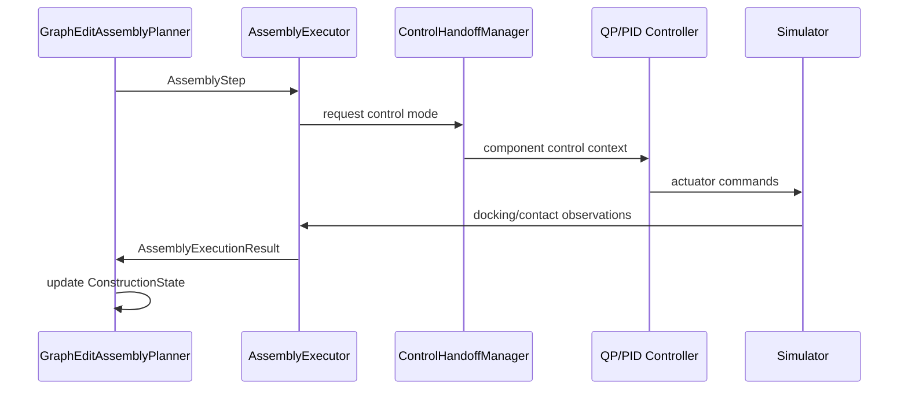

### 17.6 Attach/detach safety

detach では staged release を使う。

```text
1. unload internal/contact wrench
2. split control graph
3. verify component hover/control feasibility
4. physically release latch
5. monitor separation stability
```

Detach release gate は以下を check するべきである。

```text
relative velocity below threshold
relative pose error below threshold
estimated internal wrench below threshold
both components QP feasible
N consecutive stable control steps
```

Thresholds は config values である。

### 17.7 P3/P4 assembly execution boundary

P3 の assembly success は、deterministic `AssemblyRunner` と simplified executor による graph/state integration success であり、物理ドッキング成功率ではない。P3 acceptance は、`ConstructionState` と target `MorphologyGraph` の整合、retry/abort path、archive logging を確認するが、Isaac Lab 上で docking actuator、contact sensing、relative pose convergence、latch verification を物理的に検証したことを意味してはならない。

P4.0 では、P3 assembly result を simplified full-pipeline integration の入力として使ってよい。この場合、docking / verify_attach / detach / separation の成功は simplified execution result として扱われ、P4 full completion の証明にはならない。

P4 full completion では、π_A / `AssemblyRunner` の step を low-level controller target へ変換する bridge が必要である。この bridge は以下を扱う。

```text
move_to_staging / align_ports:
  target relative pose, waypoint, alignment tolerance を controller target へ変換する。

dock / verify_attach:
  dock mechanism command, approach velocity/pose tolerance, contact/latch sensor result を扱う。

detach / separation:
  unload internal/contact wrench, split control graph, release latch, separation stability を扱う。

retry / abort:
  controller-safe recovery target または safe stop target を生成する。
```

将来的な Isaac-backed assembly execution では、docking / verify_attach / detach / separation の success/failure は simulator / controller / sensor result から返される。P4 full completion で assembly を含む rollout を主張する場合、simplified pseudo result ではなく Isaac-backed execution result を保存しなければならない。

---

## 18. ContactCandidateSampler and Morphology-Conditioned Filtering

### 18.1 Key rule

ContactCandidate は morphology と RobotAnchors が存在した **後** に生成される。

```text
Before π_D:
  ContactRegion / ContactSlot / InteractionEnvelope

After π_D:
  RobotAnchor known
  reachability known approximately
  candidate contact points can be sampled and filtered
```

### 18.2 Pipeline

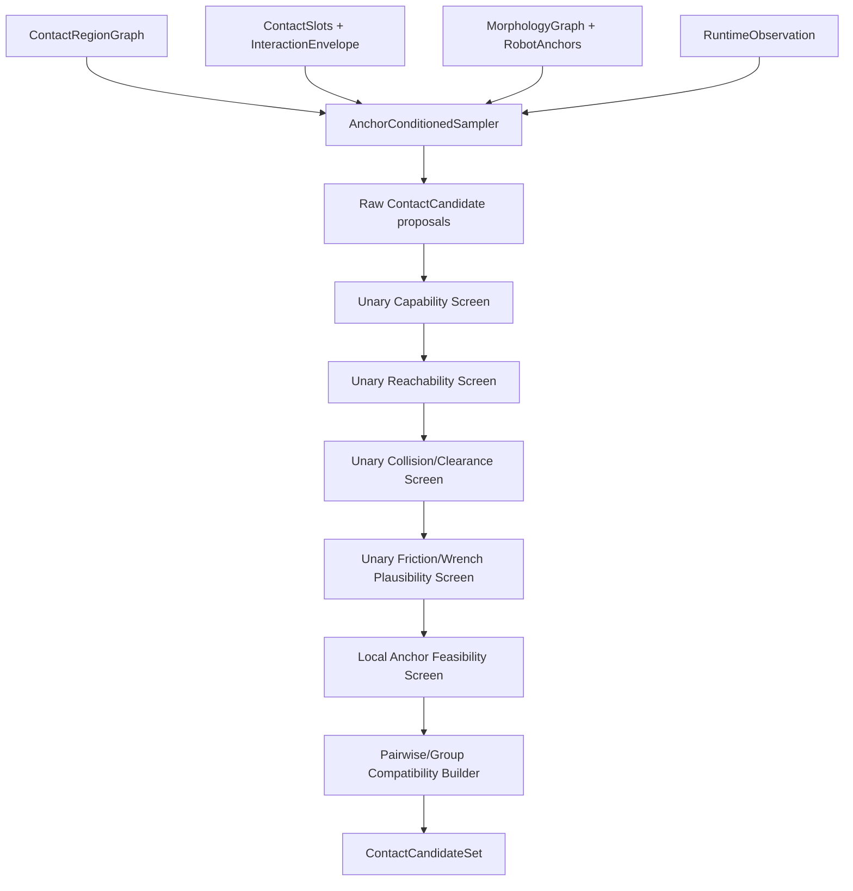

`ContactSlots + InteractionEnvelope` は sampler の required input である。ContactRegionGraph だけでは、どの task-side contact requirement に対する candidate かを決定できない。

### 18.3 ContactCandidate schema

```python
class ContactCandidate:
    candidate_id: int
    slot_id: int
    anchor_id: int
    target_entity_id: str
    region_id: str
    contact_pose_world: Pose7D
    contact_frame_world: Pose7D
    normal_world: tuple[float, float, float]
    tangent_basis_world: list[float]
    contact_mode: ContactMode
    friction: float | None
    patch_area_m2: float
    candidate_scores: dict[str, float]
    unary_valid: bool
    unary_violation_codes: list[str]
```

### 18.4 AnchorConditionedSampler algorithm

Candidate sampler は deterministic または seeded quasi-random sampling を使うべきである。Sampler は単なる surface point sampler ではなく、ContactSlot、RobotAnchor、ContactRegion、contact_mode の組に条件づけて candidate contact pose を生成する。

Required loop:

```text
for each required or optional ContactSlot s selected from IRG/Envelope:
  for each allowed ContactRegion r in s.allowed_region_ids:
    for each RobotAnchor a compatible with s.contact_mode and s.required_anchor_capability:
      for each contact_mode m allowed by both s and a:
        K = quota(s, r, a, m)
        sample K surface points p_i on r using deterministic or seeded quasi-random sampling
        for each p_i:
          estimate normal n_i and tangent basis (t_u_i, t_v_i)
          construct contact frame T_contact_i
          align anchor approach/contact axis with n_i according to m and anchor capability
          compute desired anchor pose T_anchor_i from T_contact_i and anchor local frame
          compute candidate local scores:
            normal_alignment, approach_clearance, local_reachability,
            surface_quality, moment_arm_quality, support_quality, mode_match
          emit ContactCandidate(slot=s, anchor=a, region=r, pose=T_contact_i, mode=m)
```

Quota rule:

```text
K(s,r,a,m) should preserve:
  region area coverage
  normal diversity
  region diversity
  anchor diversity
  mode diversity
  branch diversity from InteractionEnvelope
```

Task-biased sampling:

```text
object grasp/carry:
  include opposing face / inward-normal / high moment-arm candidates.

valve operation:
  include rim/handle candidates with favorable tangential wrench moment arm around valve axis.

perching:
  include latch/perch candidates with stable normal direction and sufficient clearance.

contact-mediated locomotion:
  include support-stable candidates and stance/reanchor diversity.
```

learned scorer は後で追加してよいが、Version 1 では hard pruning を行ってはならない。

### 18.5 ContactCandidateSet schema

```python
class ContactCandidateSet:
    set_id: str
    task_id: str
    morphology_graph_id: str
    candidates: list[ContactCandidate]
    candidate_mask: list[bool]
    slot_coverage: dict[int, list[int]]
    pairwise_conflict_matrix: list[list[bool]]
    pairwise_compatibility_score: list[list[float]]
    group_proposals: list[ContactCandidateGroupProposal]
    assignment_feasibility_cache: dict[str, AssignmentFeasibilityResult]
    sampler_version: str
```

```python
class ContactCandidateGroupProposal:
    group_id: str
    candidate_ids: list[int]
    group_type: Literal["grasp_pair", "multi_grasp", "perch_set", "support_set", "locomotion_stance"]
    group_score: float
    group_violation_codes: list[str]
```

```python
class AssignmentFeasibilityResult:
    assignment_key: str
    candidate_ids: list[int]
    feasible: bool
    violation_codes: list[str]
    wrench_residual: float | None
    qp_residual: float | None
    min_friction_margin: float | None
    min_collision_margin_m: float | None
```

`assignment_key` は sorted candidate ids、contact modes、schedule_state、active phase id から deterministic に生成する。

### 18.6 Unary, pairwise, and assignment-level checks

Unary screens は1つの candidate について明らかな不可能性だけを除外する。以下は unary screen でよい。

```text
anchor capability match
local reachability to candidate pose
local collision / clearance
normal and approach direction compatibility
local friction plausibility
local contact mode compatibility
```

以下は candidate 単体では判断してはならない。

```text
object grasp stability
payload support by multiple contacts
frictional force closure / wrench closure
support polygon or support ratio
full multi-contact collision
actuator feasibility of a selected contact set
full QP feasibility of a trajectory knot
```

これらは pairwise/group compatibility または π_H が選択した `ContactAssignment` set に対する assignment-level feasibility として評価する。

### 18.7 No exhaustive subset enumeration

ContactCandidateSet の任意の subset を全列挙して feasibility を判定してはならない。Version 1 は以下の階層を使う。

```text
1. unary screening
2. diversity-preserving top-K per slot × region × anchor × mode
3. pairwise conflict / compatibility matrix
4. task-specific small group proposals
5. π_H selection over finite horizon
6. assignment-level feasibility for selected ContactAssignment sets
7. cache infeasible assignments and feed violation labels to datasets/training
```

---

## 19. π_H: Contact-Wrench Trajectory Planner

### 19.1 Role

π_H は operation-mode output を置き換える。finite-horizon contact-wrench interaction trajectories を計画する。

Input:

```text
IRG
InteractionEnvelope
MorphologyGraph
RobotAnchors
ContactCandidateSet
RuntimeObservation
```

Output:

```text
ContactWrenchTrajectory over horizon H
```

`grasp`, `carry`, `perch`, `walking` などの operation mode labels は logging / curriculum / debugging 用の derived labels である。primary policy output ではない。

π_H は ContactCandidateSet から `candidate_id` を選び、`slot_id`, `anchor_id`, `contact_mode`, `schedule_state`, wrench bounds, targets を時系列に割り当てる。π_H は ContactCandidateSet の任意 subset を前提にせず、選択した assignment set について assignment-level feasibility を evaluator / checker に問い合わせてよい。

### 19.2 Trajectory schema

```python
class ContactWrenchTrajectory:
    horizon_s: float
    dt_s: float
    knots: list[InteractionKnot]
    derived_mode_label: str | None
```

```python
class InteractionKnot:
    t_rel_s: float
    contact_assignments: list[ContactAssignment]
    centroidal_target: CentroidalTarget | None
    posture_target: PostureTarget | None
    object_targets: list[ObjectTarget]
    priority_weights: dict[str, float]
    guard_conditions: list[Condition]
```

### 19.3 ContactAssignment

```python
class ContactAssignment:
    slot_id: int
    anchor_id: int
    candidate_id: int
    contact_mode: ContactMode
    schedule_state: Literal["approach", "attach", "maintain", "slide", "release"]
    wrench_target: list[float] | None
    wrench_lower: list[float] | None
    wrench_upper: list[float] | None
    priority: float
```

### 19.4 Targets

```python
class CentroidalTarget:
    com_pos_world: tuple[float, float, float] | None
    com_vel_world: tuple[float, float, float] | None
    body_orientation_world: tuple[float, float, float, float] | None
    centroidal_wrench_preference: list[float] | None
```

```python
class PostureTarget:
    joint_pos_target: dict[str, float] | None
    joint_vel_target: dict[str, float] | None
    free_anchor_pose_targets: dict[int, Pose7D] | None
```

```python
class ObjectTarget:
    object_id: str
    pose_target_world: Pose7D | None
    twist_target_world: list[float] | None
    generalized_q_target: list[float] | None
    generalized_qdot_target: list[float] | None
```

### 19.5 π_H diagram

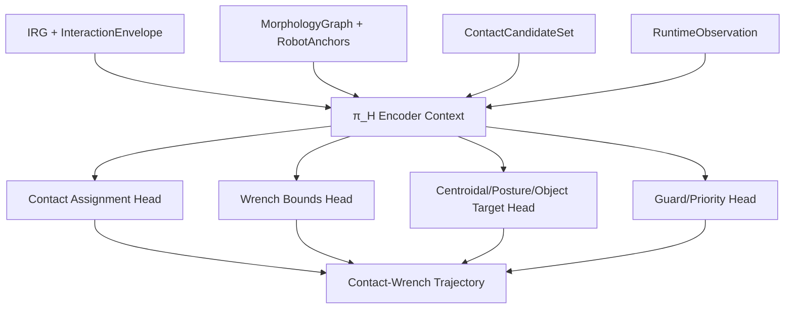

### 19.6 Time scales

Recommended defaults:

```yaml
pi_H:
  update_rate_hz: 2.0
  horizon_s: 2.0
  knot_dt_s: 0.25
```

---

## 20. π_L and Low-Level Control

### 20.1 Role split

π_L は π_H trajectory に condition された short-period intent を出力する。final actuator commands は出力しない。

```text
π_H: 1-3 s horizon interaction plan
π_L: 50-200 Hz tracking intent / residual command
QP/PID: 200-1000 Hz actuator command
```

### 20.2 π_L input

```text
RuntimeObservation
MorphologyGraph
PhysicalModel summary
ContactWrenchTrajectory
current active knot
controller status
```

### 20.3 PolicyCommand schema

```python
class PolicyCommand:
    desired_body_twist: list[float] | None             # [vx, vy, vz, wx, wy, wz]
    desired_body_pose: Pose7D | None
    desired_anchor_pose_offsets: dict[int, Pose7D]
    joint_position_bias: dict[str, float]
    joint_velocity_bias: dict[str, float]
    residual_wrench_body: list[float] | None
    contact_tracking_bias: dict[int, list[float]]
    priority_weights: dict[str, float]
```

### 20.4 ControllerCommand schema

```python
class ControllerCommand:
    rotor_thrusts_n: dict[str, float]
    vectoring_joint_targets: dict[str, float]
    joint_torque_commands: dict[str, float]
    dock_mechanism_commands: dict[str, float]
    controller_status: ControllerStatus
```

### 20.5 QP objective

各 control step で constrained allocation problem を解く。

Generic form:

```text
min_u  1/2 || A u - w_des ||^2_Q
       + α_u ||u||^2
       + α_Δ ||u - u_prev||^2
       + α_contact ||w_contact - w_contact_ref||^2

subject to:
  u_min <= u <= u_max
  joint limits
  contact friction cone approximations
  safety bounds
```

`u` は backend implementation に応じて rotor thrusts、vectoring joint targets、joint torque commands、contact proxy variables を含む。

### 20.6 Desired Wrench / Pose / Joint Bias Builder

`CentroidalTarget` と `PostureTarget` は別の target 種別である。`CentroidalTarget` は COM, body orientation, centroidal wrench preference を表す。`PostureTarget` は joint reference と free anchor pose reference を表す。`joint_position_bias` と `joint_velocity_bias` は COM 座標への offset ではなく、nominal joint reference への learned residual である。

Builder は以下を行う。

```text
q_nom, qdot_nom = reference from active PostureTarget or nominal posture generator
δq = PolicyCommand.joint_position_bias
δqdot = PolicyCommand.joint_velocity_bias
q_ref = clip(q_nom + δq, joint_limits)
qdot_ref = clip(qdot_nom + δqdot, velocity_limits)

w_H = wrench reference from active ContactWrenchTrajectory / CentroidalTarget
w_res = PolicyCommand.residual_wrench_body
w_pose = pose tracking wrench from desired_body_pose / desired_body_twist
w_des = w_H + w_res + w_pose

contact_ref = active ContactAssignment references
contact_ref = apply contact_tracking_bias to pose/force/weight references
qp_weights = merge trajectory priority_weights with PolicyCommand.priority_weights
```

QP/PID backend は実装方式に応じて、joint bias を次のどちらか、または両方として使ってよい。

```text
QP reference cost:
  + α_q    || q_next(u)    - q_ref    ||^2
  + α_qdot || qdot_next(u) - qdot_ref ||^2

PD-derived reference:
  τ_ref = Kp(q_ref - q) + Kd(qdot_ref - qdot)
```

`desired_anchor_pose_offsets` と `contact_tracking_bias` は selected anchors/candidates の追従補正であり、anchor pose reference、contact force reference、または QP tracking weights に変換される。最終 actuator command は常に QP/PID/controller layer が出力する。

### 20.7 Control diagram

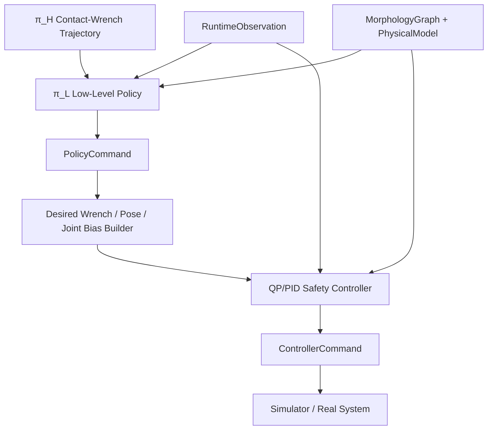

### 20.8 Controller bridge and actuator mapping for Isaac

`QPIDController` / `QPAllocator` の initial implementation は simplified scaffold であってよい。P4 full grasp/carry / Isaac execution では、`ControllerCommand` を Isaac backend の actuator targets へ変換する controller bridge が必須である。

Agent I/J は以下を提供しなければならない。

```text
Input:
  PolicyCommand
  active InteractionKnot
  RuntimeObservation
  PhysicalModel
  assembled MorphologyGraph / ConstructionState
  controller status

Output:
  ControllerCommand
  Isaac actuator target record
  controller bridge metrics
```

Requirements:

```text
1. assembled morphology から active rotors, vectoring joints, dock actuators, module ids を抽出する。
2. ControllerCommand -> Isaac actuator target 変換器を提供する。
3. assembled morphology に応じた rotor / vectoring joint / dock actuator mapping を作る。
4. missing actuator / unsupported actuator / clipped command / infeasible allocation を metrics として記録する。
5. existing BoundedVerticalRotorAllocator は fallback として残してよい。
6. exact multi-axis/contact-aware QP が未実装の場合は simplified allocator と明記する。
7. π_A 用に docking / detach / separation control handoff request を controller target へ変換する bridge を提供する。
8. controller infeasible / clipped / residual / unsupported wrench を RuntimeObservation と EpisodeArchive に保存する。
```

π_L は actuator command を直接出力してはならない。最終 actuator authority は常に controller / QP / safety layer と controller bridge に属する。

---

## 21. Encoder Architecture and Shared Interaction Workspace

### 21.1 Principle

specialized encoders と fusion workspace を使う。すべての modalities に単一の encoder type を使ってはならない。

```text
TaskSpecEncoder
GeometryEncoder
IRGEncoder
InteractionEnvelopeEncoder
MorphologyEncoder
ContactCandidateEncoder
RuntimeObservationEncoder
PhysicalModel/CapabilityEncoder
  -> FusionEncoder
  -> QueryPooling
  -> π_D, π_H, π_L, critics, feasibility heads
```

### 21.2 Backend config

```yaml
model:
  task_encoder_type: mlp_embedding
  geometry_encoder_type: graph_transformer
  irg_encoder_type: hetero_graph_transformer
  morphology_encoder_type: graph_transformer
  runtime_encoder_type: hybrid_mlp_graph
  fusion_type: transformer
  query_pooling: learned_queries
```

`morphology_encoder_type: gnn` が選択された場合、それは morphology graph encoding にのみ適用され、TaskSpec scalar tokens へ自動的に適用されるわけではない。

同じ rule はすべての `*_encoder_type` に適用する。Graph encoder backend は明確な node/edge 構造を持つ modality にだけ使う。TaskSpec scalar/enum、InteractionEnvelope summary、SafetySpec などの non-graph fields は MLP + embedding または token MLP で encode する。

InteractionEnvelopeEncoder は required component である。backend config に専用 key が存在しない場合、実装は `mlp_embedding` fallback を使う。

ContactCandidateEncoder は π_H contexts で required component である。ContactCandidateSet が存在しない π_D contexts では empty candidate token group と mask を渡す。

### 21.3 Shared workspace diagram

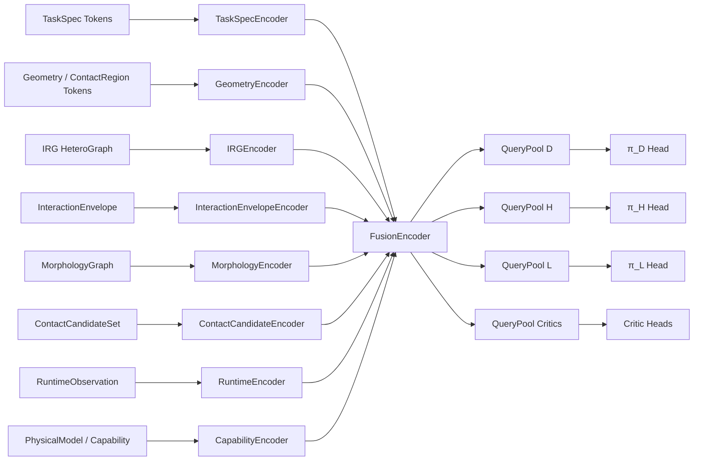

### 21.4 Token categories

```text
Task tokens:
  task type embedding, goal features, safety features, robot constraint features

Geometry tokens:
  object tokens, global shape tokens, surface patch tokens, contact region tokens

IRG tokens:
  heterogeneous node/edge embeddings

InteractionEnvelope tokens:
  contact count range, required contact mode tokens, target region set tokens, wrench requirement summary tokens, precision/duration/capability tokens, branch option tokens

Morphology tokens:
  module tokens, port tokens, dock edge tokens, robot anchor tokens, control group tokens

ContactCandidate tokens:
  candidate pose/normal/friction/mode tokens, unary scores, slot-anchor-region ids, pairwise/group summaries

Runtime tokens:
  module state tokens, object state tokens, contact state tokens, controller status tokens
```

### 21.5 Tensor conventions

すべての variable-length tensors は padding and masks を使う。

```text
mask = 1: valid
mask = 0: padding/invalid
```

zero-valued feature vectors から validity を推定してはならない。

### 21.6 SharedInteractionWorkspace tensor contract

Shared Interaction Workspace は external serialized schema ではなく、NN 内部の tensor contract である。実装は以下の dataclass または同等の TypedDict を定義しなければならない。

```python
class SharedInteractionWorkspace:
    tokens: FloatTensor              # [B, N_total, d_model]
    mask: BoolTensor                 # [B, N_total], True means valid
    token_type_ids: LongTensor       # [B, N_total]
    source_type_ids: LongTensor      # [B, N_total]
    source_ids: LongTensor           # [B, N_total], original node/candidate/module/object id or -1
    group_slices: dict[str, slice]
    group_masks: dict[str, BoolTensor]
    query_outputs: dict[str, FloatTensor] | None
```

`group_slices` は少なくとも以下の keys を持つ。

```text
task
geometry
irg
interaction_envelope
morphology
runtime
capability
contact_candidates optional, only for π_H contexts
```

各 head は `source_ids` を使って output ids を元 schema ids へ戻せなければならない。特に π_H の `candidate_id`, `slot_id`, `anchor_id` は workspace 内部 index ではなく source schema id を参照する。

### 21.7 Learned queries

`query_pooling: learned_queries` の queries は trainable parameters であり、独立した policy ではない。実装は以下を定義する。

```python
class LearnedQuerySpec:
    query_name: Literal["design", "high_level", "low_level", "critic", "feasibility"]
    num_queries: int
    d_model: int
    allowed_token_groups: list[str]
```

Recommended minimum:

```text
query_D: design context for π_D
query_H: contact-wrench trajectory context for π_H
query_L: low-level control context for π_L
query_V: critic context
query_F: feasibility/proxy context
```

Queries are updated by downstream losses through attention pooling and head gradients.

---

## 22. Reward, Critics, and Credit Assignment

### 22.1 Distinctions

```text
Proxy score:
  deterministic or heuristic score computed from model/checker.

Reward:
  scalar signal from environment/task execution.

Critic:
  learned value function predicting expected future return.
```

Proxy と critic は相関しうるが、同一の object ではない。

### 22.2 Critics

```text
V_D: evaluates design-stage decisions
V_H: evaluates high-level contact-wrench trajectory decisions
V_L: evaluates low-level control decisions
```

π_A は Version 1 では deterministic なので、learned V_A は不要である。Assembly metrics は log するべきである。

### 22.3 Stage masks

各 training sample は以下の masks を含まなければならない。

```text
design_decision_mask
high_level_decision_mask
low_level_control_mask
assembly_execution_mask
```

これらの masks により、relevant heads のみを update する。

### 22.4 Grasp & carry reward terms

Per-step reward:

```text
r_t =
  + w_progress * r_object_goal_progress
  + w_pose     * r_object_pose_accuracy
  + w_grasp    * r_grasp_maintenance
  + w_stable   * r_centroidal_stability
  - w_energy   * r_energy
  - w_qp       * r_qp_residual
  - w_slip     * r_slip
  - w_collision* r_collision
  - w_saturation * r_actuator_saturation
```

Terminal reward:

```text
R_terminal =
  + success_bonus if object pose within tolerance and contact release valid
  - failure_penalty if object dropped, collision hard fail, timeout, QP infeasible terminal
```

### 22.5 Design reward

```text
R_D = R_task_summary
    + λ_proxy * R_design_proxy
    - λ_complexity * C_complexity
    - λ_assembly * C_assembly
    - λ_feas * C_feas_violation
```

### 22.6 High-level reward

```text
R_H = R_task_progress
    + R_contact_schedule_success
    + R_wrench_requirement_satisfaction
    - R_mode_switch_instability
```

### 22.7 Low-level reward

```text
R_L = R_tracking
    + R_contact_stability
    + R_qp_feasible
    - R_energy
    - R_saturation
    - R_slip
```

### 22.8 Advantage

For each head:

```text
A_stage = G_stage - V_stage(context_stage)
```

corresponding stage mask が active のときのみ、その head を update する。

---

## 23. Simulation Environment and Task Environments

### 23.1 Simulator targets

Version 1 は Isaac Sim / Isaac Lab を support するべきである。実装は simulator-specific code を interfaces の背後に isolate するべきである。

```python
class SimulationEnvBase:
    def reset(self, task_spec, morphology=None): ...
    def step(self, controller_command): ...
    def get_runtime_observation(self) -> RuntimeObservation: ...
```

### 23.2 RuntimeObservation

```python
class RuntimeObservation:
    time_s: float
    morphology_graph: MorphologyGraph
    module_states: list[ModuleRuntimeState]
    object_states: list[ObjectRuntimeState]
    contact_states: list[ContactState]
    controller_status: ControllerStatus
    task_progress: TaskProgressState
```

### 23.3 Contact modeling v1

Version 1 は simplified contact を使ってよい。

```text
grasp attach:
  kinematic/fixed-joint approximation after conditions are satisfied

object transport:
  attached object with break force/torque thresholds

support/perch:
  contact force logging + simplified constraint or fixed support after attach

valve:
  revolute joint object with axis, torque requirement, angle state
```

### 23.4 Domain randomization

For grasp & carry:

```text
object mass
object size
object shape
object friction
target pose
initial object pose
wind perturbation
sensor noise
thrust scale error
contact break threshold
```

### 23.5 Isaac Lab backend requirements for P4

P4 full completion には Isaac Lab backend が必要である。simplified backend は P4.0 wiring と crash-free interface validation に使ってよいが、P4 full completion の物理的成功率、object drop rate、hard collision rate、controller/QP infeasible terminal rate を主張する source ではない。

Isaac Lab backend は以下を提供しなければならない。

```text
spawn:
  Holon module
  assembled MorphologyGraph
  object geometry / mass / friction
  floor and required support surfaces

runtime API:
  reset(task_spec, morphology, assembly_state)
  step(controller_command or actuator_targets)
  get_runtime_observation()

controller bridge:
  ControllerCommand -> Isaac actuator target conversion
  active rotor / vectoring joint / dock actuator mapping
  missing / unsupported / clipped actuator metrics

logging:
  object pose
  module pose and velocity
  contact state
  object drop event
  hard collision event
  controller infeasible status
  QP residual / allocation residual
  actuator target records
```

P4 full completion では、Isaac step で actuator command が実際に実行され、その結果から `RuntimeObservation`、reward、metrics、`EpisodeArchive` が更新されなければならない。deterministic rollout と minimum learning run の両方を保存すること。

---

## 24. Training Curriculum and Evaluation Phases

### 24.1 P0 acceptance

```text
TaskSpec parses example YAML.
GeometryProcessor returns GeometryDescriptor for primitives and mesh objects.
URDF parser reads developer reference holon.urdf if present.
IRGBuilder generates valid IRG for every task family.
InteractionEnvelope extracts from every IRG.
All schemas serialize/deserialize.
All padded tensor shape tests pass.
```

### 24.2 P1: diverse object grasp & carry with fixed/simple morphology

Goal: simple morphology を使い、GeometryProcessor、IRGBuilder、π_H/π_L/controller loop を検証する。

Acceptance:

```text
success_rate >= 60% on training object distribution with fixed morphology
no schema/checker crashes over 1000 episodes
contact candidate sampler returns non-empty candidates for valid objects
```

### 24.3 P2: design for grasp & carry

Goal: π_D と FeasibilityChecker を train/evaluate する。

Acceptance:

```text
valid_design_rate >= 70%
required_slot_coverage >= 90% for accepted designs
closed_loop_invalid designs rejected
feasibility labels stored correctly
```

### 24.4 P3: assembly integration

Goal: deterministic assembly plan を実行する。

Acceptance:

```text
assembly_success_rate >= 70% in simplified sim
retry/abort paths tested
ConstructionState updates match physical graph changes
```

### 24.5 P4: full grasp & carry

P4 は、simplified full-pipeline integration と Isaac-backed full grasp/carry completion を明確に分ける。

```text
P4.0:
  simplified full-pipeline integration

P4-control / P4a:
  low-level flight validation in Isaac Lab

P4.1:
  Isaac Lab backend smoke

P4.2:
  Isaac deterministic full grasp & carry rollout

P4.3:
  Isaac learning bootstrap

P4 full completion:
  Isaac-backed rollout + minimum learning run + acceptance
```

P4.0 は P4 full completion ではない。P4.0 の success_rate / object_drop_rate / collision_rate / QP infeasible rate は simplified backend 上の指標であり、Isaac Lab 上の物理的成功率ではない。P4.0 を P4 complete と呼んではならない。

#### 24.5.1 P4.0: simplified full-pipeline integration

Goal: simplified backend 上で、P2 selected `DesignOutput`、P3 assembly result、`ContactCandidateSampler`、π_H、π_L、controller scaffold、`EpisodeArchive` logging を接続する。

P4.0 では以下を実装してよい。

```text
P2 / P2.5:
  selected DesignOutput を使う。
  auxiliary learned π_D scorer / feasibility head を参照可能にしてよい。
  deterministic P2DesignPolicy / FeasibilityChecker fallback は残す。

P3:
  assembly result を使う。
  P3 simplified assembly success を physical docking success と解釈しない。

Design / morphology:
  FixedSimpleDesignPolicy 固定経路を避ける。
  P2 selected morphology / P3 assembled morphology を downstream に渡す。

Contact / trajectory / control:
  assembly 成功後の morphology から contact candidates を生成する。
  selected assignment feasibility cache を記録する。
  baseline π_H trajectory を生成する。
  π_L は PolicyCommand を出す。
  controller layer は ControllerCommand を出す。
  π_L は actuator command を直接出さない。

Logging:
  EpisodeArchive に design, feasibility, assembly_plan, trajectory,
  PolicyCommand, ControllerCommand, rewards, metrics を保存する。
```

P4.0 simplified acceptance:

```text
P2 selected DesignOutput を使う。
P3 assembly result を使う。
FixedSimpleDesignPolicy 固定経路を使わない。
contact candidates が生成される。
π_H trajectory が生成される。
π_L PolicyCommand が生成される。
ControllerCommand が生成される。
EpisodeArchive に必要な情報が保存される。
simplified success_rate / object_drop_rate / collision_rate / QP infeasible rate を記録する。
report に simplified backend 指標であり物理成功率ではないことを明記する。
```

#### 24.5.2 P4-control / P4a: low-level flight validation in Isaac Lab

Goal: object grasp/carry や contact task に入る前に、Isaac Lab 上で controller / actuator mapping / `RuntimeObservation` / `EpisodeArchive` の下位閉ループを検証する。

P4 full completion の前提条件として、以下の低レイヤ検証を必須とする。

1. Isaac single-module hover smoke

```text
Holon module 単体を Isaac Lab に spawn する。
rotor / vectoring joint / actuator target が Isaac 側に渡ることを確認する。
deterministic hover controller で一定時間 crash-free に hover できるか確認する。
RuntimeObservation に pose, velocity, actuator/controller status を保存する。
EpisodeArchive に controller_commands, actuator_targets, metrics を保存する。
```

2. Fixed morphology hover smoke

```text
2-module または 3-module の決め打ち connected morphology を spawn する。
まず P2/P3 の出力でなく固定構造でよい。
assembled morphology に対して active rotors / vectoring joints / dock actuators の mapping を確認する。
hover, attitude hold, small position hold を行う。
```

3. Fixed morphology waypoint tracking

```text
object なしで、決め打ち構造を target pose / waypoint に追従させる。
π_H は使わず、低レイヤ controller target を直接与えてよい。
π_L を使う場合でも、π_L は PolicyCommand のみを出し、最終 actuator command は controller layer が出す。
```

P4-control acceptance:

```text
single-module hover が crash-free に完了する。
fixed morphology hover が crash-free に完了する。
fixed morphology waypoint tracking が一定 pose error 以下で完了する。
ControllerCommand と Isaac actuator target record が EpisodeArchive に保存される。
RuntimeObservation が各 step で保存される。
controller infeasible / clipped allocation / residual metrics が保存される。
```

#### 24.5.3 P4.1: Isaac Lab backend smoke

Goal: Isaac Lab backend の reset / step / observation / logging path を smoke-test する。

P4.1 では、Holon module、assembled morphology、object、floor を spawn し、`ControllerCommand` から Isaac actuator targets への変換が動作することを確認する。contact-rich grasp/carry success は P4.2 で評価する。

Acceptance:

```text
Isaac backend reset が TaskSpec と MorphologyGraph を受け取る。
Isaac backend step が actuator targets を実行する。
RuntimeObservation が module pose, object pose, contact/controller status を含む。
EpisodeArchive が controller_commands, actuator target records, metrics を保存する。
missing actuator / unsupported actuator / clipped command が metrics に記録される。
```

#### 24.5.4 P4.2: Isaac deterministic full grasp & carry rollout

Goal: Isaac Lab 上で deterministic fallback policies/controllers を使い、object grasp & carry rollout を実行する。

P4.2 は learned policy quality を主張する phase ではない。deterministic `P2DesignPolicy`、deterministic `FeasibilityChecker`、baseline π_H、baseline π_L、controller bridge / allocator fallback を残したまま、Isaac-backed rollout metrics を保存する。

Acceptance:

```text
Isaac rollout success_rate を記録する。
object_drop_rate を記録する。
hard_collision_rate を記録する。
controller/QP infeasible terminal rate を記録する。
rollout archive を保存する。
deterministic fallback が残っている。
```

#### 24.5.5 P4.3: Isaac learning bootstrap

Goal: Isaac-backed rollout から、π_L、π_H、π_D scorer / selector の段階的な最小学習 run を開始する。

P4.3 learning bootstrap は π_L だけを意味しない。P4.3 では以下の3系統を段階的に学習対象とする。ただし、最初から全 policy を同時に RL してはならない。deterministic fallback と deterministic safety gate を常に残すこと。

1. π_L / residual controller learning

```text
Input:
  Isaac RuntimeObservation
  MorphologyGraph
  PhysicalModel summary
  active ContactWrenchTrajectory / InteractionKnot
  controller status

Output:
  PolicyCommand
  residual control intent
```

π_L / residual controller learning は、Isaac 上の `RuntimeObservation` を入力に、`PolicyCommand` または residual control intent を学習する。最終 actuator command は引き続き controller layer が出す。deterministic π_L fallback を残す。

2. π_H contact / trajectory policy learning

```text
Input:
  ContactCandidateSet
  InteractionEnvelope
  MorphologyGraph
  RuntimeObservation
  assignment feasibility cache

Output:
  contact assignment
  ContactWrenchTrajectory
  phase / knot timing
  priority weights
```

π_H learning は、ContactCandidateSet、InteractionEnvelope、MorphologyGraph、RuntimeObservation を入力に、contact assignment、`ContactWrenchTrajectory`、phase/knot timing、priority weights を学習する。最初は baseline π_H trajectory を teacher にした imitation / supervised learning でもよい。その後、Isaac rollout reward を使った RL または fine-tuning へ進める。deterministic π_H fallback を残す。

3. π_D outcome-conditioned design scorer / selector fine-tuning

```text
Input:
  P2 candidate DesignOutput set
  FeasibilityResult
  Isaac rollout outcome
  task success / object drop / collision / controller infeasible
  reward / return

Output:
  candidate morphology scoring
  candidate ranking
  selected DesignOutput
```

π_D scorer fine-tuning は、P2.5 で学習した π_D scorer を初期値または補助モデルとして使ってよい。Isaac rollout 結果、task success、object drop、collision、controller infeasible、reward を使って、candidate morphology scoring / ranking を fine-tune する。π_D は引き続き final actuator command を出さない。deterministic `P2DesignPolicy` と `FeasibilityChecker` fallback を残す。hard safety 判定は `FeasibilityChecker` が source of truth であり、learned feasibility head で置き換えてはならない。

P4.3 推奨順序:

```text
P4.3a:
  deterministic π_D / π_H / π_L rollout で Isaac dataset を収集する。

P4.3b:
  π_L または residual controller を最小学習する。

P4.3c:
  π_H を teacher imitation または rollout reward で学習する。

P4.3d:
  π_D scorer を Isaac rollout outcome で fine-tune する。

P4.3e:
  必要に応じて π_D / π_H / π_L の joint fine-tuning を行う。
  ただし最初から全 policy を同時に RL しない。
```

P2.5 の π_D scorer / feasibility head は補助モデルであり、P4 開始時点の production source of truth ではない。learned models を production path で使う場合は、deterministic safety gate を必ず通す。

Required artifacts:

```text
π_L または residual controller checkpoint
π_L / residual controller metrics
π_L / residual controller reward curve
π_H checkpoint
π_H metrics
π_H rollout evaluation
π_D scorer fine-tuning checkpoint
π_D scorer fine-tuning metrics
π_D rollout outcome evaluation
Isaac rollout archive
training config hash
deterministic fallback path metadata for π_D / π_H / π_L
```

full end-to-end fine-tuning は、P4.3 の minimum learning run が保存され、rollout / controller / safety metrics が確認された後の段階とする。

#### 24.5.6 P4 full acceptance

P4 full completion は、P4.0 simplified acceptance だけでは満たされない。以下を含む必要がある。

```text
P4.0 simplified full-pipeline wiring accepted
P4-control low-level flight validation accepted
P4.1 Isaac backend smoke accepted
P4.2 Isaac deterministic rollout archived
P4.3 minimum learning run archived
```

P4 full acceptance:

```text
success_rate >= 50% on held-out Isaac object distribution
object_drop_rate <= 20%
hard_collision_rate <= 5%
controller/QP infeasible terminal <= 10%
reward curve exists
π_L or residual controller checkpoint / metrics / reward curve exist
π_H checkpoint / metrics / rollout evaluation exist
π_D scorer fine-tuning checkpoint / metrics / rollout outcome evaluation exist
rollout archive exists
deterministic fallback remains available for π_D / π_H / π_L
learned production path passes deterministic safety gates
```

#### 24.5.7 P4 full-pipeline diagram

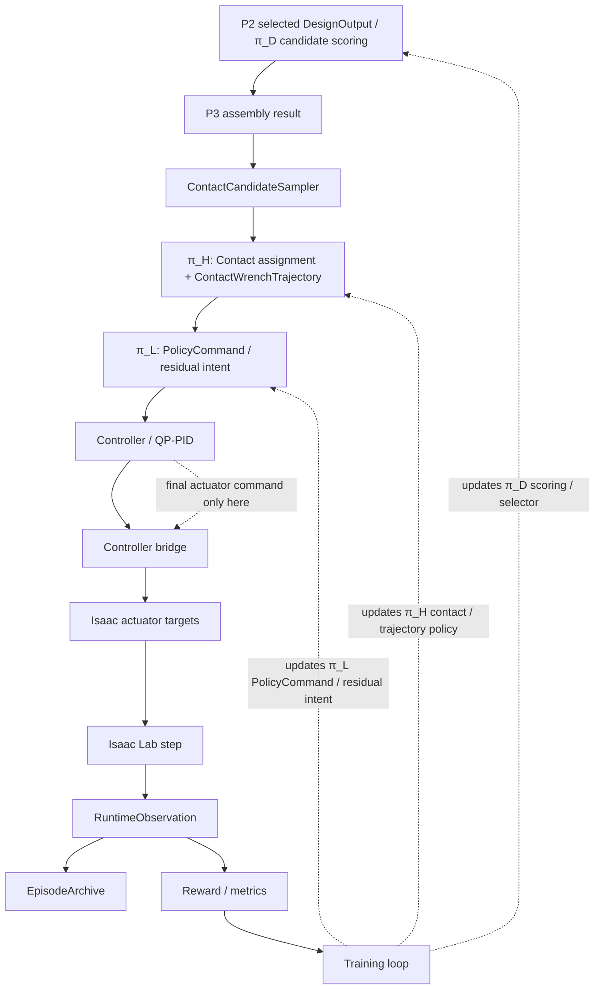

### 24.6 P5-P7 later tasks

P4 が動作した後に以下へ進む。

```text
P5 valve_operation
P6 perching_manipulation
P7 contact_mediated_locomotion
```

各 phase は task-specific success metrics を持ち、同じ IRG/Morphology/π_H/π_L interfaces を使わなければならない。

---

## 25. Data, Logging, and Dataset Schemas

### 25.1 EpisodeArchive

```python
class EpisodeArchive:
    episode_id: str
    task_spec: TaskSpec
    task_hash: str
    geometry_hashes: dict
    robot_model_hash: str
    config_hash: str
    irg: InteractionRequirementGraph
    interaction_envelope: InteractionEnvelope
    design_output: DesignOutput | None
    feasibility_result: FeasibilityResult | None
    assembly_plan: AssemblyPlan | None
    trajectory_records: list[ContactWrenchTrajectory]
    policy_commands: list[PolicyCommand]
    controller_commands: list[ControllerCommand]
    runtime_observations: list[RuntimeObservation]
    actuator_target_records: list[dict]
    rewards: list[dict]
    metrics: dict
    success: bool
    failure_reason: str | None
    rollout_artifacts: dict
    learning_artifacts: dict
```

`runtime_observations` と `actuator_target_records` は P4-control / Isaac-backed P4 で必須である。simplified P1-P4.0 archives では空 list でもよいが、Isaac rollout を P4 full completion の根拠にする場合は各 step の observation と actuator target conversion record を保存しなければならない。`learning_artifacts` は checkpoint、metrics、reward curve、rollout archive path などの reproducibility references を保存するために使う。

### 25.2 Dataset types

```text
DesignDataset:
  TaskSpec, IRG, Envelope, DesignAction sequence, FeasibilityResult, task return

FeasibilityDataset:
  partial/full morphology, action, violation codes, margins, labels

ContactCandidateDataset:
  morphology, robot anchors, ContactSlots, ContactCandidateSet, unary scores, pairwise compatibility, group proposals, assignment feasibility results

InteractionTrajectoryDataset:
  IRG, morphology, contact candidates, π_H trajectory, selected assignments, assignment feasibility results, returns

LowLevelControlDataset:
  runtime obs, π_H plan, π_L command, controller status, reward

LowLevelFlightDataset:
  Isaac single-module/fixed-morphology runtime obs, controller commands, actuator targets, pose errors, controller metrics

IsaacRolloutDataset:
  TaskSpec, morphology, assembly result, trajectories, runtime observations, actuator targets, rewards, success/drop/collision/QP metrics

GeometryCache:
  geometry_ref hash -> GeometryDescriptor

IRGCache:
  task_hash + geometry_hash -> IRG + Envelope
```

### 25.3 Reproducibility metadata

すべての run は以下を log しなければならない。

```text
git_commit or source hash
config_hash
robot_model_hash
URDF hash
thrust_model_hash
task_hash
geometry asset hashes
random seed
simulator version
```

---

## 26. Codex Multi-Agent Implementation Plan

実装は agents または work packages に分解するべきである。

Agent boundaries below are normative for cross-module schema ownership. Codex may decompose tasks inside each agent, but must not redefine schema boundaries, rename core artifacts, or move source-of-truth responsibilities across agents without updating this specification.

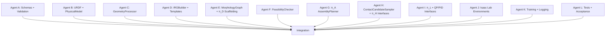

### 26.1 Agent A: Schemas and validation

Deliverables:

```text
amsrr/schemas/task_spec.py
amsrr/schemas/geometry.py
amsrr/schemas/irg.py
amsrr/schemas/interaction_envelope.py
amsrr/schemas/morphology.py
amsrr/schemas/physical_model.py
amsrr/schemas/runtime.py
amsrr/schemas/policies.py
amsrr/schemas/feasibility.py
amsrr/schemas/workspace.py
amsrr/schemas/contact_candidates.py
schema serialization tests
```

### 26.2 Agent B: URDF / PhysicalModel

Deliverables:

```text
amsrr/robot_model/urdf_loader.py
amsrr/robot_model/thrust_model.py
amsrr/robot_model/physical_model_builder.py
tests parsing ./module_urdf/holon.urdf when present
```

### 26.3 Agent C: GeometryProcessor

Deliverables:

```text
amsrr/geometry/asset_resolver.py
amsrr/geometry/geometry_processor.py
amsrr/geometry/surface_patch_graph.py
amsrr/geometry/contact_region_extractor.py
primitive and mesh tests
```

### 26.4 Agent D: IRGBuilder

Deliverables:

```text
amsrr/irg/irg_builder.py
amsrr/irg/templates/*.py
amsrr/irg/envelope_extractor.py
amsrr/irg/validator.py
IRG examples for all task families
```

### 26.5 Agent E: MorphologyGraph + π_D scaffolding

Deliverables:

```text
amsrr/morphology/graph.py
amsrr/policies/design_policy_base.py
amsrr/policies/design_candidate_generator.py
amsrr/policies/design_teacher.py
```

### 26.6 Agent F: FeasibilityChecker

Deliverables:

```text
amsrr/feasibility/checker.py
amsrr/feasibility/checks/*.py
amsrr/feasibility/violation_codes.py
checker unit tests
```

### 26.7 Agent G: AssemblyPlanner

Deliverables:

```text
amsrr/assembly/graph_edit_planner.py
amsrr/assembly/construction_state.py
amsrr/assembly/control_handoff.py
amsrr/assembly/executor_interface.py
```

### 26.8 Agent H: ContactCandidateSampler + π_H

Deliverables:

```text
amsrr/policies/contact_candidate_sampler.py
amsrr/policies/contact_candidate_set.py
amsrr/policies/contact_candidate_encoder.py
amsrr/policies/high_level_policy_base.py
amsrr/policies/contact_wrench_trajectory.py
```

### 26.9 Agent I: π_L + Controller interface

Deliverables:

```text
amsrr/policies/low_level_policy_base.py
amsrr/controllers/policy_command_builder.py
amsrr/controllers/controller_base.py
amsrr/controllers/qpid_controller.py
amsrr/controllers/qp_allocator_interface.py
amsrr/controllers/isaac_controller_bridge.py
amsrr/controllers/actuator_mapping.py
```

### 26.10 Agent J/K/L

Simulation、training、logging、tests は、schemas、geometry、IRGBuilder、robot model、feasibility checker の unit tests が pass した後に integrate すること。

P4 では以下を分けて ownership すること。

```text
Agent J:
  Isaac Lab backend
  Holon / assembled morphology / object / floor spawn
  reset / step / RuntimeObservation extraction
  Isaac actuator target execution
  P4-control low-level flight validation environments

Agent K:
  P4.0 simplified full-pipeline runner
  P4-control rollout logging
  P4.1 / P4.2 Isaac rollout runners
  P4.3 minimum learning bootstrap
  checkpoint / metrics / reward curve / rollout archive logging

Agent L:
  P4.0 simplified acceptance
  P4-control acceptance
  P4 full acceptance
  archive completeness and no-mislabeling checks
```

---

## 27. Implementation Order and Acceptance Tests

### 27.1 Implementation order

```text
1. schemas and enums
2. config loading and hashing
3. URDF parser and PhysicalModel builder
4. GeometryProcessor for primitives
5. GeometryProcessor for mesh
6. IRGBuilder and templates, including phase_label -> phase_type mapping
7. InteractionEnvelopeExtractor and InteractionEnvelopeEncoder
8. SharedInteractionWorkspace schema and query pooling contracts
9. MorphologyGraph and DesignOutput
10. FeasibilityChecker hard checks
11. deterministic design teacher and π_D scaffolding
12. π_A GraphEditAssemblyPlanner
13. ContactCandidateSampler and ContactCandidateSet compatibility schema
14. π_H trajectory schema, baseline planner, and assignment-level feasibility interface
15. π_L command schema and baseline policy
16. Desired Wrench / Pose / Joint Bias Builder
17. QP/PID controller interface
18. P4.0 simplified full-pipeline integration runner
19. P4.0 archive completeness and simplified acceptance
20. controller bridge / actuator mapping for Isaac
21. P4-control Isaac single-module hover
22. P4-control Isaac fixed-morphology hover and waypoint tracking
23. Isaac Lab backend smoke
24. Isaac deterministic full grasp & carry rollout
25. Isaac rollout datasets/logging
26. minimum P4.3 learning bootstrap
27. P4 full acceptance tests
28. later training loops and joint fine-tuning
```

### 27.2 P0 unit tests

```text
test_task_spec_parse_grasp_carry_yaml
test_geometry_processor_box_regions
test_geometry_processor_mesh_smoke
test_urdf_parse_holon_if_present
test_physical_model_total_mass_positive
test_irg_builder_grasp_carry_valid
test_irg_builder_all_task_families_smoke
test_interaction_envelope_extract
test_phase_label_to_phase_type_mapping
test_shared_interaction_workspace_tensor_shapes
test_contact_candidate_pairwise_conflict_matrix
test_assignment_level_qp_infeasible_case
test_policy_command_bias_builder
test_schema_roundtrip_json
test_padded_tensor_masks
```

### 27.3 Integration tests

```text
test_task_to_irg_to_envelope
test_task_to_design_teacher_to_feasibility
test_design_to_assembly_plan
test_design_to_contact_candidates
test_contact_candidates_to_group_proposals
test_piH_baseline_outputs_valid_trajectory
test_piH_selected_assignment_feasibility
test_piL_baseline_outputs_policy_command
test_policy_command_builder_outputs_qp_refs
test_controller_interface_accepts_policy_command
test_p4_0_uses_p2_selected_design_and_p3_assembly_result
test_p4_0_archive_contains_trajectory_policy_controller_rewards
test_controller_bridge_maps_controller_command_to_isaac_targets
test_isaac_single_module_hover_smoke
test_isaac_fixed_morphology_hover_smoke
test_isaac_fixed_morphology_waypoint_tracking
test_isaac_full_grasp_carry_rollout_archives_runtime_observations
test_p4_minimum_learning_run_writes_checkpoint_metrics_reward_curve
test_p4_full_acceptance_requires_isaac_rollout_and_learning_artifacts
```

---

## 28. Worked Example: Diverse Object Grasp & Carry

### 28.1 Input

Task: 1 kg の box を target pose へ移動する。

TaskSpec contains:

```text
object geometry_ref or primitive box parameters
object pose
object mass
object friction
goal object pose
robot module count limit
safety constraints
```

### 28.2 GeometryProcessor output

For a box object:

```text
GlobalShapeFeatures:
  bbox = [0.30, 0.20, 0.15]
  volume = 0.009 m^3
  principal axes = identity in object frame if axis-aligned

ContactRegionGraph:
  six face regions
  optional edge/rim regions
  opposite face edges for grasp relation
```

### 28.3 IRGBuilder output

IRG contains:

```text
TaskNode:
  object_grasp_carry

PhaseNodes:
  approach_object
  establish_object_contacts
  apply_grasp_wrench
  lift_object
  transport_object
  place_object
  release_contacts

ContactRegionNodes:
  box face regions

ContactSlotNodes:
  object_contact_slot_group, min=2, max=4, mode=grasp/support

WrenchRequirementNodes:
  inward_grasp_force
  no_slip_requirement
  payload_support_force

StateTargetNodes:
  object_lift_height
  object_goal_pose
  centroidal_stability

ConstraintNodes:
  friction_cone
  max_contact_force
  thrust_margin
  collision_margin
```

### 28.4 IRG cross edges

```text
approach_object -> establish_object_contacts: temporal_next
establish_object_contacts -> object_contact_slots: activates
box_face_regions -> object_contact_slots: allows
object_contact_slots -> inward_grasp_force: requires
inward_grasp_force -> no_slip_requirement: supports
lift_object -> payload_support_force: requires
transport_object -> object_goal_pose: requires
thrust_margin -> lift_object / transport_object: constrains
collision_margin -> all phases: constrains
```

### 28.5 InteractionEnvelope

```text
required_contact_count_range: [2, 4]
required_contact_modes: [grasp, support]
target_region_sets: box surface regions
wrench_space_requirements: inward force, support force, no-slip
precision_requirements: object pose tolerance
capability_requirements: grasp/support anchor force capability
```

### 28.6 π_D output

π_D produces:

```text
target MorphologyGraph:
  2-6 holon modules
  connected tree topology
  base module
  grasp/support robot anchors
  control groups

slot_anchor_binding_prior:
  ContactSlot 0 -> RobotAnchor left_grasp
  ContactSlot 1 -> RobotAnchor right_grasp
  optional ContactSlot 2 -> support_anchor
```

### 28.7 FeasibilityChecker

Checks:

```text
module count valid
ports compatible and unoccupied
graph connected and no closed loop
anchors cover required ContactSlots
coarse reachability to box face regions
thrust and payload margin
coarse collision safety
QP hover feasibility
```

### 28.8 π_A output

GraphEditAssemblyPlanner outputs steps:

```text
move module 1 to staging
align port A to base port B
dock
verify attach
repeat until target MorphologyGraph constructed
```

### 28.9 ContactCandidateSampler

target morphology が存在した後、candidates を sample する。

```text
for each object ContactSlot
  for each allowed ContactRegion
    for each compatible RobotAnchor
      sample anchor-conditioned points on box face ContactRegions
      apply unary screens: capability, reachability, approach direction, collision, friction plausibility
      build pairwise compatibility and grasp-pair group proposals
      do not claim task feasibility until π_H selected assignment is checked
```

### 28.10 π_H output

π_H produces horizon knots:

```text
Knot 0:
  approach selected box surface candidates
  COM target stable hover

Knot 1:
  attach/maintain two object contacts
  inward wrench bounds active

Knot 2:
  lift object
  payload support wrench active
  object lift target active

Knot 3:
  transport object toward goal pose
  centroidal stability target active

Knot 4:
  place and release
```

### 28.11 π_L / controller flow

```text
π_L reads current π_H knot and RuntimeObservation
π_L outputs desired body twist, joint bias, residual wrench, contact tracking bias
QP/PID converts to rotor thrusts, vectoring joint targets, and joint commands
Simulator updates RuntimeObservation
```

---

## Appendix A. Complete Feature Layout Defaults

### A.1 Constants

```yaml
constants:
  MAX_MODULES: 8
  MAX_PORTS_PER_MODULE: 4
  MAX_PORTS: 32
  MAX_DOCK_EDGES: 16
  MAX_ROBOT_ANCHORS: 16
  MAX_OBJECTS: 8
  MAX_GEOMETRY_TOKENS: 256
  MAX_CONTACT_REGIONS: 64
  MAX_SURFACE_PATCHES: 512
  MAX_IRG_TASK_NODES: 1
  MAX_IRG_PHASE_NODES: 16
  MAX_IRG_CONTACT_REGION_NODES: 64
  MAX_IRG_CONTACT_SLOT_NODES: 32
  MAX_IRG_WRENCH_REQUIREMENT_NODES: 32
  MAX_IRG_STATE_TARGET_NODES: 32
  MAX_IRG_CONSTRAINT_NODES: 64
  MAX_IRG_CAPABILITY_REQUIREMENT_NODES: 32
  MAX_IRG_EDGES: 512
  MAX_CONTACT_CANDIDATES: 256
  MAX_CONTACT_GROUP_PROPOSALS: 64
  MAX_ASSEMBLY_STEPS: 64
  MAX_TRAJECTORY_KNOTS: 16
```

### A.2 Module feature layout

```text
module_features:
  module_id_norm
  module_type_id
  is_base
  role_id
  pose_design_xyz[3]
  pose_design_quat[4]
  aggregate_mass_norm
  aggregate_inertia_diag_norm[3]
  rotor_count_norm
  port_count_norm
  thrust_to_weight_ratio_est
  health
```

### A.3 Port feature layout

```text
port_features:
  module_id_norm
  port_local_id_norm
  port_type_id
  occupied_flag
  local_pose_xyz[3]
  local_pose_quat[4]
  compatible_type_mask[K]
```

### A.4 Dock edge feature layout

```text
dock_edge_features:
  src_module_id_norm
  src_port_id_norm
  dst_module_id_norm
  dst_port_id_norm
  relative_pose_xyz[3]
  relative_pose_quat[4]
  edge_role_id
  estimated_stiffness[6]
  latch_state_id
```

### A.5 Robot anchor feature layout

```text
robot_anchor_features:
  anchor_id_norm
  module_id_norm
  anchor_type_id
  local_pose_xyz[3]
  local_pose_quat[4]
  max_force_norm
  max_torque_norm
  pose_accuracy_norm
  associated_slot_mask[MAX_IRG_CONTACT_SLOT_NODES]
```

---

## Appendix B. Feasibility Equations

### B.1 Contact wrench composition

contact frame `c_k` における contact wrench について、object-frame wrench は次である。

```text
W_object = Σ_k Ad*_{object <- c_k} w_c_k
```

object generalized coordinate `q` については次である。

```text
τ_q = Σ_k J_c_k(q)^T w_c_k
```

### B.2 Vertical thrust ratio

```text
ρ_T = Σ_i F_thrust_i,z / (m_total * g)
```

contact-dominant locomotion では、config が次を要求してよい。

```text
ρ_T <= max_vertical_thrust_ratio
```

### B.3 Contact support ratio

```text
ρ_C = Σ_k F_contact_k,z / (m_total * g)
```

contact-mediated locomotion では、config が次を要求してよい。

```text
ρ_C >= min_contact_support_ratio
```

### B.4 QP residual

```text
qp_residual = || A u - w_des ||_2
```

### B.5 Actuator saturation penalty

```text
saturation_penalty = mean_i relu(|u_i - center_i| / range_i - saturation_threshold)
```

---

## Appendix C. Example Violation Codes

```text
E_SCHEMA_MISSING_FIELD
E_GEOMETRY_REF_NOT_FOUND
E_GEOMETRY_PROCESSING_FAILED
E_IRG_NO_PHASE_SEQUENCE
E_IRG_CONTACT_SLOT_WITHOUT_REGION
E_IRG_WRENCH_WITHOUT_TARGET
E_MODULE_COUNT_EXCEEDED
E_GRAPH_DISCONNECTED
E_PORT_OCCUPIED
E_PORT_INCOMPATIBLE
E_CLOSED_LOOP_REJECTED_V1
E_REQUIRED_SLOT_UNCOVERED
E_CONTACT_CANDIDATE_UNARY_INVALID
E_CONTACT_CANDIDATE_PAIR_CONFLICT
E_CONTACT_GROUP_INSUFFICIENT
E_ASSIGNMENT_WRENCH_INFEASIBLE
E_ASSIGNMENT_QP_INFEASIBLE
E_ANCHOR_CAPABILITY_INSUFFICIENT
E_COARSE_REACHABILITY_FAIL
E_COLLISION_MARGIN_FAIL
E_THRUST_MARGIN_FAIL
E_PAYLOAD_MARGIN_FAIL
E_QP_INFEASIBLE
E_ASSEMBLY_TIMEOUT
E_DOCK_VERIFY_FAIL
E_OBJECT_DROPPED
E_CONTACT_SLIP
E_TASK_TIMEOUT
```

---

## Appendix D. Prior-art Rationale for Implementers

この section は implementation context のためだけにある。システムは上記の schemas and interfaces によって定義される。

Automated robot design は歴史的に evolutionary または search-based morphology generation を使っており、physical fabrication を伴う場合もある。Soft and modular robot co-design benchmarks は、design and control を同時に optimize しなければならないこと、同時に search space が大きく evaluation が expensive であることを示している。Graph-based robot design methods は、robot morphology が graph として自然に表現でき、graph grammars によって search を feasible structures に制約できることを示している。Modular self-assembly work は morphology-aligned policies と dynamic graph policies を動機づける。A-MSRR-specific work は naive model switching ではなく、explicit contact wrench control、vectoring thrust、stable reconfiguration を動機づける。

この project では、そこから次の engineering rule を導く。

```text
Use explicit schemas and deterministic compilers/checkers for structure and safety.
Use learned policies for design ranking, contact-wrench trajectory planning, and residual control.
Represent task interaction requirements as IRG.
Represent robot morphology as MorphologyGraph.
Keep exact physical models separate from NN feature tokens.
```

---

## Appendix E. Minimum Example Files

### E.1 configs/robot/robot_model.yaml

```yaml
robot_model:
  module_type: holon
  module_urdf_path: assets/robots/holon/holon.urdf
  thrust_model_path: configs/robot/thrust_model.yaml
  dock_port_detection:
    mode: name_pattern
    patterns:
      pitch: "pitch_dock"
      yaw: "yaw_dock"
  rotor_detection:
    mode: link_name_pattern
    patterns:
      thrust: "thrust_"
      rotor_joint: "rotor_"
      gimbal_joint: "gimbal_"
```

### E.2 configs/robot/thrust_model.yaml

```yaml
rotors:
  - rotor_id: thrust_1
    thrust_min_n: 0.0
    thrust_max_n: 20.0
    reaction_torque_coeff_nm_per_n: 0.0
  - rotor_id: thrust_2
    thrust_min_n: 0.0
    thrust_max_n: 20.0
    reaction_torque_coeff_nm_per_n: 0.0
  - rotor_id: thrust_3
    thrust_min_n: 0.0
    thrust_max_n: 20.0
    reaction_torque_coeff_nm_per_n: 0.0
  - rotor_id: thrust_4
    thrust_min_n: 0.0
    thrust_max_n: 20.0
    reaction_torque_coeff_nm_per_n: 0.0
```

### E.3 configs/training/p0_schema_tests.yaml

```yaml
phase: P0
run_tests:
  - test_task_spec_parse_grasp_carry_yaml
  - test_geometry_processor_box_regions
  - test_urdf_parse_holon_if_present
  - test_irg_builder_all_task_families_smoke
  - test_interaction_envelope_extract
```

---

## Final Implementation Rule

Codex は次の順序でシステムを実装しなければならない。

```text
Schemas -> GeometryProcessor -> URDF/PhysicalModel -> IRGBuilder -> Envelope -> MorphologyGraph -> FeasibilityChecker -> π_D scaffolding -> π_A -> ContactCandidateSampler -> π_H -> π_L -> Controller -> P4.0 simplified integration -> Controller bridge / actuator mapping -> P4-control Isaac low-level flight validation -> Isaac backend -> Isaac deterministic rollout -> P4.3 minimum learning bootstrap -> Training / fine-tuning
```

P0 schema、geometry、URDF、IRGBuilder、feasibility tests が pass する前に policy training を開始してはならない。
P4.0 simplified acceptance が pass しても P4 full completion と見なしてはならない。P4 full completion には Isaac-backed rollout、controller bridge / actuator mapping、minimum learning run、checkpoint、metrics、reward curve、rollout archive が必要である。
