# A-MSRR 構造構築知能 Version 1 実装仕様書 v0.5 日本語版

**Project:** 構造構築知能 / Aerial Modular Self-Reconfigurable Robots<br>
**Document version:** v0.5 Codex-ready standalone specification 日本語版<br>
**Target reader:** Codex multi-agent implementation system and human researchers<br>
**Assumed prior knowledge of this project:** none<br>
**Primary implementation target:** Ubuntu 22.04 native, NVIDIA GPU, Python 3.10+, PyTorch, Isaac Sim / Isaac Lab, optional C++ QP backend<br>
**Design status:** C3 as-built baseline + partially implemented high-level redesign; physical planning/control integration pending<br>
**Consolidated through:** Order-9 C3 promoted update 18<br>
**Consolidation date:** 2026-08-22<br>
**Approved design revision:** 2026-09-15 (`high_level_request_planning_v1`)

---

## 0. Document Contract for Codex

本書は、**A-MSRR 構造構築知能 Version 1** を実装するための standalone な source of truth である。Codex は、過去のチャットログ、旧設計書、暗黙のプロジェクト文脈にアクセスできることを前提にしてはならない。

実装目標は、単一の monolithic neural network を作ることではない。システムは、schema-first、modular、contact-wrench-aware な hierarchical co-design framework として実装すること。structured task specification を受け取り、interaction requirements を導出し、A-MSRR morphology を設計し、assembly を計画し、hierarchical policies と deterministic safety controllers によってタスクを実行する。

Normative keywords:

- **MUST**: Version 1 で必須。
- **SHOULD**: 推奨。逸脱する場合は理由を文書化すること。
- **MAY**: 任意拡張。
- **MUST NOT**: Version 1 で明示的に禁止。

Developer reference asset:

```text
./module_urdf/holon.urdf
```

この URDF file は、Codex が実装時に具体的な A-MSRR module geometry、links、joints、rotor-related frames、docking mechanism frames、inertial data、visual meshes、collision meshes を理解するために提供される developer reference である。runtime system は、この相対パスを **MUST NOT hard-code**。runtime robot model paths は **MUST** configurable であること。

Recommended runtime config:

```yaml
robot_model:
  module_urdf_path: assets/robots/holon/holon.urdf
  thrust_model_path: configs/robot/thrust_model.yaml
```

実装は、作業ディレクトリに `./module_urdf/holon.urdf` が存在する場合に、この developer reference URDF を parse できる unit tests を **MUST** 含む。

### 0.1 v0.5 consolidation and precedence

本版は v0.4 と `for_codex/AMSRR_design_modification_by_codex.md` に蓄積された
implementation-time supplement を統合した standalone specification である。後者は
採用済み変更だけでなく、失敗した診断、途中で supersede された契約、測定結果も含む
chronological audit log である。したがって、実装時の優先順位を次のように固定する。

```text
1. 本 v0.5 の MUST / MUST NOT と明示された現行契約
2. hash-bound release ledger / manifest が固定する artifact identity
3. controller 等の専用補助仕様のうち、本書が現行と明記する節
4. AMSRR_design_modification_by_codex.md の採用済み設計根拠
5. 同文書の historical diagnostic / rejected / superseded 記録
```

下位項目が上位項目と矛盾するときは上位項目を採用する。特に、C3の再現ではdesign modification
log に残る module-count action mask、固定 12 mm contact margin、controller-side
contact preload、exact 6D wrench-range hard gate、rounded-Gaussian normal action、
compression-only actor、および診断 checkpoint は現行C3 production contractではない。
新規runtimeの接触feedbackはSection 20.6で定義し、過去の不採用実装を自動的に復活させない。

Order-9 C3 の byte identity については、本文の説明より次を優先する。

```text
for_codex/C3_PROMOTED_UPDATE18_RELEASE_LEDGER.json
for_codex/C3_PROMOTED_UPDATE18_RELEASE.md
artifacts/p4_full/order9/releases/c3_pi_l_promoted_update18_v1
```

### 0.2 v0.4からの主要変更

下表の contact-space residual、categorical action、nominal preload 数値は保護済みC3の
契約を表す。新規runtimeの標準低レベル経路はπ_L無効の名目制御であり、Section 20に従う。

| Area | v0.5 current rule |
| --- | --- |
| controller | true-centroidal QPID/QP と independent non-vectoring joint servo を分離する |
| QP variables | rotor thrust、thrust vectoring、および slack に限定し、通常時の個別 contact wrench allocation を行わない |
| `PolicyCommand` | `centroidal_local_joint_v2` を現行契約とし、legacy bias fields は read-only compatibility とする |
| contact control | learned contact-space residual を nominal contact Jacobian で joint intent に写像する |
| contact-normal action | active contact ごとの 81-category、`[-20, +20] mm`、`0.5 mm` 刻みを用いる |
| nominal preload | morphology/contact/load/actuator/compliance から算出し、1 mm 切上げ、最低 2 mm、固定 12 mm 加算なし |
| observation boundary | actor は FK、object-state estimate、motor-current-equivalent load を使用できるが raw PhysX contact truth を使用しない |
| C3 phase/success | exact wrench-box membership を hard gate または actor reward にせず、task outcome と deterministic safety で判定する |
| C3 curriculum | 同一 v9 action/runtime contract で 2--8 modules を topology-stratified に段階拡張する |
| C3 status | update 18 が 14 held-out buckets、448/448、safety failure 0、fallback 0 で promoted |
| π_H | 有限の接触群・IRG遷移要求・サブゴール候補を選択／順位付けする |
| trajectory generation | 決定論的なオンライン制約付き計画器が全身・物体・接触力・時刻を整合させる |
| execution | 実行器が観測から段階遷移を確定し、検証済みの同一関節軌道を名目制御で追従する |
| next curriculum | 未学習の選択則＋計画器＋名目制御を先に検証し、必要に応じπ_H順位付けを学習する。R1--R4後にπ_D、π_Lは測定済みの不足がある場合のみ再検討する |

本版では、実装証跡の数値を再現性に必要な範囲だけ残す。個々の failed trial の全結果は
source-of-truth ではなく、上記 chronological audit log に保存する。

---

### 0.3 2026-09-15 approved redesign and implementation boundary

`high_level_request_planning_v1` を新しい高レベル契約とする。π_Hの最終的な学習出力は
有限候補の選択であり、full ContactWrenchTrajectory BC/PPOへ進むための暫定段階ではない。
Section 19、20、24.5.5--24.5.9、27.4が新規開発の基準となる。

この改訂は設計変更であり、既存コード、YAML、checkpoint、datasetを移行済みと宣言しない。
旧trajectory action、raw/resolved resolver契約、旧R1 full-trajectory学習工程は新契約と
非互換である。新しいrequest/catalog、execution context、plan/check record、feature/action
契約と設定を版付きで実装し、移行検査に合格するまで旧設定を新設計として起動してはならない。
既存C3 replayのschema・制御・評価・hashはAppendix Fどおり保持する。

2026-09-15の実装では、`HighLevelRequest`、有限catalog、要求順位付けπ_H、計画／検証／
実行の新しい境界を追加した。入口は`amsrr/policies/request_high_level_policy.py`および
`amsrr/policies/request_runtime.py`である。既存Order-9 full-CWTモデルは履歴・再現用に
保持し、新契約へ自動変換しない。新π_Hの学習済みcheckpointはまだ作成していない。
汎用制約付きsolverと実行参照の局所試験はあるが、Holon用の全制約を構築する計画model、
独立した追加物理制約評価、deployable guard observer、Section 20.6の接触荷重feedbackは
未接続／未実装である。新契約の物理制約評価が欠ければ、既存shadow検査だけの合格では
実行を許可しない。現実装の時間評価器は各knotで静止するquintic/FKに限定し、移動中状態
からの継続再計画を合格扱いしない。Section 27.4の物理受入完了を意味しない。

Sections 20.9、22.9、24.5.8と日付付きの過去のR1記録は、各時点の実装・実験の証跡である。
それらの「現在」「次の入口」は当時の状態を示し、新設計の工程を上書きしない。旧C3の
成功率も、新しいオンライン計画器の速度・頑健性・多タスク対応を証明しない。

### 0.4 2026-09-17 request imitation / PPO warmup profile

把持・搬送のwarmupは`causal_event_request_actor_critic_v1`を使用する。
初回の接触群選択は実際の選択前観測だけから学習し、途中観測は既決の接触群・計画・
実行phaseを保った継続／遷移要求の学習に使う。模倣、Isaac実行、categorical PPOは
`RequestActorCritic`の同じ入力処理・mask・確率分布を用いる。候補のハッシュ順が変わっても
同じ意味の候補順で乱数抽選する。PPOのdiscountは判断間の実経過時間を使用する。

このprofileの下段はSection 19.4.1の暫定接触計画を使う。当該初期状態と選ばれた接触群に
対応する検証済み幾何経路があれば、選択後に再利用し、名目力・押し込みと実行軌道の検査を
再計算する。対応する経路がない群は、回数と期限を制限した幾何計画へ渡す。幾何経路の
ライブラリに含まれる場面と、actor学習のtrain/validation分割は別に記録する。
汎用の全制約付きオンライン計画器の完成を、このwarmupの成立条件へ追加しない。

実行時はπ_Hの要求と、物体姿勢・速度、接触点の幾何、モータ負荷、QP状態に基づくguardで
段階を進める。正確な接触レンチの推定・追従は仮定せず、π_Lの補正は使用しない。
接触維持の相対速度は、観測した機体側接触点を物体座標へ変換し、前回観測との差を
実際の経過時間で割って求める（`observed_contact_point_difference_v1`）。目標姿勢や
接触力は使わない。初回・reset・接触binding変更直後は速度未確定としてguardを通さない。
同じ接触点へ移したtwistによる速度も診断用に保存するが、異なる重心間の並進速度差で
代用しない。接触維持の速度上限50 mm/sと既存のdwell・幾何・負荷条件は維持する。
入口は`scripts/train_request_imitation.py`の`warmup`／`ppo`と
`scripts/run_request_policy.py`である。実行条件と成果物は
`artifacts/p4_full/order9/request_imitation/20260916_ppo_ready/README.md`へ記録する。

2026-09-23のユーザー承認済みPPO比較では、1更新28エピソードを収集し、接触選択と
継続・遷移の方策損失およびentropy項を分岐ごとに平均して等重みで合成する。各分岐の
収集時方策からのKLを独立に検査し、どちらかが0.05を超えるoptimizer stepは共有encoder・
両head・critic・optimizer状態ごと取り消し、直前の合格stepで更新を終了する。
学習率0.001、entropy係数0.02、報酬、時間discount、advantage正規化、critic損失、
観測・要求・guard・制御器の契約は維持する。これは既存のPPO入口の明示的な比較設定であり、
旧記録の学習条件を変更しない。訓練条件で候補を選定後、学習から分離した検証20条件で
固定モデルを比較する。改善の成否は実行結果で判定する。

2026-09-23の固定検証20条件の改善実験では、明示的な後継profile
`causal_morphology_event_request_actor_critic_v2`を用いる。候補ごとの既存幾何特徴と
その接触anchorが属するmoduleのGNN表現を結合し、順序に依存しない集合表現から接触群を
採点する。GNNは遷移側と共有する。worldのXY原点・yawは機体baseを基準に正規化し、
module/candidateのIDは対応付けだけに使う。固定の機体ID・物体ID・候補番号を分類する
出力層や実行時の全候補IK探索は設けない。π_Hの要求出力契約は変更しない。

このprofileのBCは、訓練観測だけから計算するIK残差等の回帰を補助目的に加える。
補助headとIK計算はactorの実行経路に含めない。初回教師ラベルは有効候補内だけで
label smoothing 0.05を行う。遷移BCでは接触表現と共有GNNを凍結してrequest headを学習する。
PPOは`timed_mc_v1`を明示指定し、物理時刻で割り引いたMonte Carlo returnを標準化して
actor信号とする。価値headはactor/GNNを凍結して独立に80epoch学習する。
Adam状態をcheckpointとSHAで対応付けて更新間に保存・再開する。actorは両headを更新し、
前記の学習率・entropy・分岐別KL制限を維持する。

2026-09-23の後続実験では模倣→PPOの順序を固定し、PPO後の模倣再学習を行わない。
明示profile `timed_value_v1`は初回のみMCのbatch基準を用い、2回目以降は収集時に記録した
前updateのvalueをreturnから引く。同batchの結果にfitしたvalueをactor信号へ戻さない。
価値headは従来どおり独立に学習し、収集時valueのMSEと説明分散を記録する。
学習率1e-4、各分岐KL上限0.05を維持し、新規on-policy経験で更新を継続する。
独立の固定条件・共通乱数によるcategorical評価を許可するが、各環境のモデル・乱数・初回bindingを
照合し、`evaluation_only`経験はPPO入口で拒否する。収束は事前固定した評価panelで判定する。

2026-09-24の暫定計画器は、選択済み群のpregrasp中間目標がIK不成立の場合だけ、
開き距離を既定値・1/2・1/4の最大3候補で探索する。最終接触点、全経路の衝突margin、
関節・速度・actuation検査、共通計算期限を維持する。別の衝突失敗やprimary成立時には
追加探索しない。これは安全制約の緩和ではなく、中間目標の選択である。

同条件の独立rolloutが複数ある場合、`timed_value_v1`は初回接触のadvantageだけを
`condition_loo_v1`へ明示的に切り替えられる。各試行の時刻割引returnから、同じ初期条件の
他の試行のreturn平均を引く。record・prepared snapshot・実際の初回encoding・異なるseed・
全試行の保持をmanifestで検証する。遷移判断のvalue baselineは変更しない。
承認済みの全episode単位のsplit変更がある場合は、`canonical_dataset`のpath/SHAを
manifestへ明示し、そのsources表のepisode ID・元record SHA・original_split・有効splitを
照合する。未指定時は元recordのtrain区分のみ許可する。検証用episodeの一括許可や
case IDを直書きした例外は設けない。収集前にも同じ有効splitを確認する。
同条件の全試行が同じ結果なら接触の比較信号はゼロとなり、条件間の所要時間差だけで
成功選択を負評価しない。entropyと共有encoderによる分布変化は別途監視する。
Adam状態には接触baseline契約を保存し、既存状態からの切替は移行元と完了update数を
明示して記録する。2026-09-23の固定手順は最初の2 updatesを従来のvalue方式、3 update目
以降を同条件3試行のLOO方式とする。PPO後のBCや手動の重み補正は行わない。
正本は`artifacts/p4_full/order9/request_ppo/20260923_strict_ppo/protocol.json`とする。

比較した`timed_case_loo_v1`（初回接触に他の独立試行のreturnを基準値として使用）は、
固定訓練7条件のgreedy動作・報酬を変えなかったため、その時点では採用しなかった。
これはstochastic期待報酬の改善を否定する結果ではなく、上記の後続手順では接触baseline部分を再利用する。再現用sourceは
`20260923_completion/source_grouped_contact/`へ保管し、通常の学習入口から除く。
計画拒否も含む全試行を使用し、成功例の選別や検証データの勾配利用は禁止する。

要求catalogは`selected_assignment_and_contact_occlusion_v2`として、後段と同じ既存の
assignment feasibility判定を各提案群に一度適用する。摩擦とgraspの対向法線条件を
actorの候補と後段で一致させ、IKや全候補部分集合の探索は行わない。
判定は候補の観測幾何・仕様だけを使い、feasibility cacheへ書き込まない。
新規接触について、対象以外の既知box solid内に接触点がある場合、または境界上で
接触面の外向き法線がそのsolid内部へ入る場合は候補から除く。solidの姿勢・scaleと
現在の物体観測を使い、面の名前や上下方向で一律に禁止しない。これは点のアクセス性の
必要条件だけであり、未提供のsolid・box以外の形状・把持器全体の衝突・IKは後段で検査する。
成立済みbindingの継続要求は維持し、実行中の衝突対応はguard/safetyが担う。
候補maskまたは実行guardを変更した前後のrolloutを同一のon-policy経験として再利用しない。

新収集は`observed_reward_time_v1`として区間内の各報酬発生時刻と区間終端を保存し、
判断開始時刻への一括帰属を行わない。報酬合計やタスク成功条件は変えない。
旧profile/旧trajectoryは旧来の意味で再現でき、新profileへの暗黙の読み替えは禁止する。
仕様・実装が存在することと、検証20/20や将来の多物体・多タスクが実証されたことは区別する。
本比較の設定・split・source・checkpointの正本は
`artifacts/p4_full/order9/request_ppo/20260923_completion/training_protocol.json`とする。

`task_state_retimed_temporal_warmup_v1`は、接触選択・共有encoder・value・正規化を固定し、
遷移headだけを訓練splitの教師要求で再初期化する事前学習段階である。元のcontinue/transition
ラベルを保持する。経過時間と既知の計画時間を同じ倍率（0.25〜16）で拡縮し、進行率・
目標誤差・観測feedbackを保持する。教師が実行した接触群以外での特徴依存を抑えるため、
このwarmupでは段階・時間・目標誤差・feedbackに対応するhead入力だけを使い、他の入力に
対応する第1層の重みを0にする。これは事前学習時の初期化であり、runtime入力を削除せず、
後続のPPOでは全列を通常どおり更新できる。別タスクでの汎化をこの初期化だけで保証しない。
入口は`train_request_imitation.py warmup-temporal`、seed・親model・dataset・設定と結果を保存する。

初回のシミュレーション状態は選択前の記録観測から復元し、選択済み軌道の始点速度で
上書きしない。初回catalogには選択前のTaskSpecを使い、選択後のplannerによる座標の
groundingと区別する。`request_isaac_job_v3_fixed_predecision_catalog`は選択前の
候補catalog・TaskSpec・観測・encoded入力をSHA付きで保存する。候補catalogは
RequestCatalogBuilderによる観測座標への変換前のものを保存し、二重変換を避ける。
実行用の初回catalog再構築を保存済みencoded入力と照合してからIsaacを起動する。
実行時の初回判断には実際の観測を使い、準備時との全入力・要求の一致を照合する。
Isaacのrootと制御用COMが異なる場合、resetのtwistも基準点を変換する。

旧v1 profileの模倣warmupは2026-09-17に完了した。訓練は初回99/99、継続・遷移が
各693/693一致。固定6場面（訓練5、BC-validation1）のphase0/full-mesh実行で
6/6成功し、衝突・落下・fallbackなし。全件の物体目標到達はTaskSpecの150秒以内。
同一actorの実軌跡56イベントでPPO更新・保存／再読込を通し、更新後も事前指定した
1場面を全工程成功した。失敗した000074は追加模倣で明示的にtrainへ移し、その再実行を
未使用場面での汎化成功とは数えない。PPO初期化は同artifact rootの
`bc_ready/checkpoint.pt`、更新接続の証拠は`ppo_ready.json`を使用する。

2026-09-17のPPO開始時に、旧harnessの最終状態判定だけではTaskSpecの物体目標到達期限が
反映されないことを修正した。request実行器は保存した物体pose・時刻を、仕様の位置・姿勢
許容差と期限で照合し、その結果を成功判定およびPPO終端報酬へ反映する。期限内に目標へ
到達した後の解放・退避は期限後でもよい。本学習では同じ許容差・保存時刻に基づく照合を
実行中の終端判定にも接続し、未到達のまま期限を超えたepisodeを失敗として終了する。
期限前に動作を終えて目標許容差を満たさなかった場合は、目標未到達と期限切れを区別する。
期限内に一度到達しても、解放・退避後の最終poseがTaskSpecの許容差を外れた場合は
`object_pose_goal_not_maintained`として失敗報酬を与える。旧harnessの2 mmの数値余裕を
request実行結果の最終目標判定へ流用しない。段階遷移guardの許容差は変更しない。
これらの照合はactor入力や段階遷移guardへ追加の情報を渡さない。前記warmupの6場面は
この照合にも合格している。

同日の初回PPO学習では、訓練7場面を各2回、計14エピソード・120意思決定イベントで
2更新した。訓練は14/14成功、学習から外した固定4場面は更新前後とも2/4成功であり、
成功率の改善・汎化完成・PPO収束は確認していない。現行の実験結果とcheckpointは
`artifacts/p4_full/order9/request_ppo/20260917_initial_ppo/deadline_checked/README.md`
へ記録する。これを自動的なdeployment modelの昇格とはしない。

同日の本学習では、BCで初回接触群の確率がほぼ1に飽和していたため、第2更新後に一度だけ
接触headの最終線形層の重み・biasを1/8にした。これはPPO更新とは区別する初期化調整であり、
新しいruntime入力・flagを追加しない。訓練99場面のgreedy選択、継続・遷移のlogitsとvalueは
保持され、調整後は新checkpointから収集したcategorical rolloutだけでPPOを続ける。
選ばれた別候補の計画拒否や実行失敗も除外せず学習する。本学習のprotocol・checkpoint・
評価は`artifacts/p4_full/order9/request_ppo/20260917_main_training/`へ記録する。

この本学習は53の異なる訓練場面・390判断イベントで4更新し、固定した別の7場面の前後評価まで
完了した。訓練39/53成功（計画拒否8、物理実行の失敗6、うち安全違反1）、評価は前後とも
3/7成功・安全違反0であり、成功率改善や収束は確認していない。実験は224.14分、ユーザーの
5時間上限内で終了した。結果・制約は同directoryの`README.md`、最終実験checkpointは
`update_4/checkpoint.pt`を参照し、deployment modelへの自動昇格は行わない。

同日の固定訓練bucket検証では、2/3/5/8モジュールの同じ4場面を2回収集し、計8episode・
57判断イベントで2更新した。同条件のgreedy評価は成功2/4→2/4、平均累積報酬
6.67179→6.67179、安全違反0→0であり、この範囲で改善は確認していない。
独立Isaacプロセスの2並列は逐次比0.9238倍の処理速度だったため採用しなかった。
runtime契約は不変で、証拠と限定条件は
`artifacts/p4_full/order9/request_ppo/20260917_fixed_bucket/README.md`へ記録する。


---

## 1. Project Goal and Problem Definition

### 1.1 What is A-MSRR?

A-MSRR は **Aerial Modular Self-Reconfigurable Robot** を意味する。A-MSRR system は、互いに dock / separate し、task-specific connected structures を形成できる複数の aerial robot modules から構成される。各 module は飛行し、thrust を生成し、vectoring や docking mechanisms などの internal joints を actuation し、より大きな connected morphology の一部として機能できる。

想定するシステムは、次のような構造を構築できる。

- object transport のための grasping body
- manipulation のための arm-like structure
- environment contact を使う support / perch structure
- contact-mediated locomotion structure
- wrench と thrust を再配分する multi-module aerial structure

### 1.2 What is 構造構築知能?

構造構築知能は、与えられたタスクに対して **what structure to build**、**how to build it**、**how to use it** を決める intelligence layer である。

structured task specification と利用可能な A-MSRR modules の集合が与えられたとき、システムは次を実行しなければならない。

1. interaction requirements としてタスクを理解する。
2. contact, wrench, state, safety requirements を導出する。
3. それらの requirements を実現できる connected A-MSRR morphology を設計する。
4. morphology を構築するための deterministic assembly sequence を計画する。
5. 接触群・IRG遷移要求・サブゴールを選び、決定論的な制約付き計画器で contact-wrench trajectories を生成する。
6. low-level control intents を生成する。
7. deterministic controller / QP / safety layers によって、それらの intent を physically feasible actuator commands に変換する。

### 1.3 Core formulation

Version 1 の問題は次のように定義する。

```text
Input:
  Structured TaskSpec
  Scene / object geometry references
  Available module inventory
  Robot module URDF and thrust model
  Training / evaluation config

Output:
  InteractionRequirementGraph IRG
  InteractionEnvelope
  Target MorphologyGraph G_static
  AssemblyPlan
  HighLevelRequest
  Validated execution plan with Contact-Wrench Trajectory
  Low-level PolicyCommand
  ControllerCommand
  EpisodeArchive and metrics
```

主たる設計原理は次である。

```text
TaskSpec
  -> interaction requirements
  -> morphology design
  -> assembly plan
  -> high-level request selection
  -> constrained trajectory planning and independent validation
  -> low-level control intent
  -> deterministic controller / allocator
```

システムは、不透明な neural network によって task string から rotor thrusts や final actuator torques へ直接写像しては **MUST NOT** ならない。

### 1.4 Research position

本 framework は embodied co-design system である。task、environment、morphology、control を同時に reasoning する。設計の動機は、robot performance が body morphology と control policy の両方で決まり、automatic robot design には structured search spaces、reusable representations、physically grounded evaluation が必要であるという点にある。

Version 1 は open-ended generation よりも implementability を重視する。hard safety には deterministic compilers と feasibility checkers を使い、design / planning / control components には適切な箇所で learning を使う。

---

## 2. Version 1 Scope and Development Phases

### 2.1 Version 1 task families

Version 1 は、schema と IRGBuilder のレベルで以下の task families を **MUST** support する。

```text
free_flight_navigation
object_grasp_carry
valve_operation
perching_manipulation
contact_mediated_locomotion
```

Training と evaluation は phase 分割する。すべての task families は早期から representable でなければならないが、すべてを同時に training する必要はない。

### 2.2 Version 1 training/evaluation phases

```text
P0: schemas, URDF parser, GeometryProcessor, IRGBuilder, tests
P1: diverse object grasp & carry with fixed/simple morphology
P2: π_D + FeasibilityChecker for diverse object grasp & carry
P3: π_A deterministic assembly integration
P4.0: simplified full-pipeline integration
P4-control / P4a: low-level flight validation in Isaac Lab
P4.1: Isaac Lab backend smoke
P4.2: Isaac deterministic full grasp & carry rollout
P4.3: Isaac learning bootstrap
P4 full completion: Isaac-backed rollout + minimum learning run + acceptance
P5: valve operation
P6: perching manipulation
P7: contact-mediated locomotion
P8: joint fine-tuning and ablations
```

最初の task target は **diverse object grasp & carry** である。これは、shape、size、mass、friction、target pose が異なる objects を grasp して transport することを意味する。

P4 は単一の acceptance phase ではない。`P4.0` は simplified backend 上で既存 P2/P3/H/I/J/K scaffolds を full-pipeline wiring するための必要段階であるが、Isaac Lab 上の物理的 full grasp/carry completion ではない。P4 full completion は、Isaac Lab backend、controller bridge / actuator mapping、Isaac rollout、minimum learning run、checkpoint、metrics、reward curve、rollout archive を含む。

#### 2.2.1 As-built Order roadmap and learning rings

`P0--P8` は capability phase 名である。repository の実装順序と artifact lineage は
`Order 0--9` を用いる。両者を同じ index と解釈してはならない。

```text
Orders 0--3:
  actuator characterization -> random morphology flight -> centroidal control
  -> morphology-conditioned pi_L

Orders 4--8:
  deterministic pi_H/free flight -> dynamic assembly -> articulated assembly
  -> natural-contact grasp/carry substrate

Order 9:
  C0 teacher collection
  C1 fixed-morphology pi_L BC
  C2 conservative fixed-morphology pi_L PPO
  C3 arbitrary 2--8-module pi_L PPO
  model-based online planning + nominal control baseline
  R1--R4 progressive object conditions; optional pi_H request ranking learning
  post-R4 pi_D learning
  optional pi_L application/readaptation only after measured need
  optional request/design-level fine-tuning after separate validation
  held-out full-system evaluation
```

本版時点で C3 は promoted 済みである。R1以降の新規開発はSection 19の契約を使う。
C3の保護された制御・物理モデルは明示的な互換性確認の上で再利用してよいが、C3 の morphology-only 成果を object diversity、
learned `pi_H`、learned `pi_D`、または別 task family の達成と解釈してはならない。
C3までのcanonical stage list、stage index、budget、およびgateは、保護済み
`configs/training/order9_learning_curriculum.yaml`を正本とする。2026-08-25のπ_L適用延期時は、
同ファイルを変更せず、版付き追加契約
`configs/training/order9_r1_nominal_calibration_protocol_v2.yaml`を適用した。
旧設定中のR1--R4 π_L BC/PPO/再調整stageは宣言を保存するが、再適用条件が別途
承認されるまで実行対象ではない。2026-09-15以降の新規開発ではSection 24.5.9を
優先する。v2の過去の較正手順や旧full-trajectory BC/PPOを新工程へ暗黙に引き継がない。

### 2.3 Version 1 inclusions

Version 1 は以下を **MUST** implement する。

- schema-first data models
- structured TaskSpec parsing
- geometry references and GeometryProcessor
- shape tokens and ContactRegionGraph
- InteractionRequirementGraph and IRGBuilder
- all task families 向けの InteractionTemplate library
- InteractionEnvelope extraction
- MorphologyGraph and DesignOutput schemas
- π_D design policy interface and initial implementations
- deterministic FeasibilityChecker
- deterministic π_A GraphEditAssemblyPlanner
- morphology design 後の morphology-conditioned ContactCandidateSampler
- π_H request-selection interface、deterministic constrained planner、execution supervisor
- nominal low-level control interface、および保護C3／任意再適用用のπ_L interface
- QP/PID controller interface
- controller bridge / actuator mapping for Isaac Lab execution
- Isaac Lab backend for module, morphology, object, and floor rollout
- logging, datasets, metrics, and acceptance tests

### 2.4 Version 1 exclusions

Version 1 は以下を必要としては **MUST NOT** ならない。

- natural-language task parsing
- LLM-based grounding
- accepted physical structures としての closed-loop morphology designs
- assembly の唯一の方法としての learned assembly flight control
- first simulator target としての high-fidelity real grasp mechanics
- π_L による direct final actuator command generation
- NN features としての raw mesh paths
- morphology が設計される前の ContactCandidate enumeration

closed-loop graph schema は存在してもよいが、Version 1 design feasibility は、explicit experimental override が有効でない限り、closed-loop physical docking topologies を **MUST reject** する。

---

## 3. Repository Layout and Required External Assets

Recommended repository layout:

```text
project_root/
  DESIGN_SPEC.md                         # this document or successor
  module_urdf/
    holon.urdf                            # developer reference module model for Codex
  configs/
    env/
      isaac_lab.yaml
      torch.yaml
    robot/
      robot_model.yaml
      thrust_model.yaml
    task/
      grasp_carry/
      valve_operation/
      perching/
      contact_locomotion/
      free_flight/
    training/
      p0_schema_tests.yaml
      p1_grasp_carry_fixed.yaml
      p2_design_grasp_carry.yaml
  assets/
    objects/
      primitives/
      meshes/
      sdf/
    scenes/
    robots/
      holon/
  amsrr/
    schemas/
    geometry/
    irg/
    robot_model/
    morphology/
    feasibility/
    assembly/
    policies/
    controllers/
    simulation/
    training/
    datasets/
    logging/
    utils/
  tests/
    unit/
    integration/
    acceptance/
```

### 3.1 Developer reference URDF

`./module_urdf/holon.urdf` は developer reference file である。Codex はこれを inspect して具体的な module structure を理解するべきである。実装は configurable URDF loader を提供しなければならない。

loader は以下を extract しなければならない。

```text
link names
joint names and types
parent-child frame tree
joint axes
joint limits
link inertial data
visual mesh references
collision mesh references
candidate rotor frames
candidate docking mechanism frames
```

実装は、runtime に同じ file path が使われることを仮定してはならない。

### 3.2 Thrust model YAML

Rotor thrust limits と reaction torque coefficients は URDF で信頼性高く表現できないため、別 config に保存する。

```yaml
rotors:
  - rotor_id: thrust_1
    thrust_min_n: 0.0
    thrust_max_n: 20.0
    reaction_torque_coeff_nm_per_n: 0.0
  - rotor_id: thrust_2
    thrust_min_n: 0.0
    thrust_max_n: 20.0
    reaction_torque_coeff_nm_per_n: 0.0
  - rotor_id: thrust_3
    thrust_min_n: 0.0
    thrust_max_n: 20.0
    reaction_torque_coeff_nm_per_n: 0.0
  - rotor_id: thrust_4
    thrust_min_n: 0.0
    thrust_max_n: 20.0
    reaction_torque_coeff_nm_per_n: 0.0
```

上記の値は placeholders であり、configurable でなければならない。

---

## 4. System Inputs and Outputs

### 4.1 Inputs

```text
TaskSpec YAML/JSON:
  structured task family, objects, scene references, goals, safety constraints

Geometry assets:
  primitive parameters, mesh files, SDF files, point clouds, collision models

Robot model:
  module URDF, thrust model YAML, runtime module inventory

Training/evaluation config:
  simulator settings, curriculum, randomization, reward weights, policy config
```

### 4.2 Outputs

```text
IRG:
  typed heterogeneous graph of interaction requirements

InteractionEnvelope:
  compact summary of contact, wrench, precision, support, and duration requirements

DesignOutput:
  target MorphologyGraph, robot anchors, role assignments, slot-anchor binding prior

FeasibilityResult:
  hard validity, soft scores, violation codes, margins

AssemblyPlan:
  deterministic graph-edit assembly sequence

ContactCandidateSet:
  morphology-conditioned finite contact proposal pool after morphology is known, with unary scores, masks, pairwise compatibility, optional group proposals, and selected-assignment feasibility cache

HighLevelRequest:
  finite contact-group / IRG-transition / subgoal selection from a bound catalog

ContactWrenchTrajectory:
  deterministic planner output, bound to the same validated whole-body/joint solution

PolicyCommand:
  nominal low-level intent; learned π_L residual disabled in the standard path

ControllerCommand:
  actuator-level command from QP/PID/controller layer

EpisodeArchive:
  replayable episode record with all configs and hashes
```

---

## 5. Core Concepts and Glossary

### 5.1 TaskSpec

Structured task input。task family、scene objects、geometry references、goals、constraints、safety parameters を含む。raw natural-language command ではない。

### 5.2 GeometryDescriptor

GeometryProcessor の出力。global shape features、surface patch tokens、SurfacePatchGraph、ContactRegionGraph、collision model references、physics metadata を含む。

### 5.3 ContactRegion

object または environment surface 上の、contact を支えうる continuous region。final contact point ではない。

Example:

```text
box side surface
valve rim
pipe exterior surface
floor support patch
wall patch
```

### 5.4 ContactSlot

IRG 内の abstract task-side contact requirement。指定された target ContactRegion 上に、ある mode の contact が成立する必要があることを表す。

Example:

```text
object surface requires 2 to 4 grasp/support contacts
floor requires 1 to N support contacts
pipe requires latch/perch contact
```

### 5.5 ContactCandidate

morphology と robot anchors が既知になった **後** に ContactRegion から sampled される有限の contact proposal。ContactCandidate generation は morphology-conditioned である。

ContactCandidate は単体で task feasibility を保証するものではない。ContactCandidateSet は π_H が選択するための finite proposal pool であり、unary feasibility screens、pairwise compatibility、optional group proposals、selected assignment feasibility results を保持してよい。任意の candidate subset が feasible であることを意味してはならない。

### 5.6 RobotAnchor

object や environment と interaction できる robot-side point、frame、link、tool、または docking-related structure。π_D は ContactSlots を満たせる RobotAnchors を create または identify しなければならない。

### 5.7 InteractionRequirementGraph (IRG)

task-level interaction requirements を表す typed heterogeneous factor graph。phases、contact regions、contact slots、wrench requirements、state targets、constraints、capability requirements を含む。

### 5.8 InteractionEnvelope

IRG から抽出される compact summary。π_D は morphology を design するために使い、π_Hは接触群・遷移要求・サブゴールを選ぶために、計画器は軌道制約を構成するために使う。

NN へ入力する場合、InteractionEnvelope は raw dict ではなく envelope summary tokens として encoding する。実装は `InteractionEnvelopeEncoder` を提供しなければならない。

### 5.9 MorphologyGraph

connected A-MSRR structure の graph。nodes は modules、edges は docked connections。additional typed sub-elements として ports、robot anchors、control groups、roles を表す。

### 5.10 π_D, π_A, π_H, π_L

```text
π_D: Design Policy. Creates target morphology and robot anchors.
π_A: Assembly Planner. Deterministic in v1. Creates assembly sequence.
π_H: High-Level Request Policy. Selects/ranks contact group, IRG transition, and subgoal.
Constrained Planner: Deterministic online generator of whole-body contact-wrench trajectories.
Execution Supervisor: Owns observed phase completion, contact continuity, and recovery.
π_L: Optional Low-Level Residual Policy. Disabled in the standard new runtime.
```

### 5.11 FeasibilityChecker

hard safety decisions を所有する deterministic checker。learned feasibility heads は training を補助してよいが、deterministic checker を置き換えてはならない。

### 5.12 QP/PID safety layer

final actuator authority。名目制御のPolicyCommand（π_L再適用時はそのbounded intentを含む）をphysical constraintsの下でthrust、vectoring、joint commandsに変換する。

---

## 6. End-to-End System Pipeline

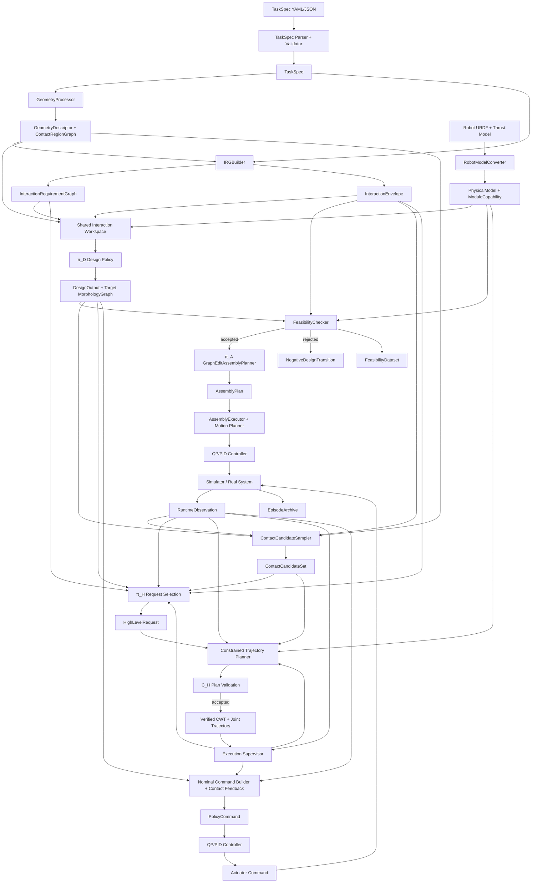

Key constraints:

```text
IRGBuilder produces abstract interaction requirements, not final contact points.
π_D designs morphology and robot anchors.
ContactCandidateSampler runs after π_D.
π_H selects/ranks finite grounded requests; the deterministic planner generates trajectories.
ContactCandidateSet is a finite proposal pool, not a proof that every subset is feasible.
The planner and independent C_H validate the selected assignment and the same executable trajectory.
The executor owns observed phase transitions; π_L is disabled in the standard path.
QP/PID/controller layer outputs actuator commands.
```

---

## 7. TaskSpec, SceneSpec, ObjectSpec

### 7.1 General principle

TaskSpec は structured task data と geometry assets への references のみを含む。巨大 mesh、dense map、raw point cloud を埋め込んではならない。そのような assets は `geometry_ref` または `asset_path` で参照してよいが、file paths は NN features になってはならない。

```text
TaskSpec YAML/JSON
  -> parser
  -> schema object
  -> GeometryProcessor resolves refs
  -> shape tokens / region tokens for NN
  -> exact mesh/SDF/collision geometry for simulator/checkers
```

Data lifecycle rule:

```text
TaskSpec + GeometrySpec + InteractionTemplate = source data / compiler inputs
GeometryDescriptor + ContactRegionGraph = geometry-derived intermediate representations
IRG = compiled detailed interaction requirement graph
InteractionEnvelope = cached compact summary extracted from IRG
NN tokens = encoded features derived from the above
Exact geometry / PhysicalModel = simulator and deterministic checker inputs
```

NN は source data 全体を直接再解釈してはならない。GeometryProcessor、IRGBuilder、EnvelopeExtractor の deterministic outputs を入力 token 化して使う。

### 7.2 TaskSpec schema

```python
class TaskSpec:
    task_id: str
    task_type: TaskType
    scene: SceneSpec
    goals: list[GoalSpec]
    robot_constraints: RobotConstraints
    safety: SafetySpec
    curriculum_tags: list[str] = []
    metadata: dict = {}
```

### 7.3 TaskType enum

```python
class TaskType(str, Enum):
    FREE_FLIGHT_NAVIGATION = "free_flight_navigation"
    OBJECT_GRASP_CARRY = "object_grasp_carry"
    VALVE_OPERATION = "valve_operation"
    PERCHING_MANIPULATION = "perching_manipulation"
    CONTACT_MEDIATED_LOCOMOTION = "contact_mediated_locomotion"
```

### 7.4 SceneSpec

```python
class SceneSpec:
    world_frame: str = "world"
    geometry_library: list[GeometrySpec]
    objects: list[ObjectSpec]
    environment: EnvironmentSpec
```

### 7.5 GeometrySpec

```python
class GeometrySpec:
    geometry_id: str
    geometry_type: Literal["box", "sphere", "cylinder", "capsule", "mesh", "sdf", "point_cloud"]
    primitive_params: dict | None
    asset_path: str | None
    scale: tuple[float, float, float] = (1.0, 1.0, 1.0)
    collision_model: Literal["primitive", "convex", "mesh", "sdf"]
    units: Literal["m"] = "m"
```

`asset_path` は GeometryProcessor、simulator、checkers のみが使用する。neural feature としては使用しない。

### 7.6 ObjectSpec

```python
class ObjectSpec:
    object_id: str
    geometry_id: str
    pose_world: Pose7D
    movable: bool
    mass_kg: float | None
    inertia_kgm2: list[float] | None
    friction: float | None
    material_tag: str | None
    contact_allowed: bool = True
    allowed_contact_modes: list[ContactMode]
    semantic_tags: list[str] = []
    kinematic_model: ObjectKinematicModel | None = None
```

manipulation objects では、task template による明示 override がない限り `mass_kg` は required である。

### 7.7 EnvironmentSpec

```python
class EnvironmentSpec:
    support_surfaces: list[SurfaceSpec]
    obstacles: list[ObstacleSpec]
    wind: WindSpec | None
    gravity: tuple[float, float, float] = (0.0, 0.0, -9.80665)
```

### 7.8 GoalSpec

```python
class GoalSpec:
    goal_id: str
    target_entity_id: str | None
    goal_type: Literal[
        "robot_pose", "object_pose", "object_displacement", "object_joint_state",
        "contact_state", "centroidal_state", "free_flight_pose"
    ]
    target_pose_world: Pose7D | None
    target_twist_world: list[float] | None
    target_q: list[float] | None
    tolerance_pos_m: float | None
    tolerance_rot_rad: float | None
    tolerance_q: list[float] | None
    time_limit_s: float
```

### 7.9 RobotConstraints

```python
class RobotConstraints:
    min_modules: int = 1
    max_modules: int = 8
    allowed_module_types: list[str] = ["holon"]
    allow_closed_loop: bool = False
    max_docked_edges: int | None = None
    max_robot_anchors: int = 16
```

### 7.10 SafetySpec

```python
class SafetySpec:
    collision_margin_m: float = 0.03
    max_contact_force_n: float = 30.0
    max_contact_torque_nm: float = 5.0
    max_tilt_rad: float = 1.2
    min_thrust_margin_ratio: float = 0.15
    min_qp_margin: float = 0.0
    allow_object_drop: bool = False
```

### 7.11 Example TaskSpec YAML: object grasp & carry

```yaml
task_id: grasp_carry_box_001
task_type: object_grasp_carry
scene:
  world_frame: world
  geometry_library:
    - geometry_id: box_geom
      geometry_type: box
      primitive_params:
        size_m: [0.30, 0.20, 0.15]
      asset_path: null
      scale: [1.0, 1.0, 1.0]
      collision_model: primitive
  objects:
    - object_id: box_01
      geometry_id: box_geom
      pose_world: [0.8, 0.0, 0.4, 0.0, 0.0, 0.0, 1.0]
      movable: true
      mass_kg: 1.0
      inertia_kgm2: null
      friction: 0.6
      material_tag: cardboard
      contact_allowed: true
      allowed_contact_modes: [grasp, support, push]
  environment:
    support_surfaces:
      - surface_id: floor
        geometry_id: floor_geom
        pose_world: [0, 0, 0, 0, 0, 0, 1]
        friction: 0.8
        contact_allowed: true
        allowed_contact_modes: [support]
    obstacles: []
    wind: null
goals:
  - goal_id: place_box
    target_entity_id: box_01
    goal_type: object_pose
    target_pose_world: [2.0, 0.0, 0.4, 0.0, 0.0, 0.0, 1.0]
    tolerance_pos_m: 0.05
    tolerance_rot_rad: 0.20
    time_limit_s: 30.0
robot_constraints:
  min_modules: 2
  max_modules: 6
  allow_closed_loop: false
safety:
  collision_margin_m: 0.03
  max_contact_force_n: 30.0
  min_thrust_margin_ratio: 0.15
```

---

## 8. GeometryProcessor and Shape Representation

### 8.1 Purpose

GeometryProcessor は geometry references を learning features、contact regions、collision models、physics metadata に変換する。

2つの representations を生成しなければならない。

```text
Learning representation:
  global shape features
  surface patch tokens
  SurfacePatchGraph
  ContactRegionGraph

Physics/checking representation:
  raw mesh / SDF / primitive / convex hull / collision model
```

### 8.2 File paths are not NN features

実装は次を **MUST** enforce する。

```text
geometry_ref / asset_path -> GeometryProcessor input only
GeometryDescriptor / SurfacePatchTokens / ContactRegionTokens -> NN input
```

NN inputs は `assets/objects/foo.obj` のような raw path strings を含んではならない。

### 8.3 GeometryDescriptor schema

```python
class GeometryDescriptor:
    geometry_id: str
    global_shape_features: GlobalShapeFeatures
    surface_patch_graph: SurfacePatchGraph
    contact_region_graph: ContactRegionGraph
    collision_ref: str
    exact_geometry_ref: str
```

### 8.4 GlobalShapeFeatures

```python
class GlobalShapeFeatures:
    bbox_m: tuple[float, float, float]
    volume_m3: float
    surface_area_m2: float
    approximate_com_object: tuple[float, float, float]
    approximate_inertia_diag: tuple[float, float, float]
    principal_axes_flat: list[float]     # 9 values
    compactness: float
    symmetry_features: list[float]
```

### 8.5 SurfacePatchToken

各 surface patch token は surface 上の local patch を表す。final contact point ではない。

```python
class SurfacePatchToken:
    patch_id: int
    entity_id: str
    position_object: tuple[float, float, float]
    normal_object: tuple[float, float, float]
    tangent_u_object: tuple[float, float, float]
    tangent_v_object: tuple[float, float, float]
    patch_area_m2: float
    mean_curvature: float
    gaussian_curvature: float
    local_thickness_m: float | None
    friction: float | None
    contact_allowed: bool
    allowed_contact_modes: list[ContactMode]
```

### 8.6 SurfacePatchGraph

```python
class SurfacePatchGraph:
    nodes: list[SurfacePatchToken]
    edges: list[SurfacePatchEdge]
```

Edges は patch adjacency、similar normal clusters、rim/edge relation、semantic grouping を表す。

```python
class SurfacePatchEdge:
    src_patch_id: int
    dst_patch_id: int
    edge_type: Literal["adjacent", "same_region", "rim_neighbor", "opposite_patch", "normal_cluster"]
    distance_m: float
    normal_angle_rad: float
```

### 8.7 ContactRegion

```python
class ContactRegion:
    region_id: str
    entity_id: str
    region_type: Literal["face", "rim", "edge", "pipe", "floor", "wall", "curved_patch", "mesh_patch_cluster"]
    patch_ids: list[int]
    pose_object: Pose7D | None
    normal_summary_object: tuple[float, float, float]
    area_m2: float
    curvature_summary: list[float]
    friction: float | None
    allowed_contact_modes: list[ContactMode]
    task_relevance_features: list[float]
```

### 8.8 ContactRegionGraph

```python
class ContactRegionGraph:
    nodes: list[ContactRegion]
    edges: list[ContactRegionEdge]
```

Typical region edges:

```text
adjacent_region
opposite_region
same_object
spatially_near
supports_moment_arm
mutually_exclusive_contact
```

### 8.9 GeometryProcessor algorithms

For primitives:

```text
box:
  create face regions: +x, -x, +y, -y, +z, -z
  create edge/rim regions if task template requires rim/edge reasoning

cylinder:
  create side surface region, top/bottom regions, rim regions

sphere:
  sample normal clusters and contactable patches

capsule:
  create cylindrical side + hemispherical end regions
```

For mesh:

```text
load mesh
repair if possible
normalize scale
compute normals and curvature
segment into connected patch clusters by normal/curvature/area
extract rims and high-curvature features
build SurfacePatchGraph
aggregate ContactRegions
compute collision primitive or convex decomposition
```

For SDF:

```text
sample zero-level surface
estimate normals from SDF gradient
cluster patches
build ContactRegionGraph
```

For point cloud:

```text
estimate normals
optional surface reconstruction
cluster patches
build approximate ContactRegionGraph
```

### 8.10 GeometryProcessor diagram

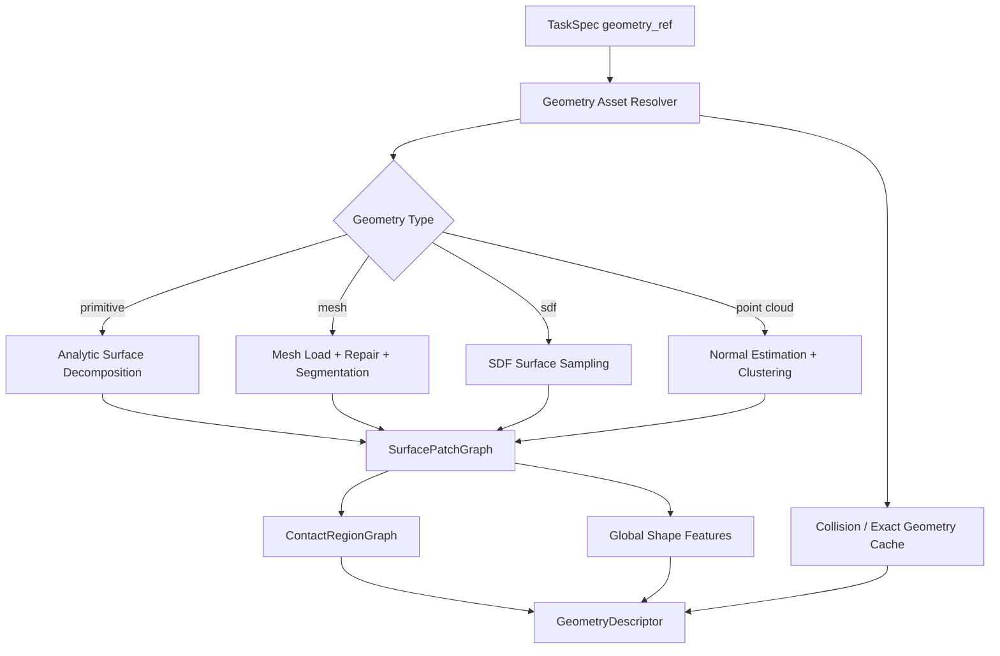

---

## 9. Robot Module Model and PhysicalModel

### 9.1 Purpose

robot model layer は URDF と thrust model configuration を次に変換する。

```text
PhysicalModel:
  exact link/joint/rotor/dock/geometry data for simulation, checkers, controllers

ModuleCapability:
  compact learning features for π_D, π_H, π_L
```

### 9.2 Developer reference module

提供される `./module_urdf/holon.urdf` は tests の中で parse されるべきである。実装は、この URDF だけが存在するという仮定を encode してはならない。

parser test は次を report するべきである。

```text
number of links
number of joints
joint type counts
link masses and total mass
candidate rotor frames
candidate docking mechanism frames
frame tree validity
```

### 9.3 PhysicalModel schema

```python
class PhysicalModel:
    model_id: str
    urdf_path: str
    links: list[LinkModel]
    joints: list[JointModel]
    rotors: list[RotorModel]
    dock_ports: list[DockPortSpec]
    collision_primitives: list[CollisionPrimitive]
    aggregate_mass_kg: float
    aggregate_inertia_body: list[float]
    metadata: dict
```

### 9.4 LinkModel

```python
class LinkModel:
    link_id: str
    parent_joint_id: str | None
    mass_kg: float
    inertia_kgm2: list[float]          # [ixx, ixy, ixz, iyy, iyz, izz]
    local_com: tuple[float, float, float]
    visual_geometry_ref: str | None
    collision_geometry_ref: str | None
```

### 9.5 JointModel

```python
class JointModel:
    joint_id: str
    joint_type: Literal["fixed", "revolute", "continuous", "prismatic"]
    parent_link: str
    child_link: str
    origin_xyz: tuple[float, float, float]
    origin_rpy: tuple[float, float, float]
    axis_xyz: tuple[float, float, float]
    limit_lower: float | None
    limit_upper: float | None
    effort_limit: float | None
    velocity_limit: float | None
```

URDF effort/velocity values が zero の場合、config がそれを hard zero と明示しない限り unknown と扱うべきである。

### 9.6 RotorModel

```python
class RotorModel:
    rotor_id: str
    thrust_frame_link: str
    thrust_axis_local: tuple[float, float, float]
    thrust_min_n: float
    thrust_max_n: float
    reaction_torque_coeff_nm_per_n: float
    vectoring_joint_ids: list[str]
```

thrust model config は thrust limits と reaction torque を提供する。URDF は frames と joints を提供する。

### 9.7 DockPortSpec

Dock ports は URDF frame naming conventions または robot metadata config から derive されうる。実装は両方を support するべきである。

```python
class DockPortSpec:
    port_id: str
    parent_link: str
    local_pose: Pose7D
    grasp_contact_frame_from_connect: Pose7D | None
    port_type: Literal["pitch_dock", "yaw_dock", "generic_dock"]
    compatible_port_types: list[str]
    latch_axis_local: tuple[float, float, float] | None
    mechanical_limits: dict
```

`local_pose` は structural assembly connect frame を表す。
`grasp_contact_frame_from_connect` は object-contact semantics 専用の optional transform
であり、structural docking geometry を変更しない。Holon pitch Dock の現行 transform は
`pitch_connect_point_{1,2}` から local X 方向へ `+0.0424086 m` の並進である。
Yaw Dock は connect frame と grasp-contact frame が同一でよい。RobotAnchor、contact
candidate、IK、collision review は composed grasp-contact frame を使い、DockEdge assembly
は connect frame を使わなければならない。

### 9.8 ModuleCapabilityToken

これは learning feature であり、exact physical model ではない。

```python
class ModuleCapabilityToken:
    module_type: str
    aggregate_mass_norm: float
    aggregate_inertia_features: list[float]
    rotor_count: int
    port_count: int
    thrust_min_features: list[float]
    thrust_max_features: list[float]
    thrust_to_weight_ratio_est: float
    dock_port_type_counts: list[int]
    has_vectoring: bool
    has_dock_mechanism: bool
```

exact dynamics は ModuleCapabilityToken ではなく PhysicalModel を使わなければならない。

---

## 10. InteractionRequirementGraph Formal Specification

### 10.1 Definition

IRG は TaskSpec instance ごとに1つの typed heterogeneous factor graph である。

```text
IRG = one heterogeneous graph
  with typed node groups
  with typed edge groups
  with cross edges connecting subgraph views
```

IRG は independent graphs の集合ではない。Phase、contact、wrench、state target、constraint structures は、同一 integrated graph 内の subgraph views である。

### 10.2 IRG diagram

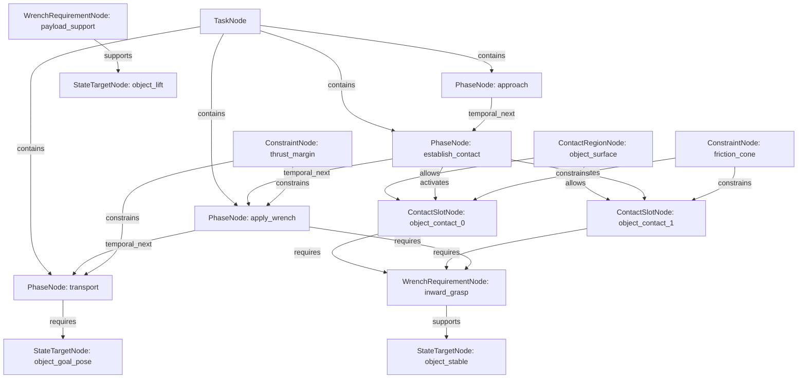

### 10.3 Node types

Version 1 node types:

```python
class IRGNodeType(str, Enum):
    TASK = "task"
    PHASE = "phase"
    CONTACT_REGION = "contact_region"
    CONTACT_SLOT = "contact_slot"
    WRENCH_REQUIREMENT = "wrench_requirement"
    STATE_TARGET = "state_target"
    CONSTRAINT = "constraint"
    CAPABILITY_REQUIREMENT = "capability_requirement"
```

### 10.4 Edge types

Version 1 edge types:

```python
class IRGEdgeType(str, Enum):
    TEMPORAL_NEXT = "temporal_next"
    CONTAINS = "contains"
    ALLOWS = "allows"
    ACTIVATES = "activates"
    REQUIRES = "requires"
    SUPPORTS = "supports"
    CONSTRAINS = "constrains"
    APPLIES_TO = "applies_to"
    SIMULTANEOUS = "simultaneous"
    MUTUALLY_EXCLUSIVE = "mutually_exclusive"
    SPATIAL_RELATION = "spatial_relation"
    WRENCH_COMPOSITION = "wrench_composition"
    KINEMATIC_COUPLING = "kinematic_coupling"
    GUARD_TRANSITION = "guard_transition"
    FALLBACK = "fallback"
```

### 10.5 Common node fields

```python
class IRGNode:
    node_id: int
    node_type: IRGNodeType
    ref_id: str | None
    priority: float
    is_hard: bool
    active_phase_id: int | None
    feature: dict
```

### 10.6 TaskNode

```python
TaskNode.feature = {
    "task_id": str,
    "task_type": str,
    "success_conditions": list[Condition],
    "failure_conditions": list[Condition],
    "time_limit_s": float,
}
```

### 10.7 PhaseNode

```python
PhaseNode.feature = {
    "phase_type": Literal[
        "free_motion", "approach", "establish_contact", "maintain_contact",
        "apply_wrench", "shift_support", "transport", "place", "release_contact",
        "recovery"
    ],
    "phase_label": str | None,     # template-local readable name, not an enum
    "phase_index": int,
    "entry_condition": Condition | None,
    "exit_condition": Condition | None,
    "failure_condition": Condition | None,
    "nominal_duration_s": float | None,
    "max_duration_s": float | None,
}
```

`phase_type` は上記 enum の値だけを許可する。`approach_object`, `establish_perch_contact`, `rotate_valve` などの task/template 固有名は `phase_label` または common field `ref_id` に保存しなければならない。IRGBuilder はすべての template-local phase labels を valid `phase_type` へ map し、schema validator は unknown `phase_type` を reject しなければならない。

### 10.8 ContactRegionNode

```python
ContactRegionNode.feature = {
    "region_id": str,
    "target_entity_id": str,
    "region_type": str,
    "allowed_contact_modes": list[str],
    "area_m2": float,
    "normal_summary": list[float],
    "curvature_summary": list[float],
    "friction": float | None,
}
```

### 10.9 ContactSlotNode

ContactSlotNode は abstract である。final contact point coordinates を含んではならない。

```python
ContactSlotNode.feature = {
    "slot_id": int,
    "target_entity_type": Literal["object", "environment", "robot"],
    "target_entity_id": str,
    "allowed_region_ids": list[str],
    "contact_mode": ContactMode,
    "required": bool,
    "min_count_group": int,
    "max_count_group": int,
    "normal_constraint": dict | None,
    "approach_direction_constraint": dict | None,
    "separation_constraint": dict | None,
    "required_anchor_capability": dict,
}
```

### 10.10 WrenchRequirementNode

Version 1 は wrench を exact mandatory command ではなく、range / inequality / priority として表現しなければならない。

```python
WrenchRequirementNode.feature = {
    "requirement_id": str,
    "applies_to": Literal["contact_slot", "object_effect", "centroidal"],
    "frame": Literal["world", "object", "contact_region", "com", "joint_axis"],
    "required_effect": str,
    "wrench_lower": list[float] | None,   # [fx, fy, fz, tx, ty, tz]
    "wrench_upper": list[float] | None,
    "target_wrench": list[float] | None,
    "slack_weight": float,
    "hard_or_soft": Literal["hard", "soft"],
}
```

### 10.11 StateTargetNode

```python
StateTargetNode.feature = {
    "target_type": Literal[
        "object_pose", "object_twist", "object_joint_state",
        "centroidal", "body_pose", "joint_state", "contact_state"
    ],
    "target_entity_id": str | None,
    "pose_target_world": Pose7D | None,
    "twist_target_world": list[float] | None,
    "q_target": list[float] | None,
    "tolerance": dict,
}
```

### 10.12 ConstraintNode

```python
ConstraintNode.feature = {
    "constraint_type": Literal[
        "friction_cone", "no_slip", "collision_margin", "max_contact_force",
        "thrust_margin", "payload_margin", "support_ratio", "vertical_thrust_ratio",
        "time_limit", "joint_limit", "workspace", "closed_loop_reject"
    ],
    "parameters": dict,
    "violation_code": str,
}
```

### 10.13 CapabilityRequirementNode

```python
CapabilityRequirementNode.feature = {
    "capability_type": Literal["grasp", "support", "push", "latch", "perch", "slide", "free_flight"],
    "min_force_n": float | None,
    "min_torque_nm": float | None,
    "pose_accuracy_m": float | None,
    "pose_accuracy_rad": float | None,
    "stiffness_requirement": float | None,
}
```

### 10.14 Common edge fields

```python
class IRGEdge:
    src_id: int
    dst_id: int
    edge_type: IRGEdgeType
    priority: float
    condition: Condition | None
    params: dict
```

### 10.15 HeteroData representation

PyTorch Geometric style representation を推奨する。

```python
IRGData = {
    "nodes": {
        "task": TaskNodeTensor,
        "phase": PhaseNodeTensor,
        "contact_region": ContactRegionNodeTensor,
        "contact_slot": ContactSlotNodeTensor,
        "wrench_requirement": WrenchRequirementNodeTensor,
        "state_target": StateTargetNodeTensor,
        "constraint": ConstraintNodeTensor,
        "capability_requirement": CapabilityRequirementNodeTensor,
    },
    "edges": {
        ("phase", "temporal_next", "phase"): EdgeTensor,
        ("phase", "activates", "contact_slot"): EdgeTensor,
        ("contact_region", "allows", "contact_slot"): EdgeTensor,
        ("contact_slot", "requires", "wrench_requirement"): EdgeTensor,
        ("wrench_requirement", "supports", "state_target"): EdgeTensor,
        ("constraint", "constrains", "phase"): EdgeTensor,
        ("constraint", "constrains", "contact_slot"): EdgeTensor,
    }
}
```

---

## 11. IRGBuilder v1: Deterministic Compiler

### 11.1 Role

IRGBuilder は deterministic compiler である。

```text
TaskSpec + GeometryDescriptor
  -> InteractionRequirementGraph + InteractionEnvelope
```

IRGBuilder は以下を **MUST NOT** 行う。

```text
choose final contact points
choose robot anchors
generate morphology
generate assembly sequence
generate contact-wrench trajectories
generate actuator commands
```

IRGBuilder は以下を **MUST** 行う。

```text
validate TaskSpec
construct SceneGraph
use GeometryDescriptor and ContactRegionGraph
select InteractionTemplate by task_type
generate PhaseNodes
create abstract ContactSlots
generate WrenchRequirements
create StateTargets
create Constraints
create typed cross edges
validate IRG
extract InteractionEnvelope
```

### 11.2 IRGBuilder pipeline

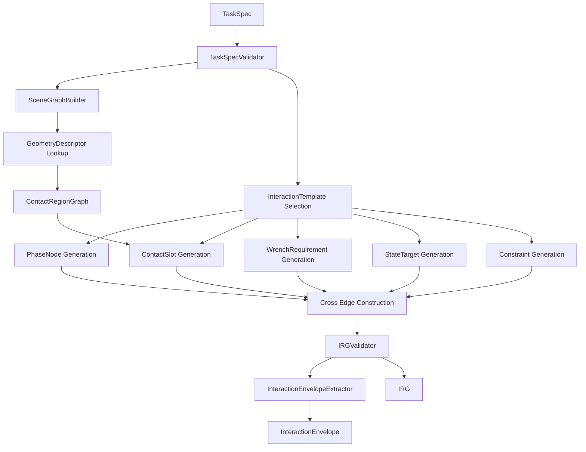

### 11.3 Determinism requirement

同じ TaskSpec、geometry cache、config が与えられた場合、IRGBuilder は同じ IRG node IDs、edge IDs、envelope values を生成しなければならない。stochastic sampling は後段の ContactCandidateSampler に属し、IRGBuilder には属さない。

### 11.4 SceneGraph construction

SceneGraph は entities と references を normalize する。

```python
class SceneGraph:
    entities: list[SceneEntity]
    geometry_descriptors: dict[str, GeometryDescriptor]
    entity_edges: list[SceneEdge]
```

Entity types:

```text
object
environment_surface
obstacle
support_surface
valve
pipe
wall
floor
```

### 11.5 ContactRegion extraction

IRGBuilder は GeometryProcessor から得た ContactRegionGraph を使う。required regions が存在しない場合は、task-aware region extraction options 付きで GeometryProcessor を呼び出さなければならない。

Example:

```text
object_grasp_carry:
  require object surface contact regions

valve_operation:
  require valve rim or handle contact regions

contact_mediated_locomotion:
  require environment support regions

perching_manipulation:
  require perch/latch/support environment regions
```

### 11.6 WrenchRequirement generation rules

IRGBuilder は final exact wrench commands ではなく、physical inequalities と soft target ranges を生成するべきである。

Generic formulas:

Object support force lower bound:

```text
F_support_total >= m_object * (g + a_lift_margin)
```

Frictional no-slip proxy for grasp:

```text
Σ_i μ_i * f_normal_i >= F_tangential_required
```

Valve/contact torque effect:

```text
τ_q = Σ_i J_contact_i(q)^T * w_contact_i
```

Centroidal dynamics relation:

```text
h_dot = W_thrust + Σ_k Ad*_{COM<-contact_k} w_contact_k + W_gravity
```

IRG は requirements、bounds、references を保存する。actual contact frames は選ばない。

### 11.7 Cross-edge construction rules

IRGBuilder は subgraph views を明示的に接続しなければならない。

Examples:

```text
PhaseNode establish_contact --activates--> ContactSlot object_contact_0
ContactRegion box_side_surfaces --allows--> ContactSlot object_contact_0
ContactSlot object_contact_0 --requires--> WrenchRequirement inward_grasp_force
WrenchRequirement inward_grasp_force --supports--> StateTarget object_stable
Constraint friction_cone --constrains--> ContactSlot object_contact_0
PhaseNode lift --requires--> WrenchRequirement payload_support
PhaseNode carry --requires--> StateTarget object_goal_pose
```

### 11.8 IRG validation rules

IRGValidator は以下を reject しなければならない。

```text
missing TaskNode
missing PhaseNode sequence
ContactSlot without ContactRegion
WrenchRequirement without applies_to relation
StateTarget without corresponding goal or phase
Constraint without target
object_grasp_carry without movable target object mass
valve_operation without object kinematic model / axis
contact_mediated_locomotion without support surface
perching_manipulation without allowed perch/support region
```

---

## 12. InteractionTemplate Library

### 12.1 Definition

InteractionTemplate は IRG compiler rule であり、solution template ではない。TaskSpec から required IRG node and edge patterns を生成する。final contact points や robot morphology を選んではならない。

```python
class InteractionTemplateBase:
    task_type: TaskType
    def validate_required_fields(self, task_spec: TaskSpec) -> None: ...
    def build(self, task_spec: TaskSpec, scene_graph: SceneGraph, geometry: dict) -> IRGPartial: ...
```

以下の template sections に出てくる phase names は、特記がない限り template-local `phase_label` である。実装時には必ず valid `PhaseNode.feature["phase_type"]` へ写像すること。

### 12.2 Template diagram

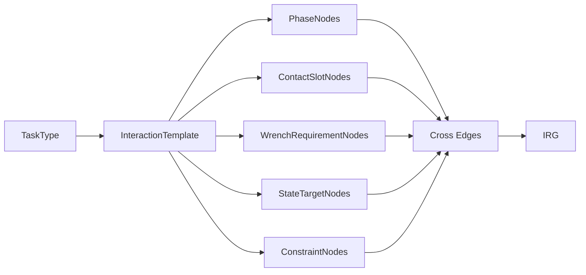

### 12.3 free_flight_navigation template

Required TaskSpec fields:

```text
goal robot_pose or free_flight_pose
time_limit
safety constraints
```

Generated nodes:

```text
PhaseNodes:
  takeoff_or_stabilize -> phase_type="free_motion"
  navigate -> phase_type="free_motion"
  hold_or_land -> phase_type="free_motion"

ContactSlotNodes:
  none

WrenchRequirementNodes:
  centroidal_wrench_for_free_flight

StateTargetNodes:
  robot_pose_target
  body_orientation_target

ConstraintNodes:
  collision_margin
  thrust_margin
  max_tilt
```

### 12.4 object_grasp_carry template

Required fields:

```text
target movable object
object geometry
object mass
object friction or default friction config
object target pose
```

Generated nodes:

```text
PhaseNodes:
  approach_object -> phase_type="approach"
  establish_object_contacts -> phase_type="establish_contact"
  apply_grasp_wrench -> phase_type="apply_wrench"
  lift_object -> phase_type="transport"
  transport_object -> phase_type="transport"
  place_object -> phase_type="place"
  release_contacts -> phase_type="release_contact"

ContactRegionNodes:
  object surface regions from GeometryProcessor

ContactSlotNodes:
  object_contact_slot_group with min_count=2, max_count=4
  optional support/push slots if template branch allows support transport

WrenchRequirementNodes:
  inward_grasp_force
  no_slip_requirement
  payload_support_force
  object_pose_tracking_effect

StateTargetNodes:
  object_lift_height
  object_goal_pose
  centroidal_stability
  release_contact_state

ConstraintNodes:
  friction_cone
  max_contact_force
  collision_margin
  thrust_margin
  payload_margin
```

Alternative branches inside one IRG:

```text
grip_branch
support_underneath_branch
push_slide_branch optional if task permits non-lift transport
```

これらの branches は `mutually_exclusive` edges で接続される。P1/P2 training では grip/support branches を優先し、明示的に configured されない限り push-slide は disable する。

### 12.5 valve_operation template

Required fields:

```text
valve object
valve axis or kinematic joint model
valve radius or handle geometry
required or estimated torque
angle target
```

Generated nodes:

```text
PhaseNodes:
  approach_valve -> phase_type="approach"
  establish_valve_contact -> phase_type="establish_contact"
  apply_tangential_wrench -> phase_type="apply_wrench"
  rotate_valve -> phase_type="apply_wrench"
  release_contact -> phase_type="release_contact"

ContactSlots:
  valve_rim_or_handle_contact, contact_mode=push/stick

WrenchRequirements:
  tangential_force
  valve_axis_torque >= tau_required

StateTargets:
  valve_q_target
  body_stabilization

Constraints:
  friction_cone
  maintain_contact
  collision_margin
  thrust_margin
```

### 12.6 perching_manipulation template

Required fields:

```text
perchable environment region
allowed contact modes support/perch/latch
optional manipulation target
```

Generated nodes:

```text
PhaseNodes:
  navigate_to_perch_region -> phase_type="approach"
  establish_perch_contact -> phase_type="establish_contact"
  hold_perch_wrench -> phase_type="maintain_contact"
  optional_manipulation -> phase_type="apply_wrench"
  release_perch -> phase_type="release_contact"

ContactSlots:
  environment_perch_slot, contact_mode=perch/latch/support
  optional object manipulation slots

WrenchRequirements:
  hold_wrench
  slip_resistance
  thrust_reduction_preference

StateTargets:
  body_pose_hold
  optional object target

Constraints:
  max_contact_force
  latch feasibility
  no_slip
  collision_margin
```

### 12.7 contact_mediated_locomotion template

これは walking-like behavior を contact-mediated locomotion として含む。以下の spectrum を表す。

```text
aerial_dominant_contact_support
hybrid_contact_locomotion
contact_dominant_legged_equivalent
```

Version 1 では full explicit footstep/gait planner を必要としない。Footstep planning は contact slot から contact candidate への時間方向 assignment として表現する。

Required fields:

```text
support surface or terrain
locomotion target or displacement
support constraints
allowed contact modes
```

Generated nodes:

```text
PhaseNodes:
  approach_support_region -> phase_type="approach"
  establish_support_contact -> phase_type="establish_contact"
  maintain_support -> phase_type="maintain_contact"
  shift_centroidal_state -> phase_type="shift_support"
  reposition_free_anchor -> phase_type="free_motion"
  reanchor_support -> phase_type="establish_contact"
  release_or_continue -> phase_type="release_contact" or "maintain_contact" depending on branch

ContactSlots:
  support contact slots on environment region

WrenchRequirements:
  contact_support_force
  friction-limited tangential force
  vertical_thrust_ratio <= threshold
  contact_support_ratio >= threshold

StateTargets:
  COM shift
  body pose stabilization
  joint/posture target
  locomotion progress target

Constraints:
  no_slip
  friction_cone
  support polygon / support ratio proxy
  collision_margin
```

Example config:

```yaml
locomotion_contact_mode:
  support_allocation: hybrid_contact_locomotion
support_constraints:
  max_vertical_thrust_ratio: 0.4
  min_contact_support_ratio: 0.5
  allow_thrust_for_stabilization: true
```

---

## 13. InteractionEnvelope

### 13.1 Purpose

InteractionEnvelope は π_D と π_H が共有する compact requirement summary である。

```text
IRG = detailed typed graph
InteractionEnvelope = compact design/control requirement summary
```

π_D は morphology and anchors を design するために使う。π_Hは接触群・遷移要求・サブゴールを選ぶために、計画器は軌道制約を構成するために使う。

### 13.2 Schema

```python
class InteractionEnvelope:
    envelope_id: str
    task_id: str
    required_contact_count_range: tuple[int, int]
    required_contact_modes: list[ContactMode]
    target_region_sets: list[TargetRegionSet]
    wrench_space_requirements: list[WrenchSpaceRequirement]
    support_ratio_requirements: SupportRatioRequirement | None
    vertical_thrust_ratio_limit: float | None
    precision_requirements: list[PrecisionRequirement]
    duration_requirements: list[DurationRequirement]
    capability_requirements: list[CapabilityRequirement]
    branch_options: list[EnvelopeBranchOption]
```

### 13.3 Example: grasp & carry envelope

```yaml
required_contact_count_range: [2, 4]
required_contact_modes: [grasp, support]
target_region_sets:
  - entity_id: box_01
    region_types: [face, mesh_patch_cluster]
wrench_space_requirements:
  - applies_to: object_contact_slots
    effect: inward_grasp_force
    lower_bound_description: no_slip_and_payload_support
  - applies_to: centroidal
    effect: maintain_stability
precision_requirements:
  - target: object_pose
    tolerance_pos_m: 0.05
    tolerance_rot_rad: 0.20
capability_requirements:
  - capability_type: grasp
    min_force_n: 5.0
```

### 13.4 Extraction rules

EnvelopeExtractor は以下を aggregate する。

```text
ContactSlot min/max counts
ContactSlot contact modes
ContactRegion targets
WrenchRequirement bounds and priorities
StateTarget tolerances
Constraint thresholds
CapabilityRequirement minimums
```

### 13.5 Data lifecycle and cache rule

InteractionEnvelope は IRG から deterministic に再生成可能でなければならない。runtime では `task_hash + geometry_hash + irg_builder_version` を key として cache してよい。IRG、TaskSpec、GeometryDescriptor、または InteractionTemplate version が変わった場合、Envelope は stale と見なして再抽出すること。

π_D、ContactCandidateSampler、π_H は cached Envelope を読んでよいが、Envelope を source of truth として IRG を上書きしてはならない。

---

## 14. MorphologyGraph, RobotAnchor, and DesignOutput

### 14.1 MorphologyGraph purpose

MorphologyGraph は target connected A-MSRR morphology を表す。π_D の主出力であり、π_A への target input である。

MorphologyGraph は接続 topology、dock port の選択、module role、RobotAnchor、control group、assembly / operation に必要な graph-level metadata を表す。可動関節の瞬間的な関節角度、または可動関節によって task execution 中に変化する module relative pose を、π_D の設計自由度として表してはならない。

### 14.2 MorphologyGraph schema

```python
class MorphologyGraph:
    graph_id: str
    modules: list[ModuleNode]
    ports: list[PortNode]
    dock_edges: list[DockEdge]
    robot_anchors: list[RobotAnchor]
    control_groups: list[ControlGroup]
    base_module_id: int
    is_closed_loop: bool
```

### 14.2.1 Pose and transform semantics

`ModuleNode.pose_in_design_frame` および `DockEdge.relative_pose_src_to_dst` は、π_D が連続値として最適化する設計変数ではない。

これらの pose / transform は、以下の用途に限定する。

```text
selected docking port geometry から決まる canonical transform
nominal assembly geometry の記録
visualization
coarse collision precheck
graph layout / debugging
simulator initialization reference pose
```

これらは、可動関節の現在角度や、task execution 中の module relative pose を表してはならない。

したがって、`pose_in_design_frame` や `relative_pose_src_to_dst` を用いて、π_D が「特定の関節姿勢込みの構造」を生成していると解釈してはならない。関節姿勢、関節角度、姿勢軌道は、π_D ではなく、制約付き軌道計画器、実行器、低レベル制御、および runtime state estimator / simulator が扱う。

### 14.3 ModuleNode

```python
class ModuleNode:
    module_id: int
    module_type: str
    pose_in_design_frame: Pose7D
    role_id: str
    is_base: bool
    health: float = 1.0
    capability_token: ModuleCapabilityToken
```

### 14.4 PortNode

```python
class PortNode:
    port_global_id: int
    module_id: int
    port_local_id: str
    local_pose: Pose7D
    port_type: str
    occupied: bool
    compatible_port_type_mask: list[int]
```

### 14.5 DockEdge

```python
class DockEdge:
    edge_id: int
    src_module_id: int
    src_port_id: int
    dst_module_id: int
    dst_port_id: int
    relative_pose_src_to_dst: Pose7D
    edge_role: Literal["structural", "grasp_arm", "support", "perch_anchor", "locomotion_support"]
    estimated_stiffness: list[float]
    latch_state: Literal["planned", "attached", "detached"]
```

### 14.6 RobotAnchor

RobotAnchor は interaction のための robot-side capability である。

```python
class RobotAnchor:
    anchor_id: int
    module_id: int
    link_id: str | None
    local_pose: Pose7D
    anchor_type: Literal["grasp", "support", "push", "latch", "perch", "tool", "body_contact"]
    capability: dict
    associated_contact_slot_ids: list[int]
```

### 14.7 DesignOutput

```python
class DesignOutput:
    task_id: str
    irg_id: str
    target_morphology: MorphologyGraph
    module_roles: dict[int, str]
    slot_anchor_binding_prior: list[SlotAnchorBindingPrior]
    design_actions: list[DesignAction]
    design_logprobs: list[float] | None
    design_scores: dict
```

```python
class SlotAnchorBindingPrior:
    slot_id: int
    anchor_id: int
    score: float
    reason_code: str | None
```

### 14.8 Shared identifiers

以下の IDs は stages をまたいで preserve しなければならない。

```text
ContactSlotID:
  abstract task-side contact requirement in IRG

RobotAnchorID:
  robot-side contact/action capability generated by π_D

ContactCandidateID:
  scene/object-side concrete contact candidate generated after morphology is known
```

π_Hが選ぶ接触群は次の対応を参照する。時間ごとのassignmentは計画器が生成する。

```text
ContactSlotID -> RobotAnchorID -> ContactCandidateID
```

---

## 15. π_D: Design Policy

### 15.1 Role

π_D は InteractionEnvelope を実現できる morphology を design する。

π_D は、A-MSRR の接続構造を設計する方策であり、可動関節の瞬間的な関節角度、または可動関節によって変化する module relative pose を設計自由度として扱ってはならない。

Input:

```text
TaskSpec tokens
GeometryDescriptor tokens
IRG embeddings
InteractionEnvelope
module inventory
ModuleCapability tokens
```

Output:

```text
DesignOutput:
  target MorphologyGraph
  RobotAnchors
  module roles
  control groups
  slot-anchor binding prior
```

π_D が出力してよい設計対象は、以下に限定する。

```text
使用する module 数
module 間の接続 topology
接続に用いる docking port の組
base module の選択
module role の割当
RobotAnchor の生成
ContactSlot と RobotAnchor の対応 prior
control group の割当
assembly / operation に必要な graph-level metadata
```

π_D は、以下を出力してはならない。

```text
可動関節の具体的な関節角度
動作中に変化する module relative pose
task execution 中の姿勢軌道
actuator-level command
rotor thrust
joint torque
vectoring joint target
```

可動関節の姿勢、関節角度、姿勢軌道は、π_D ではなく、制約付き軌道計画器、実行器、低レベル制御が扱う。

### 15.2 Action vocabulary

Version 1 design actions:

```python
class DesignActionType(str, Enum):
    ADD_MODULE = "add_module"
    CONNECT_PORT = "connect_port"
    DISCONNECT_PORT = "disconnect_port"
    ASSIGN_ROLE = "assign_role"
    CREATE_ANCHOR = "create_anchor"
    BIND_ANCHOR_TO_SLOT = "bind_anchor_to_slot"
    SET_CONTROL_GROUP = "set_control_group"
    SET_BASE_MODULE = "set_base_module"
    STOP = "stop"
```

π_D は巨大な raw categorical spaces ではなく candidate enumeration を使うべきである。

### 15.3 Candidate enumeration

```text
partial morphology G_partial
  -> enumerate valid add/connect/role/anchor actions
  -> apply action mask
  -> score candidates with policy head
  -> sample or choose action
  -> repeat until STOP
```

STOP は次を満たす場合にのみ valid である。

```text
minimum module count satisfied
all required ContactSlots have possible RobotAnchor coverage
base module assigned
morphology connected
no occupied port conflict
closed-loop rejected unless override
coarse feasibility passes
```

### 15.4 Design grammar / teacher generator

Version 1 は bootstrapping のために teacher generator を含むべきである。

```text
chain_grasp
symmetric_two_anchor_grasp
tri_anchor_support_grasp
central_base_plus_two_grasp_arms
perch_anchor_frame
valve_torque_arm
support_shift_frame
```

これは demonstration design action sequences の generator であり、永続的な hand-coded solution ではない。

### 15.5 π_D diagram

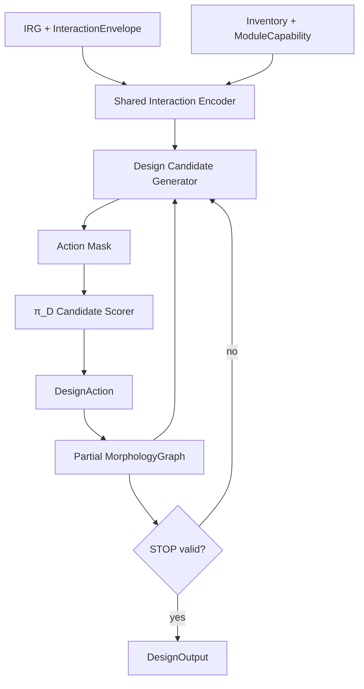

---

## 16. FeasibilityChecker

### 16.1 Role

FeasibilityChecker は hard validity and safety を所有する。Learned models は training acceleration のために feasibility を approximate / predict してよいが、deterministic hard checks を override してはならない。

### 16.2 FeasibilityResult schema

```python
class FeasibilityResult:
    feasible: bool
    hard_violations: list[Violation]
    soft_violations: list[Violation]
    margins: dict[str, float]
    proxy_scores: dict[str, float]
    checker_version: str
```

```python
class Violation:
    code: str
    severity: Literal["hard", "soft", "warning"]
    message: str
    node_or_edge_ref: str | None
    margin: float | None
    threshold: float | None
```

### 16.3 Hard checks

Version 1 hard checks:

```text
F_SCHEMA_VALID
F_CONNECTED_GRAPH
F_MODULE_COUNT
F_PORT_OCCUPANCY
F_COMPATIBLE_PORT_TYPES
F_CLOSED_LOOP_REJECT_V1
F_BASE_MODULE_ASSIGNED
F_REQUIRED_SLOT_COVERAGE
F_ROBOT_ANCHOR_CAPABILITY
F_COARSE_REACHABILITY
F_COARSE_COLLISION
F_THRUST_MARGIN
F_PAYLOAD_MARGIN
F_QP_HOVER_FEASIBILITY
```

### 16.4 Soft proxy scores

```text
S_COMPACTNESS
S_ASSEMBLY_COMPLEXITY
S_REACHABILITY_SCORE
S_GRASP_QUALITY_PROXY
S_WRENCH_MARGIN
S_ENERGY_PROXY
S_SYMMETRY_PRIOR
S_CONTACT_REGION_COVERAGE
```

### 16.5 Slot coverage check

すべての required ContactSlot について、以下を満たす RobotAnchor が存在すること。

```text
exists RobotAnchor such that:
  anchor_type compatible with contact_mode
  estimated max force/torque >= requirement
  coarse reachability to allowed ContactRegion exists
  no immediate collision with target/object/environment
```

### 16.6 Thrust margin

Approximate hover thrust margin:

```text
required_total_vertical_force = total_mass * g + payload_force_margin
available_total_vertical_force = Σ rotor thrust_max projected to vertical under nominal vectoring
thrust_margin_ratio = (available - required) / max(required, eps)
```

Hard valid if:

```text
thrust_margin_ratio >= safety.min_thrust_margin_ratio
```

### 16.7 Wrench feasibility

各 required wrench envelope について、robot anchors と rotors が required wrench を生成できるかを近似評価する。

```text
minimize || A u - w_required ||^2
subject to u_min <= u <= u_max
```

ここで `u` は check に応じて thrust と allowed joint/contact force proxy variables を含む。これは coarse checker であり、exact control は runtime QP が行う。

### 16.8 Feasibility levels

Feasibility checks は以下の levels に分ける。実装は violation code に level を含めるか、`Violation.node_or_edge_ref` / `message` で level を明示すること。

```text
design-level feasibility:
  MorphologyGraph, RobotAnchor, thrust/payload, graph validity, slot coverage を評価する。

  Design-level feasibility は、単一の nominal joint configuration に基づいて判定してはならない。特に、以下のような判定は禁止する。

  ```text
  この固定関節角で ContactRegion に到達できるか
  この固定 module pose で grasp point に届くか
  この nominal pose で required wrench を満たせるか
  ```

  design-level coarse reachability / wrench / collision checks は、接続 topology、dock port compatibility、RobotAnchor capability、allowed ContactRegion、module count、thrust/payload margin などの graph-level / capability-level 必要条件を評価する。可動関節の具体角度や task execution 中の pose trajectory は、制約付き軌道計画器、assignment-level feasibility、実行器、runtime QP/PID controller、または simulator/controller state の責務である。

candidate-level unary screening:
  1つの ContactCandidate について capability, local reachability, local collision, normal alignment, friction plausibility を評価する。

pairwise/group candidate compatibility:
  candidate pairs or small groups について anchor conflict, module conflict, opposing normals, separation, local collision, support/grasp geometry を評価する。

assignment-level feasibility:
  π_Hの要求を受けて計画器が構成するContactAssignment setと軌道について slot cardinality, wrench feasibility, friction cones, multi-contact collision, QP residual を評価する。

runtime controller feasibility:
  actual RuntimeObservation と controller state に対して QP/PID が actuator limits, joint limits, safety bounds を満たすか評価する。
```

ContactCandidate 単体の unary screening は必要条件であり、task feasibility の十分条件ではない。

---

## 17. π_A: Assembly Planner and Construction Execution

### 17.1 Role

Version 1 の π_A は deterministic である。

```text
GraphEditAssemblyPlanner(current_graph, target_graph, construction_state) -> AssemblyStep
```

Version 1 では learned RL policy ではない。

### 17.2 AssemblyPlan

```python
class AssemblyPlan:
    plan_id: str
    target_graph_id: str
    steps: list[AssemblyStep]
    estimated_duration_s: float
    fallback_policy: str
```

### 17.3 AssemblyStep

```python
class AssemblyStep:
    step_id: int
    step_type: Literal["move_to_staging", "align_ports", "dock", "verify_attach", "detach", "retry", "abort"]
    leader_module_id: int
    follower_module_id: int | None
    src_port_id: int | None
    dst_port_id: int | None
    target_relative_pose: Pose7D | None
    preconditions: list[Condition]
    success_conditions: list[Condition]
    timeout_s: float
```

### 17.4 ConstructionState

```python
class ConstructionState:
    physical_graph: MorphologyGraph
    control_graph: MorphologyGraph
    unattached_modules: list[int]
    attached_components: list[list[int]]
    active_step_id: int | None
    docking_attempts: dict
    failures: list[Violation]
```

### 17.5 Assembly diagram

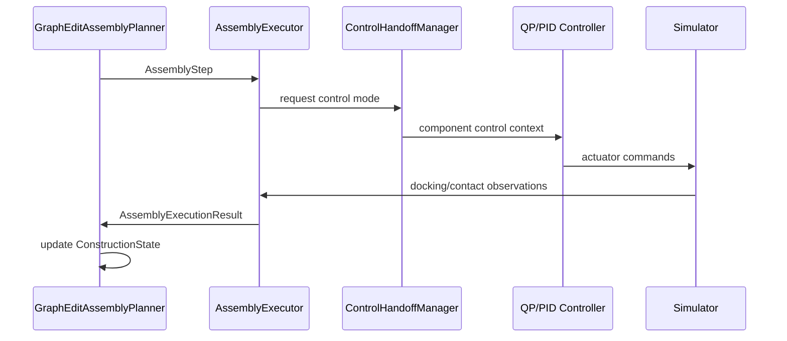

### 17.6 Attach/detach safety

detach では staged release を使う。

```text
1. unload internal/contact wrench
2. split control graph
3. verify component hover/control feasibility
4. physically release latch
5. monitor separation stability
```

Detach release gate は以下を check するべきである。

```text
relative velocity below threshold
relative pose error below threshold
estimated internal wrench below threshold
both components QP feasible
N consecutive stable control steps
```

Thresholds は config values である。

### 17.7 P3/P4 assembly execution boundary

P3 の assembly success は、deterministic `AssemblyRunner` と simplified executor による graph/state integration success であり、物理ドッキング成功率ではない。P3 acceptance は、`ConstructionState` と target `MorphologyGraph` の整合、retry/abort path、archive logging を確認するが、Isaac Lab 上で docking actuator、contact sensing、relative pose convergence、latch verification を物理的に検証したことを意味してはならない。

P4.0 では、P3 assembly result を simplified full-pipeline integration の入力として使ってよい。この場合、docking / verify_attach / detach / separation の成功は simplified execution result として扱われ、P4 full completion の証明にはならない。

P4 full completion では、π_A / `AssemblyRunner` の step を low-level controller target へ変換する bridge が必要である。この bridge は以下を扱う。

```text
move_to_staging / align_ports:
  target relative pose, waypoint, alignment tolerance を controller target へ変換する。

dock / verify_attach:
  dock mechanism command, approach velocity/pose tolerance, contact/latch sensor result を扱う。

detach / separation:
  unload internal/contact wrench, split control graph, release latch, separation stability を扱う。

retry / abort:
  controller-safe recovery target または safe stop target を生成する。
```

将来的な Isaac-backed assembly execution では、docking / verify_attach / detach / separation の success/failure は simulator / controller / sensor result から返される。P4 full completion で assembly を含む rollout を主張する場合、simplified pseudo result ではなく Isaac-backed execution result を保存しなければならない。

---

## 18. ContactCandidateSampler and Morphology-Conditioned Filtering

### 18.1 Key rule

ContactCandidate は morphology と RobotAnchors が存在した **後** に生成される。

```text
Before π_D:
  ContactRegion / ContactSlot / InteractionEnvelope

After π_D:
  RobotAnchor known
  reachability known approximately
  candidate contact points can be sampled and filtered
```

### 18.2 Pipeline

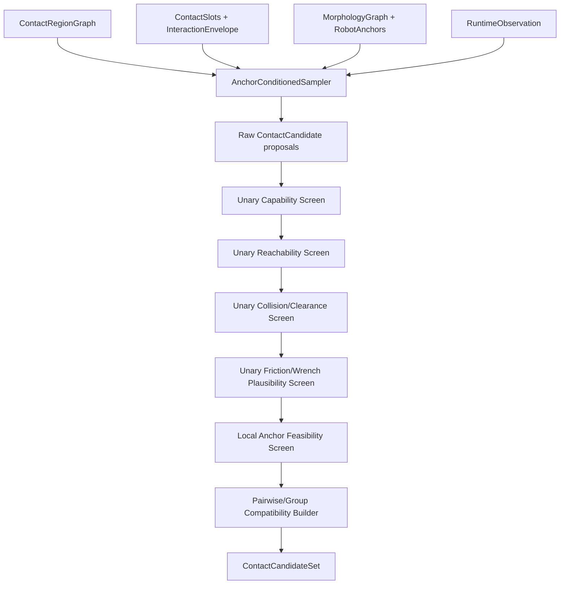

`ContactSlots + InteractionEnvelope` は sampler の required input である。ContactRegionGraph だけでは、どの task-side contact requirement に対する candidate かを決定できない。

### 18.3 ContactCandidate schema

```python
class ContactCandidate:
    candidate_id: int
    slot_id: int
    anchor_id: int
    target_entity_id: str
    region_id: str
    contact_pose_world: Pose7D
    contact_frame_world: Pose7D
    normal_world: tuple[float, float, float]
    tangent_basis_world: list[float]
    contact_mode: ContactMode
    friction: float | None
    patch_area_m2: float
    candidate_scores: dict[str, float]
    unary_valid: bool
    unary_violation_codes: list[str]
```

### 18.4 AnchorConditionedSampler algorithm

Candidate sampler は deterministic または seeded quasi-random sampling を使うべきである。Sampler は単なる surface point sampler ではなく、ContactSlot、RobotAnchor、ContactRegion、contact_mode の組に条件づけて candidate contact pose を生成する。

Required loop:

```text
for each required or optional ContactSlot s selected from IRG/Envelope:
  for each allowed ContactRegion r in s.allowed_region_ids:
    for each RobotAnchor a compatible with s.contact_mode and s.required_anchor_capability:
      for each contact_mode m allowed by both s and a:
        K = quota(s, r, a, m)
        sample K surface points p_i on r using deterministic or seeded quasi-random sampling
        for each p_i:
          estimate normal n_i and tangent basis (t_u_i, t_v_i)
          construct contact frame T_contact_i
          align anchor approach/contact axis with n_i according to m and anchor capability
          compute desired anchor pose T_anchor_i from T_contact_i and anchor local frame
          compute candidate local scores:
            normal_alignment, approach_clearance, local_reachability,
            surface_quality, moment_arm_quality, support_quality, mode_match
          emit ContactCandidate(slot=s, anchor=a, region=r, pose=T_contact_i, mode=m)
```

Quota rule:

```text
K(s,r,a,m) should preserve:
  region area coverage
  normal diversity
  region diversity
  anchor diversity
  mode diversity
  branch diversity from InteractionEnvelope
```

Task-biased sampling:

```text
object grasp/carry:
  include opposing face / inward-normal / high moment-arm candidates.

valve operation:
  include rim/handle candidates with favorable tangential wrench moment arm around valve axis.

perching:
  include latch/perch candidates with stable normal direction and sufficient clearance.

contact-mediated locomotion:
  include support-stable candidates and stance/reanchor diversity.
```

learned scorer は後で追加してよいが、Version 1 では hard pruning を行ってはならない。

### 18.5 ContactCandidateSet schema

```python
class ContactCandidateSet:
    set_id: str
    task_id: str
    morphology_graph_id: str
    candidates: list[ContactCandidate]
    candidate_mask: list[bool]
    slot_coverage: dict[int, list[int]]
    pairwise_conflict_matrix: list[list[bool]]
    pairwise_compatibility_score: list[list[float]]
    group_proposals: list[ContactCandidateGroupProposal]
    assignment_feasibility_cache: dict[str, AssignmentFeasibilityResult]
    sampler_version: str
```

```python
class ContactCandidateGroupProposal:
    group_id: str
    candidate_ids: list[int]
    group_type: Literal["grasp_pair", "multi_grasp", "perch_set", "support_set", "locomotion_stance"]
    group_score: float
    group_violation_codes: list[str]
```

```python
class AssignmentFeasibilityResult:
    assignment_key: str
    candidate_ids: list[int]
    feasible: bool
    violation_codes: list[str]
    wrench_residual: float | None
    qp_residual: float | None
    min_friction_margin: float | None
    min_collision_margin_m: float | None
```

`assignment_key` は sorted candidate ids、contact modes、schedule_state、active phase id から deterministic に生成する。

### 18.6 Unary, pairwise, and assignment-level checks

Unary screens は1つの candidate について明らかな不可能性だけを除外する。以下は unary screen でよい。

```text
anchor capability match
local reachability to candidate pose
local collision / clearance
normal and approach direction compatibility
local friction plausibility
local contact mode compatibility
```

以下は candidate 単体では判断してはならない。

```text
object grasp stability
payload support by multiple contacts
frictional force closure / wrench closure
support polygon or support ratio
full multi-contact collision
actuator feasibility of a selected contact set
full QP feasibility of a trajectory knot
```

これらは pairwise/group compatibility または π_Hが要求した接触群から計画器が構成する`ContactAssignment` set に対する assignment-level feasibility として評価する。

### 18.7 No exhaustive subset enumeration

ContactCandidateSet の任意の subset を全列挙して feasibility を判定してはならない。Version 1 は以下の階層を使う。

```text
1. unary screening
2. diversity-preserving top-K per slot × region × anchor × mode
3. pairwise conflict / compatibility matrix
4. task-specific small group proposals
5. π_H finite request ranking -> bounded constrained planning -> independent C_H validation
6. assignment-level feasibility for selected ContactAssignment sets
7. cache infeasible assignments and feed violation labels to datasets/training
```

---

## 19. π_H: High-Level Request Policy and Constrained Planning

### 19.1 Responsibility and output boundary

π_Hは、実行可能性を検証できる有限の要求候補を選択／順位付けする。決定論的なオンライン
制約付き軌道計画器が、その要求を具体的なContactWrenchTrajectory（CWT）へ変換する。
初期検証ではπ_Hの代わりに固定の優先則を使い、学習なしで計画・制御系を成立させる。

| 旧π_Hの出力 | 新契約での所有者 |
| --- | --- |
| slot / anchor / candidate assignment | π_Hが接触群を選択し、計画器がその群の具体的assignmentを展開 |
| 段階・モードの時系列 | π_HはIRG遷移を要求。実行器が観測guardを満たした遷移だけを確定 |
| wrench target / lower / upper | IRG・物理制約を入力とする計画器 |
| centroidal pose / twist / wrench preference | 全身・物体運動を同時に扱う計画器 |
| free-anchor pose、object pose / twist軌道 | 同一全身解から計画器が導出 |
| knot時刻、接触schedule、duration | 計画器と実行器。π_Hの連続出力から除外 |
| priority weights / guard conditions | TaskSpec・IRG・版付き計画設定。学習器は変更不可 |
| joint position / velocity reference | 計画器の検証済み全身解。π_Hの出力ではない |

`grasp`、`carry`等のderived mode labelはログ用途である。π_Hは連続的な位置、力、時間、
安全閾値、関節指令、最終actuator commandを **MUST NOT** 出力する。候補のscore／選択確率
を連続値で出すことは許す。候補IDを任意の連続軌道を隠したcodebookにしてはならない。

### 19.2 Decision context and HighLevelRequest

Input:

```text
IRG + InteractionEnvelope
MorphologyGraph + RobotAnchors + ContactCandidateSet
pre-decision deployable RuntimeObservation
active_execution_state + previous request outcome
finite request catalog tied to this observation/model/geometry snapshot
```

Action schema（新設、contract = `high_level_request_planning_v1`）:

```python
class HighLevelRequest:
    contact_group_id: str | None
    transition_id: str | None
    subgoal_id: str
```

- `contact_group_id`は`ContactCandidateGroupProposal.group_id`を参照する。接触候補の
  `candidate_id / slot_id / anchor_id`は元schemaのIDを保つ。`None`はカタログが明示した
  contact-free要求だけに使い、維持中の接触を暗黙に解除する記号にしてはならない。
- `transition_id`は決定論的な遷移カタログのIDとする。既存IRGEdgeには`edge_id`がないため、
  IRG identity、`src_id / dst_id / edge_type`、condition/paramsを含むedge内容との対応を
  カタログに保存する。`None`は現在の実行phaseを継続する要求である。初期phaseはTaskSpec／
  IRGの開始条件と観測から初期化する。回復要求もIRGの宣言済み遷移を参照する。
- `subgoal_id`はIRGのStateTarget node群またはphaseの完了条件に結び付いたサブゴール
  カタログを参照する。対象entity、座標系、目標領域／姿勢、許容差と導出根拠を保持する。
  現在の物体・支持台・障害物geometryから具体化し、ケースID別の手書き目標を使わない。
- カタログは有限個の許可された三つ組を列挙する。各headの独立maskだけで任意の組合せを
  許可せず、IRG・接触継続・対象entityの整合を組合せ単位で検査する。空なら要求を捏造せず
  計画不能として実行器へ返す。事前screen合格は軌道の実行可能性を保証しない。
- IDはそのカタログsnapshotの内容に束縛し、別sceneのIDやtensor内部indexを流用しない。
  Request recordにはdecision ID、観測時刻/hash、catalog hash、IRG/model/geometry/config
  identity、policy version、候補順・scoreを保存する。再計画後も同じ接触の意味を追跡する。

### 19.3 Planner-produced CWT and execution reference

```python
class ContactWrenchTrajectory:
    horizon_s: float
    dt_s: float
    knots: list[InteractionKnot]
    derived_mode_label: str | None
```

```python
class InteractionKnot:
    t_rel_s: float
    contact_assignments: list[ContactAssignment]
    centroidal_target: CentroidalTarget | None
    posture_target: PostureTarget | None
    object_targets: list[ObjectTarget]
    priority_weights: dict[str, float]
    guard_conditions: list[Condition]
```

このCWTは計画器の出力であり、π_Hのaction tensorではない。以下の全fieldは計画器が生成する。

#### 19.3.1 ContactAssignment

```python
class ContactAssignment:
    slot_id: int
    anchor_id: int
    candidate_id: int
    contact_mode: ContactMode
    schedule_state: Literal["approach", "attach", "maintain", "slide", "release"]
    wrench_target: list[float] | None
    wrench_lower: list[float] | None
    wrench_upper: list[float] | None
    priority: float
```

#### 19.3.2 Targets

```python
class CentroidalTarget:
    com_pos_world: tuple[float, float, float] | None
    com_vel_world: tuple[float, float, float] | None
    body_orientation_world: tuple[float, float, float, float] | None
    centroidal_wrench_preference: list[float] | None
```

```python
class PostureTarget:
    joint_pos_target: dict[str, float] | None
    joint_vel_target: dict[str, float] | None
    free_anchor_pose_targets: dict[int, Pose7D] | None
```

```python
class ObjectTarget:
    object_id: str
    pose_target_world: Pose7D | None
    twist_target_world: list[float] | None
    generalized_q_target: list[float] | None
    generalized_qdot_target: list[float] | None
```


`PostureTarget.joint_pos_target / joint_vel_target`は非vectoring関節について、計画器が
同時最適化した解から設定する。free-anchor姿勢とCoMは同じ全身状態のFKとPhysicalModel
から導出する。旧契約の「raw CWTでは関節値を空にし、検証後に別IKで追加する」処理を
新契約へ持ち込んではならない。

Generated plan recordはrequest recordへの参照、初期状態／生成時刻、有効期限、CWT、
全身・関節・物体の解、時間補間の定義、制約残差、solver/config/versionを一体で保持する。
Checkerとexecutorは同一の時間評価器とframe定義を使用する。Knot値だけを一致させて
区間内を別のIKやCartesian線形補間で作り直してはならない。

要求された接触面の幾何位置と、compliance/preloadを含む実行姿勢も区別して記録する。
Preloadを計画後に無検査で加えて関節余裕・障害物間隔を消費してはならない。

### 19.4 Deterministic constrained trajectory planner

計画器は単なる書式変換器や最近傍教師軌道の再生器ではない。現在の観測、PhysicalModel、
TaskSpec、IRG、接触候補、SafetySpecを用い、少なくとも次を同じ解に課す。

```text
whole-body pose, non-vectoring joint motion, object motion, contact wrench, timing
FK / CoM / contact geometry consistency from one body-and-joint trajectory
robot self-collision, object, support and obstacle clearance along motion intervals
joint position margins, velocity, acceleration and effort limits
centroidal dynamics, object force/moment balance, friction and contact capability
rotor/vectoring authority, thrust reserve and controller allocation feasibility
contact continuity, feasible loading/unloading, placement and release clearance
tracking, estimation and compliance uncertainty margins
```

非vectoring関節の運動はSection 20の準静的モデルが妥当な速度・加速度に制限する。
必要な運動がその範囲を超える場合はモデル／制御契約の拡張を別途設計し、モデル誤差を
無視して成功扱いしない。必要接触力を計画できても、局所サーボがその力を実現できるとは
限らないため、Section 20の観測feedbackと実行評価を必須とする。

一回の連続最適化では接触群と離散接触scheduleを固定し、IRGから得た少数のschedule候補
を設定上限内で比較する。全接触組合せ・全phaseを巨大な混合整数／相補性問題として
毎周期解くことを標準設計にしない。短い実行horizonに加え、残りタスクの粗い見通しで
配置・解放・退避の成立を確認し、把持だけ成功して後段を塞ぐ選択を避ける。

warm start、候補数、反復回数、総wall-clock deadlineを版付き設定で制限する。同じ
snapshot／seed／設定で候補順を再現できるようにする。観測が変われば物体相対geometryと
制約を再構成し、10 mmの物体単独移動をNNによる軌道暗記や場面全体の移送だけで補わない。

#### 19.4.1 暫定的な接触計画（2026-09-16承認）

π_H後段は、次の順序で初期実装する。正確な接触レンチの推定・追従は成立条件にしない。

1. サブゴール、接触幾何、質量・摩擦等から必要な支持力／接触力の名目配分を計算する。
2. 名目の関節・接触complianceから法線方向の押し込み参照を計算する。これは暫定的な
   近似手法であり、計算どおりの接触レンチを保証しない。問題が観測された段階で改良する。
3. 幾何学的な接触面と予圧参照を区別し、予圧を含む全身姿勢・関節角を生成する。
4. 接触獲得、保持、荷重移行、解放を含む関節軌道を生成し、同じ補間器で検査・実行する。

初期の教師検証では、既存の把持・搬送教師を接触binding・幾何経路・サブゴールの入力に
使用してよい。準静的な鉛直支持の名目力配分と既存接触IKを再利用し、接触獲得／解放で
予圧を滑らかに増減する。教師の幾何経路、計算した力／押し込み、生成後の関節軌道、
補間定義、検査結果を保存する。実行中に追加IKや未検査の予圧を加えてはならない。

モータfeedbackは使用できるが、そこから各接触点の正確な6Dレンチを復元できると仮定
しない。最初は名目予圧と既存の関節・機体feedback／actuator制限を使い、タスク成立と
過負荷・滑り等の実行結果で評価する。精密な接触力observerや適応予圧制御を、この暫定
手法の導入前提に追加しない。幾何／負荷に応じた名目計算を全条件共通の固定値で代用しない。

教師の段階進行を既存Isaac teacher supervisorで行う検証は、下段の教師軌道実行の証拠
として区別する。自主的なπ_H要求選択・deployable guard・新C_H全制約の受入とはしない。
有限時刻の衝突検査はsampled checkと明記し、連続時間の衝突証明と呼ばない。

初回の接触IKが有限反復内で成立しなかった場合に限り、選択済みの同じ接触群について、
既存の関節限界内branch seedを最大2本、観測されたbase module姿勢から試してよい。
飛行接近の追加solveは観測baseの傾きを保持し、base回転は世界Z軸のyawに限定する。
反復上限は通常の4倍とし、接触位置・法線・関節限界・衝突の許容値は変えない。
rootの傾き保持だけで各moduleの推力成立を保証せず、生成軌道の支持力配分も検査する。
同じ成立seedを接触IKとconfiguration-space goalに引き継ぎ、全体の計画deadlineを共有する。
既に成立する初回IKと、その後だけで起きる衝突拒否にはこの再初期化を適用しない。
使用branch・seed hash・全計画時間をprovenanceへ保存し、選択群の変更や安全判定の回避には使わない。

### 19.5 Execution state, transitions and recovery

次の三つは別のrecordとauthorityを持つ。

| 状態 | 内容・更新者 |
| --- | --- |
| observed state | sensor/FK/object-state estimate/contact-load estimate。状態推定器が更新 |
| active_execution_state | 実行中phase、接触binding、plan ID、有効区間、未完了guard。実行器が更新 |
| requested_transition | π_Hが望む次のIRG遷移。要求だけでは実行中phaseを変更しない |

IRGのentry/exit/failure guardは、deployable観測、推定の信頼度、必要な維持時間に基づき
決定論的に評価する。例えばliftの要求だけで接触成立とみなさず、支持が実測上成立して
から荷重を移す。releaseの要求だけで接触やpayload feedforwardを消さず、支持台への
荷重移行を確認する。動作計画に含まれる未来のschedule_stateは現在の接触の証拠ではない。

実行器は接触群のbindingを維持し、正当なtransfer/releaseまで候補の再sampleや順位変動で
anchor/candidateを切り替えない。接触喪失、滑り、推定信頼度不足、追従誤差、限界接近を
検出したら、再計画またはIRGで宣言された回復へ進む。任意phaseへ飛ぶteacher supervisorを
runtime authorityとして残してはならない。把持用8phaseを全タスク共通の固定分類器にしない。

教師データもruntimeも「観測snapshotを固定 → 要求を選択 → 実行・遷移判定」の順とする。
教師が選んだ次phase、future state、post-decision task_progressを同じdecisionの入力へ
先に書き込んではならない。現在の実行phaseは入力にできるが、要求先phaseとは分離する。

### 19.6 Independent validation, time budgets and failure handling

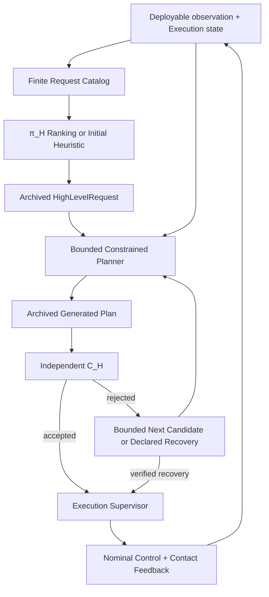

`C_H`は生成済みplanを変更せずaccept/rejectする。計画器内部の最適化はarchive前の
生成処理であり、archive済み不合格軌道をcheckerが黙って修復してはならない。Requestと
planは別々にhash保存し、実行器はC_Hが合格にした同一解だけを受け取る。修正案は新しい
plan IDと再検証を必要とする。安全制約・閾値はNNのscoreや報酬では変更できない。
Solverのsuccess flagや自己申告の残差だけを合格根拠にせず、C_Hは保存された解と入力モデル
から必要な制約を再評価する。

計画結果は、少なくとも`solution_found / no_solution_found / timeout / invalid_request`
とC_Hの`accepted / rejected / not_checked`を分けて保存する。`no_solution_found`や
時間切れは物理的実行不能の証明ではない。拒否・時間切れの原因、探索数、計画／検証時間、
使用した制約marginを記録する。第一候補の成功、上限内の候補探索でのsystem成功、緊急
fallback成功を別々に評価し、拒否された要求へfallbackの成功報酬を帰属させない。

π_Hの離散選択は主にphase境界・失敗・再選択が必要なeventで行い、同じ要求を使う
連続軌道の再計画と低レベル制御は別周期にする。旧2 Hz／2 s／0.25 sはlegacy実験値であり、
オンライン成立の保証値ではない。実装するdeployment profileは次を明示して測定する。

```text
decision / replanning / control rates and horizon / discretization
maximum candidate count, solver iterations and end-to-end planning/checking deadline
allowed observation age, plan validity interval and tracking-error envelope
safe continuation / stop / retreat conditions and recovery deadline
latency distribution, worst observed latency, timeout and missed-deadline rates
```

遅れて返った解は現在状態と有効範囲を再確認してから使う。期限内に新解がないときは、
状態が保証範囲内にある検証済み継続区間または宣言済み回復だけを実行する。last commandの
保持を一般に安全とはみなさない。接触タスクでは停止にも荷重支持が必要である。

独立Isaac shadow executionはモデル・checker・controllerの受入試験と回帰確認に残す。
全候補の高忠実度shadow rolloutを恒久的なオンライン必須処理とする設計は採らないが、
検証済みのonline validation profileがない間は既存shadow gateを単に無効化してはならない。
高速checkerへの移行には、同じhard safety基準、区間衝突、力・actuator余裕、推定／追従
誤差を扱えることをshadow比較とfull-task Isaac評価で確認する。未検証profileはfail closed。
新しい安全基準や許容値の緩和をこの責務変更に便乗して導入してはならない。

### 19.7 Legacy teacher and promoted C3 boundary

C3のconfiguration-space plannerはoffline teacher toolingであり、保護されたC3実行は
hash-bound complete nominal trajectoryをreplayする。この契約をオンライン再計画へ
変更しない。C3の`approach / contact_acquisition / lift / transport / place / release /
retreat / settle`、compact phase adapter、privileged outcome evaluationも履歴契約に従う。

新規runtimeではC3 privileged phase supervisor、full-CWT NN head、検証後に別IKを解く
raw/resolved pathを用いない。既存CWTのfield layoutを再利用しても、producer、補間、
検証対象、policy actionの意味が変わるため、同一契約としてcheckpointをloadしてはならない。

---

## 20. π_L and Low-Level Control

### 20.1 Role split

新規runtimeの標準経路は、検証済みplanを追従する名目制御であり、π_Lの学習済み補正は0
とする。名目制御はplanの関節・centroidal参照、決定論的な接触／荷重feedback、QPID/QP、
local servoを含む。π_Lは必要性が測定された後の任意拡張であり、最終actuator commandを
出してはならない。Section 20.2のπ_L入力と20.9のv9 actionは保護C3／将来の再適用用である。

```text
π_H: event-driven request selection
Constrained Planner: bounded online replanning under the active request
Nominal builder / contact feedback: short-period bounded PolicyCommand
QPID/QP + local servo: actuator command at the validated control rate
```

各周期・deadlineはSection 19.6のdeployment profileで決める。

現行 `centroidal_local_joint_v2` では、通常制御を次の二経路に分ける。

```text
centroidal pose/twist + additive centroidal wrench bias
  -> true-centroidal QPID
  -> rotor/thrust-vectoring QP

absolute non-vectoring joint targets + bounded torque bias
  -> actuator-local position/velocity servo
  -> safety clamp / controller bridge
```

通常時 QP は per-contact wrench、Dock internal wrench、または generic non-vectoring
joint torque を decision variable にしてはならない。Vectoring joints だけは rotor axisを
決めるため allocator が所有する。非vectoring joint motionは Version 1では quasi-static
とし、測定joint stateから mass、CoM、inertia、rotor origin/axisを各周期で更新する。

QP/PID controller、準静的な合体形態の単一剛体モデル更新、QP allocation、Isaac actuator target 変換、および P4-control acceptance の詳細は、以下の補助仕様を参照すること。

```text
for_codex/A-MSRR_QP_PID_controller_design_spec_v0_1_ja.md
```

この補助仕様の Section 14 は controller-specific detail の正本である。本 v0.5はその
承認済み改訂を本文へ取り込んでいる。補助仕様の Section 1--13 に旧 contact-aware QP
表現が残る場合は、本節と同補助仕様 Section 14を優先する。

### 20.2 π_L input

```text
RuntimeObservation
MorphologyGraph
PhysicalModel summary
ContactWrenchTrajectory
current active knot
controller status
previous action and recurrent state
deployable contact-relative kinematics and motor-load proxy when active
```

Actor input に raw PhysX contact force/impulse、privileged exact wrench、simulator-only
collision truthを含めてはならない。Active-contact feedbackは FK、object-state estimate、
anchor/object relative twist、motor-current-equivalent signed joint loadから構成する。

### 20.3 PolicyCommand schema

```python
class PolicyCommand:
    control_contract_version: str                      # centroidal_local_joint_v2
    desired_body_twist: list[float] | None             # CoM linear world + angular body
    desired_body_pose: Pose7D | None
    residual_wrench_body: list[float] | None
    joint_position_targets: dict[str, float]
    joint_velocity_targets: dict[str, float]
    joint_torque_bias: dict[str, float]
    priority_weights: dict[str, float]

    # legacy_contact_bias_v1 archive readability only
    desired_anchor_pose_offsets: dict[int, Pose7D]
    joint_position_bias: dict[str, float]
    joint_velocity_bias: dict[str, float]
    contact_tracking_bias: dict[int, list[float]]
```

`desired_body_pose/twist` の body は base module ではなく assembled morphology の
centroidal control frame を意味する。`joint_*_targets` は nominal referenceへのbiasでは
なく absolute non-vectoring joint targets である。`joint_torque_bias` は local servoへの
bounded offsetであってfinal torque commandではない。

Legacy fieldsは既存artifactのdeserializeにだけ使い、`centroidal_local_joint_v2`で
normal controller referenceへ変換してはならない。特に `contact_tracking_bias` は現行
normal pathでは no-op である。

### 20.4 ControllerCommand schema

```python
class ControllerCommand:
    control_contract_version: str
    rotor_thrusts_n: dict[str, float]
    vectoring_joint_targets: dict[str, float]
    joint_torque_commands: dict[str, float]
    dock_mechanism_commands: dict[str, float]
    joint_position_targets: dict[str, float]
    joint_velocity_targets: dict[str, float]
    joint_torque_bias: dict[str, float]
    controller_status: ControllerStatus
```

### 20.5 QP objective

各 control step で true-centroidal desired wrench を rotor thrust / thrust-vectoringへ
割り当てる constrained problem を解く。

Generic form:

```text
min_{f, v, s}  1/2 || A(q) [f, v] + s - w_des ||^2_Q
       + α_u ||u||^2
       + α_Δ ||u - u_prev||^2
       + α_s ||s||^2

subject to:
  rotor thrust bounds and rate limits
  thrust-vectoring position/velocity/effort bounds
  finite command and actuator support constraints
  configured safety bounds
```

通常 path の変数は rotor thrust、thrust-vectoring、および必要な slack に限定する。
Contact wrench requirementsは計画・feasibility・接触feedbackの目標／制限、任意π_Lの
context、reward/evaluation、loggingに用いる。個別contact wrench tracking termとして
通常のcentroidal QPへは入れない。計画器が接触力を最適化することとは区別する。

Non-vectoring joint commandは別の deterministic local servoで生成する。

```text
tau_requested = Kp * (q_target - q)
              + Kd * (qdot_target - qdot)
              + tau_bias
```

Controllerは position、velocity、rate、effort、torque-bias、finite-value、joint-limitを
検査・clampし、`pi_A` latch/detach overrideとdeterministic holdを優先する。

### 20.6 Nominal command builder and closed-loop contact feedback

`CentroidalTarget`と`PostureTarget`はSection 19で検証済みの同じ全身解に属する。
Builderはその時間評価器からabsolute referenceを得る。制約付き計画で得た関節軌道を
捨てて、実行時に別IKでanchor poseから再生成してはならない。

幾何経路のcache再利用では、同じ観測・選択要求に対するfresh計画と区間時刻・経路が一致すること。
reviewed経路はその正本の全区間から復元し、generated経路と同じ尾部生成器へ渡して
区間時間を変更してはならない。いずれも名目preloadと実行軌道の全体検査は再計算する。

```text
q_plan, qdot_plan, centroidal_ref = evaluate the accepted plan at execution time
learned_delta_q, learned_delta_qdot, learned_wrench = 0 in the standard path
q_target, qdot_target = planned references + bounded deterministic contact correction
w_pose = centroidal pose/twist tracking wrench
w_payload = estimated supported payload / gravity / inertia feedforward
w_des = w_pose + w_payload + bounded deterministic feedback
PolicyCommand = absolute references and bounded biases for QPID/QP and local servos
```

接触制御には、FK、anchor/object相対距離・速度、object-state estimate、motor-current-
equivalent load、接触推定の信頼度を使う。19.4.1の暫定段階では名目preloadと既存の
関節・機体feedbackから開始し、実際に問題が観測された部分を改良する。接触制御の
拡張時は荷重不足・過大圧縮・滑りを観測して、同定したcomplianceとactuator上限
の下で参照／biasを調整する。必要feedbackが取得できない場合は0という架空の測定値で
継続せず、信頼度不足として遷移を止め、再計画・回復する。

この補正には、計画時に検証したjoint／collision／effort／接触許容範囲を適用する。
補正量、追従誤差、saturationを記録し、範囲を超える要求は新しいplanと再検証へ戻す。
安全clampが作動した指令を元planの完全追従と報告してはならない。単一の固定押し込み量や
module-count別の応急ruleでcontact feedbackを代用してはならない。

`observed_material_slip_bounded_closure_v3`では、取得済みのgrasp bindingについて、
接触取得時のFK点を物体座標で記録し、現在の同じ点の接線方向変位から滑りを観測する。
法線変位を除いた滑りが2 mmを超えると、その超過分に比例する追加の閉じ量を要求する。
要求を時間積分せず、滑りが止まった後は確立した閉じ量を保持する。接触距離とmotor load
による接触推定が成立している間だけ増加させ、releaseでは滑らかに解除し、binding変更や
resetで状態を消去する。raw contact forceや教師の将来姿勢は入力にしない。

追加幅は名目閉じ量一回分を上限とし、既存の最大leadと、名目法線荷重・重力支持を含む
actuator負荷推定の余裕で制限する。選択済みbindingについて一つの追加圧縮姿勢を求め、
量子化後のIK解をFKで再評価して法線増分が上限以内になるよう縮小する。最大要求幅を
全て達成できなくても、絶対・追加の接線誤差がともに2 mm以内となる部分方向を採用できる。
補正幅は要求値ではなく実FKで達成した最大法線増分を記録する。全候補IKは行わない。
実行する追加qとその差分に対応するqdotには、既存joint/velocity限界と、毎control sampleの
native全身衝突判定を適用する。新しい増分が不適なら直前の増分を再検査し、それも不適なら
実行を拒否する。実actuator指令のeffort clampは維持する。負荷推定は正確な接触力の保証では
なく、sampleごとの衝突検査も連続時間の安全証明ではない。

この処理は決定論的な後段接触補正であり、π_Hの三つの離散出力とπ_Lの学習残差ゼロを
変更しない。補正予備幅・滑り・追加閉じ量・実適用倍率を保存し、rolloutのruntime契約にも
束縛する。現在の実装はgrasp用で、他の接触modeには対応する接触制御則が必要である。

`authored_object_pose_goal_guard_v1`では、最終目標に対応するplace/release/settleの
位置・姿勢完了判定に、追跡対象のTaskSpec object-pose goalの許容値を使う。固定値52 mmで
50 mm許容の目標への設置を完了扱いしてはならない。lift/transportの中間目標判定は区別し、
タスクの合否条件・制限時間は変更しない。このguardの意味もrolloutのruntime契約に含める。

`observed_object_orientation_bounded_posture_v3_native_gn`では、名目軌道の終端保持中に、観測物体姿勢と
現在phaseの物体目標姿勢との差から、両手先への共通回転目標を作る。機体centroidal poseと
全Dock関節角を同時に補正し、手先目標誤差・手先間相対pose誤差・上限で正規化した名目からの
変形量を最小二乗で抑える。正確な接触力追従や物体との剛体結合を仮定せず、物体姿勢を再観測する。
現在の解は局所的な正則化最小二乗であり、大域最小変形や目標の完全実現を保証しない。

計算時間を有界にするため、同じ目的関数に対してGauss–Newton更新を最大2回行う。各回の
線形化されたbox拘束付き最小二乗はnative C++/EigenのQR active-set法で最大180反復とし、
有限差分用のFK・CoM再中心化・残差をnative batchで計算する。有限な候補で、元の非線形
目的関数が増えない場合のみ更新候補とする。線形solverの収束と非線形目標の達成を区別し、
後述の実FKによる把持形状・速度・全身衝突検査は省略しない。

終端はprogress>=1−1e−6と名目機体twist/関節速度（追加閉じ速度を含む）が丸め許容1e−6以内の
ゼロで識別する。観測物体速度≤0.05m/s・角速度≤0.1rad/s、既存phase guardの姿勢許容超過、
把持維持と接触推定成立を起動条件とする。phase内で起動をラッチし、phase/binding/resetで解除する。
名目への絶対補正として0.50秒一次応答の物体姿勢比例誤差を使い、実機体poseを目標へ取り込まない。
raw接触力や教師未来姿勢は入力にしない。material-slip閉じ量feedbackは別責務で維持する。

機体補正は位置30mm・回転0.20rad、追加速度20mm/s・0.15rad/s以内とする。実装は各3軸の
上限を各norm上限/√3とした保守的boxで保証する。関節補正は閉じ量適用後の名目から各0.10rad、
追加速度0.05rad/s以内、さらに物理可動域と名目＋閉じ量＋姿勢補正の合成速度限界を満たす。
各cycleの差分だけでなく名目からの累積offsetを制限する。CoM再中心化を含む既存native FKを
使い、手先間相対poseは名目から位置0.5mm・角度0.005rad以内に保つ。これらは暫定の共通補正
上限であり、TaskSpecの合否許容値の変更ではない。接触荷重・圧縮の実現を保証する値ではない。

把持が続く移動区間では、成立した補正offsetを保持する。移動中に新たな姿勢feedback補正を起動しない。
新phaseの終端では既存の整定・姿勢誤差条件に従って再調整する。releaseや接触推定喪失時には、
実現手先poseの補正を滑らかに0へ戻す目標を同じ拘束付きIKで解く。保持中も新しい名目姿勢との
合成でjoint範囲・総速度・pair相対pose・全身衝突を再検査し、不適なら停止する。
関節と機体のoffsetを別々にclipして把持を変形させない。実採用差分から追加twist/qdotを生成し、
毎sampleのnative全身衝突検査で合成指令を検証する。拒否時は直前補正を再検査し、それも不適なら
停止する。無効proposalの内部補正stateはcommitしない。既存QP/actuator制限とTaskSpec合否条件を維持する。
補正量、目標未達誤差、手先間誤差、線形solver収束・反復数、安全受理をtraceに記録する。controller契約をrollout
identityへ含め、旧経験を新契約のon-policy経験として再利用しない。旧bodyのみ補正や局所姿勢投影は
標準経路へ重ねず、履歴としてのみ保持する。

名目QPID/QP経路ではGPUの固定反復をCUDA Graphで再実行し、CPUでは同じADMM反復と
6半空間への射影をnative実装する。反復数・実適用指令の可行性検査・制約は維持する。
固定形態のCPU剛体モデル計算はTorch compileを使用でき、GPU Graph/CPU compileの初回処理は
制御開始前に完了させる。現在状態に依存する値を固定cacheへ入れず、形態・参照幾何のみを
cacheする。PCの計算時間や過去の別kernelのVIM4比率を、実機50Hz保証と同一視しない。


Payload feedforwardは現在の荷重分担の推定に基づく。lift/releaseを要求しただけでは
on/offせず、支持台との荷重移行を観測して変更する。PIDにはQP infeasible、saturation、
resetでanti-windupを適用する。接触力の最適化がservoで実現されるかはfull-task評価で確認する。

`centroidal_local_joint_v2`のPolicyCommand field layoutは保持する。新しいnominal builderと
feedbackの意味・設定は新runtime contractに束縛し、π_Lのlearned residualとログで区別する。
C3 replayでは旧v9 decoder／nominal preload規則を変更しない。最終actuator commandの
authorityは常にQPID/QP、local servo、safety/controller bridgeである。

### 20.7 Control diagram

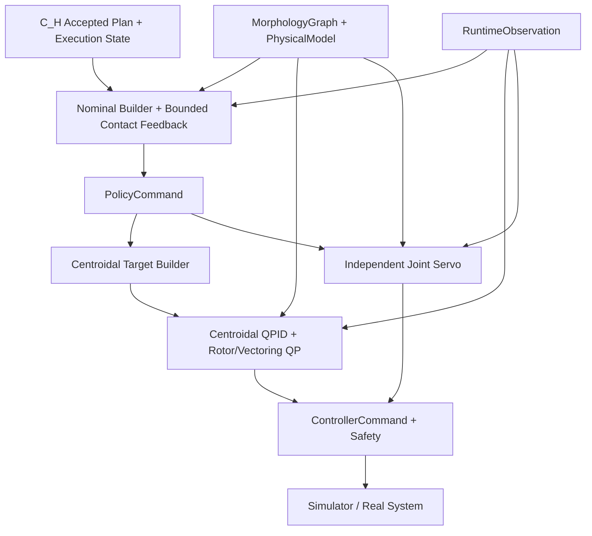

### 20.8 Controller bridge and actuator mapping for Isaac

`QPIDController` / `QPAllocator` の initial implementation は simplified scaffold であってよい。P4 full grasp/carry / Isaac execution では、`ControllerCommand` を Isaac backend の actuator targets へ変換する controller bridge が必須である。

Agent I/J は以下を提供しなければならない。

```text
Input:
  PolicyCommand
  active InteractionKnot
  RuntimeObservation
  PhysicalModel
  assembled MorphologyGraph / ConstructionState
  controller status

Output:
  ControllerCommand
  Isaac actuator target record
  controller bridge metrics
```

Requirements:

```text
1. assembled morphology から active rotors, vectoring joints, dock actuators, module ids を抽出する。
2. ControllerCommand -> Isaac actuator target 変換器を提供する。
3. assembled morphology に応じた rotor / vectoring joint / dock actuator mapping を作る。
4. missing actuator / unsupported actuator / clipped command / infeasible allocation を metrics として記録する。
5. existing BoundedVerticalRotorAllocator は fallback として残してよい。
6. true-centroidal multi-axis rotor/vectoring QP が未実装の場合は simplified allocator と明記する。通常QPへ個別contact wrench変数を追加してはならない。
7. π_A 用に docking / detach / separation control handoff request を controller target へ変換する bridge を提供する。
8. controller infeasible / clipped / residual / unsupported wrench を RuntimeObservation と EpisodeArchive に保存する。
```

π_L は actuator command を直接出力してはならない。最終 actuator authority は常に controller / QP / safety layer と controller bridge に属する。

### 20.9 Order-9 v9 common contact-space action contract

本節は保護されたC3のas-built契約であり、新規runtimeの標準経路へのπ_L適用を要求しない。
本節のπ_H軌道はC3用teacher/replayを指す。以下の数値・preload・action規則を保持する。

Order-9 C3以降の現行 `pi_L` は、全 2--8-module morphology で同一の
`order9_categorical_contact_normal_policy_command_pi_l_v9` contractを使う。
Module count、bucket ID、held-out identityによりhead、mask、action range、controller
modeを切り替えてはならない。MorphologyGraphを入力として値が変化することは許される。
Legacy artifactのdeserialize/replay validationのため
`c3_contact_compression_only_module_counts` や `c3_joint_only_module_counts` がconfig schemaに
残っていてもよいが、v9 runtimeはそれらをaction selectorとして参照してはならない。
これらのserialized値は、現行headやapplied actionを制限する根拠ではない。

Actorの論理出力は次である。

```text
global:
  centroidal position/orientation residual
  centroidal linear/angular twist residual

per active contact slot:
  inward-normal translation
  two tangential translations
  three contact-frame rotations

per non-vectoring joint:
  position residual
  velocity residual
```

Schemaにはcentroidal wrench biasとjoint torque biasが存在するが、v9 contact-space
adapterのapplied actionでは両方をゼロにする。Torque-level authorityはQPID/local servoに
残す。

Active contactごとのinward-normal coordinateは81値のcategorical distributionである。

```text
physical values = {-20.0, -19.5, ..., 0.0, ..., +19.5, +20.0} mm
category count  = 81
step            = 0.5 mm
```

これはGaussian actionを後段で丸める方式ではない。Executed category自身のcategorical
log probabilityをPPO replayに保存する。他の5 contact coordinatesはbounded continuous
distributionのままとする。Current promotion profileのtangential translation limitは
`2 mm`、rotation limitは`0.02 rad`である。

Reviewed nominal contact postureで一度構築したcontact Jacobian basisを用いて、runtimeを
tensor-onlyで写像する。

```text
delta_q = N_contact * delta_q_posture
        + J_contact_damped_inverse * delta_x_contact
        + delta_q_centroidal_compatibility
```

Centroidal pose/twist residualはactive point-contact translational constraintsと両立する
subspaceへprojectし、independent joint residualはcontact Jacobian nullspaceへprojectする。
二つのpoint contactを二つのfull-6D rigid constraintsとして扱って全centroidal actionを
消してはならない。Projector weightはapproachで0、contact acquisitionで連続的に増加し、
lift/transport/placeで1、releaseで連続的に減少し、retreat/settleで0とする。

#### 20.9.1 Morphology-aware nominal contact preload

π_Hのanchor poseはobject surface上の幾何目標であり、押し込み量を含まない。Nominal IK
はreview済みfinal contact postureにおいて、次のdeterministic modelからinward leadを
計算する。

```text
required tangential support = safety_factor * object_mass * gravity
normal-force allocation     = minimize peak joint effort utilization
joint compliance            = J_n * diag(1 / joint_stiffness) * J_n^T
contact compliance          = normal_force / contact_stiffness
requested lead              = max over anchors of predicted displacement
nominal lead                = ceil(requested lead / 1 mm) * 1 mm
```

Promotion profileではsupport safety factor `1.25`、各anchorの最低分担率 `0.50`、peak
effort utilization上限 `0.80`、nominal lead最低 `2 mm`、configurable safety cap
`50 mm`を用いる。Universal `12 mm` model-error marginは **MUST NOT** 加算する。
Nominal preloadとlearned categorical contact-normal residualは別の量であり、最終的な
contact closure intentは両者をcontact-space adapter内で合成してjoint limit/local trust
regionへclampする。

この計算はmorphology/contact/load/actuator/complianceに依存するがmodule countやbucket ID
に依存するrule tableではない。Raw contact forceを読みながら押し込みを積分する
controller-side preloadでもない。

#### 20.9.2 Deployable feedback and privileged boundary

v9 actorは各active contactについて次のdeployable feedbackを受け取ってよい。

```text
signed anchor-to-object surface distance
contact-frame relative linear/angular velocity
signed motor-current-equivalent compression load
contact geometry, friction, patch area, priority, authored wrench context
```

これらはFK、object-state estimation、およびmotor currentから構成する。Raw PhysX contact
force/impulse、exact penetration、simulator collision truthをactor inputへ入れてはならない。
TrainingではPhysX contact truthをreward、critic、probe label、diagnostic、formal evaluationに
使用してよい。Probe-derived contact-normal teacherはPPOを置き換えず、contact-normal head
だけへのauxiliary updateであり、PPO update indexを消費しない。

---

## 21. Encoder Architecture and Shared Interaction Workspace

### 21.1 Principle

specialized encoders と fusion workspace を使う。すべての modalities に単一の encoder type を使ってはならない。

```text
TaskSpecEncoder
GeometryEncoder
IRGEncoder
InteractionEnvelopeEncoder
MorphologyEncoder
ContactCandidateEncoder
RuntimeObservationEncoder
PhysicalModel/CapabilityEncoder
  -> FusionEncoder
  -> QueryPooling
  -> π_D, π_H, π_L, critics, feasibility heads
```

### 21.2 Backend config

```yaml
model:
  task_encoder_type: mlp_embedding
  geometry_encoder_type: graph_transformer
  irg_encoder_type: hetero_graph_transformer
  morphology_encoder_type: graph_transformer
  runtime_encoder_type: hybrid_mlp_graph
  fusion_type: transformer
  query_pooling: learned_queries
```

`morphology_encoder_type: gnn` が選択された場合、それは morphology graph encoding にのみ適用され、TaskSpec scalar tokens へ自動的に適用されるわけではない。

同じ rule はすべての `*_encoder_type` に適用する。Graph encoder backend は明確な node/edge 構造を持つ modality にだけ使う。TaskSpec scalar/enum、InteractionEnvelope summary、SafetySpec などの non-graph fields は MLP + embedding または token MLP で encode する。

InteractionEnvelopeEncoder は required component である。backend config に専用 key が存在しない場合、実装は `mlp_embedding` fallback を使う。

ContactCandidateEncoder は π_H contexts で required component である。ContactCandidateSet が存在しない π_D contexts では empty candidate token group と mask を渡す。

### 21.3 Shared workspace diagram

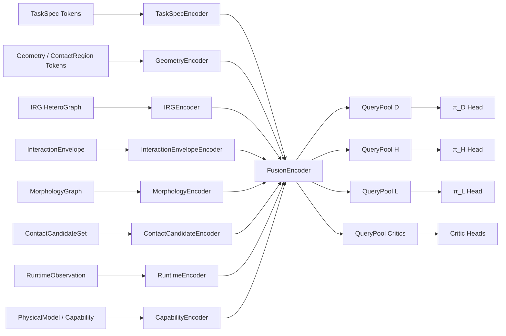

### 21.4 Token categories

```text
Task tokens:
  task type embedding, goal features, safety features, robot constraint features

Geometry tokens:
  object tokens, global shape tokens, surface patch tokens, contact region tokens

IRG tokens:
  heterogeneous node/edge embeddings

InteractionEnvelope tokens:
  contact count range, required contact mode tokens, target region set tokens, wrench requirement summary tokens, precision/duration/capability tokens, branch option tokens

Morphology tokens:
  module tokens, port tokens, dock edge tokens, robot anchor tokens, control group tokens

ContactCandidate tokens:
  candidate pose/normal/friction/mode tokens, unary scores, slot-anchor-region ids, pairwise/group summaries

Runtime tokens:
  module state tokens, object state tokens, contact state tokens, controller status tokens
```

### 21.5 Tensor conventions

すべての variable-length tensors は padding and masks を使う。

```text
mask = 1: valid
mask = 0: padding/invalid
```

zero-valued feature vectors から validity を推定してはならない。

### 21.6 SharedInteractionWorkspace tensor contract

Shared Interaction Workspace は external serialized schema ではなく、NN 内部の tensor contract である。実装は以下の dataclass または同等の TypedDict を定義しなければならない。

```python
class SharedInteractionWorkspace:
    tokens: FloatTensor              # [B, N_total, d_model]
    mask: BoolTensor                 # [B, N_total], True means valid
    token_type_ids: LongTensor       # [B, N_total]
    source_type_ids: LongTensor      # [B, N_total]
    source_ids: LongTensor           # [B, N_total], original node/candidate/module/object id or -1
    group_slices: dict[str, slice]
    group_masks: dict[str, BoolTensor]
    query_outputs: dict[str, FloatTensor] | None
```

`group_slices` は少なくとも以下の keys を持つ。

```text
task
geometry
irg
interaction_envelope
morphology
runtime
capability
contact_candidates optional, only for π_H contexts
```

各 head は `source_ids` を使って output ids を元 schema ids へ戻せなければならない。π_Hのgroup／transition／subgoal選択はSection 19.2のcatalog IDへ戻す。参照先の
`candidate_id`, `slot_id`, `anchor_id`もworkspace内部indexではなくsource schema IDとする。
新request catalogのtokens、joint tuple mask、action headは新しいfeature/action versionで
定義し、旧CWT headやAppendix Aのpadding寸法をshape一致だけで流用しない。

### 21.7 Learned queries

`query_pooling: learned_queries` の queries は trainable parameters であり、独立した policy ではない。実装は以下を定義する。

```python
class LearnedQuerySpec:
    query_name: Literal["design", "high_level", "low_level", "critic", "feasibility"]
    num_queries: int
    d_model: int
    allowed_token_groups: list[str]
```

Recommended minimum:

```text
query_D: design context for π_D
query_H: grounded request catalog and current execution context for π_H
query_L: low-level control context for π_L
query_V: critic context
query_F: feasibility/proxy context
```

Queries are updated by downstream losses through attention pooling and head gradients.

---

## 22. Reward, Critics, and Credit Assignment

### 22.1 Distinctions

```text
Proxy score:
  deterministic or heuristic score computed from model/checker.

Reward:
  scalar signal from environment/task execution.

Critic:
  learned value function predicting expected future return.
```

Proxy と critic は相関しうるが、同一の object ではない。

### 22.2 Critics

```text
V_D: evaluates design-stage decisions
V_H: evaluates high-level request decisions, only if request-level RL is used
V_L: evaluates low-level control decisions
```

π_A は Version 1 では deterministic なので、learned V_A は不要である。Assembly metrics は log するべきである。

### 22.3 Stage masks

各 training sample は以下の masks を含まなければならない。

```text
design_decision_mask
high_level_decision_mask
low_level_control_mask
assembly_execution_mask
```

これらの masks により、relevant heads のみを update する。

### 22.4 Grasp & carry reward terms

Per-step reward:

```text
r_t =
  + w_progress * r_object_goal_progress
  + w_pose     * r_object_pose_accuracy
  + w_grasp    * r_grasp_maintenance
  + w_stable   * r_centroidal_stability
  - w_energy   * r_energy
  - w_qp       * r_qp_residual
  - w_slip     * r_slip
  - w_collision* r_collision
  - w_saturation * r_actuator_saturation
```

Terminal reward:

```text
R_terminal =
  + success_bonus if object pose within tolerance and contact release valid
  - failure_penalty if object dropped, collision hard fail, timeout, QP infeasible terminal
```

### 22.5 Design reward

```text
R_D = R_task_summary
    + λ_proxy * R_design_proxy
    - λ_complexity * C_complexity
    - λ_assembly * C_assembly
    - λ_feas * C_feas_violation
```

### 22.6 High-level selection objective

初期のπ_H学習は、実行結果と計画costを用いた候補の分類／順位付けでよい。連続CWTの
wrench・pose・knot timingを回帰対象にしない。必要性が実測された場合だけrequest-level RL
を追加し、その場合の例を次とする。

```text
R_H = task completion and observed progress
    - execution time / planning cost
    - unnecessary contact switches / failed requests
```

静止した接触維持や時間経過だけでtask完了を上回る報酬を累積させてはならない。接触力の
実現可能性と安全性は決定論的制約であり、報酬と引き換えに違反を許さない。要求、生成plan、
実行結果を結び付け、別候補や回復が得た成功を拒否された要求の教師正例にしない。

### 22.7 Low-level reward

```text
R_L = R_tracking
    + R_contact_stability
    + R_qp_feasible
    - R_energy
    - R_saturation
    - R_slip
```

### 22.8 Advantage

For each head:

```text
A_stage = G_stage - V_stage(context_stage)
```

corresponding stage mask が active のときのみ、その head を update する。
Event駆動のπ_Hではdecision間の実経過時間を記録し、return/discountをその時間に整合させる。
RLのaction/log probabilityは実際にsampleしたrequestまたはrankingに対して定義し、
決定論的計画器が生成した連続CWTをNNがsampleしたactionとして扱わない。
教師順位付けのみの段階でcritic/PPOを必須としない。

初期の要求模倣では、既存の成功教師ログを新しいrequest tupleへ対応付けてよい。
教師とIRGの段階分割が違う場合は対応する実行profileを明示し、現在の教師選択を入力側の
実行状態へ先に書かない。最初の要求より後に教師が生成した計画の目標・時間も、初回入力へ
戻してはならない。過去の要求で確定したactive planの参照値は、由来を記録して使用できる。
接触群を平均化する場合も候補と担当moduleの対応を保持し、異なる要求が入力上で識別不能に
ならないか実データで確認する。正規化はtrainのみで推定し、checkpointへ保存する。
初回接触群選択・継続・遷移要求の成績を分け、模倣一致率をIsaacでのtask成功率と区別する。
候補集合自体の生成履歴も因果性監査に含める。教師が選択した群だけに施した接触位置の
補正を、未選択状態の入力へ戻してはならない。R1の平面移送ログでは、記録された選択後の
鉛直補正を観測物体座標への再配置前に取り除き、選択前の候補位置を復元する。
復元根拠・座標系が未対応の補正は拒否する。確定済み計画の参照値と元の成功記録は保持する。
選択群と補正量を変える反実仮想でも初回入力が変わらないことを検査し、runtimeでも
未確定の要求へ教師補正済み候補が入る経路を拒否する。

段階学習では、最初に接触群選択だけを学習してよい。この段階は、未commitの実行状態で
現在phaseのsubgoalとtransition=Noneを固定し、接触群だけを比較する。過去に選択済みの群や
その計画を入力へ戻して初回選択の教師例を増やさない。checkpointには学習範囲を保存し、
接触群専用モデルを継続・遷移まで学習済みとして実行しない。評価用データを開く前に
選択基準と評価対象を固定し、既に評価したheld-outを新規未見データとして扱い直さない。

接触選択の局所geometry profileでは、観測したmotor関節角とURDFの順運動学から
実グリッパanchorの姿勢を求める。観測module姿勢はPhysicalModelのbaselink
（Holonではfc）基準であり、URDFのroot基準のリンク変換を直接合成してはならない。
同じ関節角で計算したroot→baselinkの逆変換を挟み、制御側の独立した運動学と
ゼロ／非ゼロ関節角・回転姿勢で一致を検査する。その上で、anchorから候補接触点への相対位置・相対回転、
baseから担当moduleへの相対姿勢、接触属性と物理port種別を候補ごとに符号化する。
候補ごとの非線形embeddingを生成してから群内の平均・二次モーメントを計算する。
任意のIDを数値特徴として使用せず、world座標を使う量は観測物体のXY/yawに対して
正規化する。現時点のlocal profileは単一剛体物体を対象とする。

PPOへのwarmupでは、初回接触群選択の教師例を実際の選択前観測に限定する。
教師動作の途中・終了後の姿勢を、未選択の実行状態へ書き換えて初回選択の例にしてはならない。
軌道途中の観測は、その時点より前に確定した群・binding・plan・実行phaseを保持し、
継続または次の遷移要求を学習する例として使う。このとき既決計画の目標はruntimeでも
取得できる参照値であり、未来の実測姿勢や教師の次actionを入力へ戻すこととは区別する。
初回選択・継続・遷移要求の成績を分け、全観測の一致率で初回選択の成績を代用しない。
訓練再現性を確認するrunでは各epochで全trainの一致率を測り、100%再現または
事前のepoch/時間上限で終了する。validationの停滞を訓練一致率の飽和と解釈しない。
train基準checkpoint、最終checkpoint、validation基準checkpointを区別して保存する。
教師との接触群一致を目的とするvalidation基準checkpointとearly stoppingは、初回観測の
接触群一致率で判定する。タスク成功を目的とするwarmupの完了条件は別に事前固定し、
教師と異なる群・軌道でも実際のタスク成功を評価する。初回からのIsaac実行と、同じ入力・
action mask・確率を用いる実rolloutのPPO更新を確認する。途中reset、教師による段階切替、
greedy実行をcategorical on-policy PPOの証拠として代用しない。

### 22.9 Order-9 C3 outcome and factorized actor-credit contract

C3のscalar task rewardは次の13 termsを明示的に保存する。

```text
object-goal progress
object-pose accuracy
grasp maintenance
wrench-range diagnostic penalty
deployable normal-contact quality
centroidal stability
energy
QP residual
slip
collision
actuator saturation
terminal success
terminal failure
```

現行C3では `w_wrench_range = 0.0` である。Exact per-contact 6D wrench-box membershipは
π_H feasibility contextとprivileged telemetryとして保持するが、π_L actor reward、phase
admission、task success hard gateにしてはならない。Contact existenceに用いる `0.5 N`
thresholdは数値/no-contact rejection用であってtarget forceではない。

Contact acquisitionはselected physical contact count、QP feasibility、およびcontinuous
dwellを要求する。Lift/transport/place/release/retreat/settleはそれぞれcontact maintenance、
object motion/pose、release contact-free、clearance、settlingと、collision/drop/QP/timeout
safetyを用いる。C3でPhysX contact truthをphase supervisionへ使用してよいが、その事実を
artifact metadataへ記録し、R1以降のlearned π_H runtimeへ持ち込んではならない。

Actor creditはscalar rewardを変更せず、各transitionで厳密に再構成可能な三channelへ
分配する。

```text
contact:
  grasp maintenance, normal-contact quality, slip, contact share of terminal outcome

centroidal:
  object progress/pose, centroidal stability, QP residual, saturation,
  rotor-energy share, centroidal share of terminal outcome

posture:
  collision, joint-energy share, posture share of terminal outcome
```

Contact channelはさらにnormal translation、tangential translation、rotationへ分ける。
Normal-contact qualityはnormal translation、slipはtangential translationへrouteし、
共有terminal outcomeは等分する。全channelの和は元のscalar rewardと各transitionで一致
しなければならない。Criticは分割前のscalar returnをfitする。Promotion profileでは
normal-translation actor loss weightを `3.0` とし、追加のcontact-only optimizer passは
使用しない。

---

## 23. Simulation Environment and Task Environments

### 23.1 Simulator targets

Version 1 は Isaac Sim / Isaac Lab を support するべきである。実装は simulator-specific code を interfaces の背後に isolate するべきである。

```python
class SimulationEnvBase:
    def reset(self, task_spec, morphology=None): ...
    def step(self, controller_command): ...
    def get_runtime_observation(self) -> RuntimeObservation: ...
```

### 23.2 RuntimeObservation

```python
class RuntimeObservation:
    time_s: float
    morphology_graph: MorphologyGraph
    module_states: list[ModuleRuntimeState]
    object_states: list[ObjectRuntimeState]
    contact_states: list[ContactState]
    controller_status: ControllerStatus
    task_progress: TaskProgressState
```

新契約では、この観測にSection 19.2/19.5の版付きexecution contextとcatalogを関連付ける。
`task_progress`は実行器が観測から確定した進捗だけを表す。次phaseの教師labelや未受理の
requestで上書きしてはならない。接触／荷重推定には値だけでなく時刻・信頼度・有効性を
保持する。これらのrecord追加は明示的schema migrationとし、既存C3観測の意味を変更しない。
新しい実行器のphase guardもactorと同じdeployable情報境界に従う。PhysX truthは
学習label・診断・評価専用とし、runtime phase決定の隠れた入力にしてはならない。

### 23.3 Contact modeling v1

P1--P4.0のinterface smokeでは simplified contactを使ってよい。

```text
grasp attach:
  kinematic/fixed-joint approximation after conditions are satisfied

object transport:
  attached object with break force/torque thresholds

support/perch:
  contact force logging + simplified constraint or fixed support after attach

valve:
  revolute joint object with axis, torque requirement, angle state
```

ただし、P4.2以降のphysical grasp/carry、Order 8 natural-contact substrate、Order 9
training/promotionはfree objectと実際のPhysX contactを使わなければならない。Kinematic
attach、fixed joint、invisible fixture、またはcontact truthから生成したcontroller commandを
task-success evidenceへ使用してはならない。Reset construction専用fixtureを使う場合も、
rollout step 0より前に完全に解除し、artifactへ明示する。

### 23.4 Domain randomization

For grasp & carry:

```text
object mass
object size
object shape
object friction
target pose
initial object pose
wind perturbation
sensor noise
thrust scale error
contact break threshold
```

### 23.5 Isaac Lab backend requirements for P4

P4 full completion には Isaac Lab backend が必要である。simplified backend は P4.0 wiring と crash-free interface validation に使ってよいが、P4 full completion の物理的成功率、object drop rate、hard collision rate、controller/QP infeasible terminal rate を主張する source ではない。

Isaac Lab backend は以下を提供しなければならない。

```text
spawn:
  Holon module
  assembled MorphologyGraph
  object geometry / mass / friction
  floor and required support surfaces

runtime API:
  reset(task_spec, morphology, assembly_state)
  step(controller_command or actuator_targets)
  get_runtime_observation()

controller bridge:
  ControllerCommand -> Isaac actuator target conversion
  active rotor / vectoring joint / dock actuator mapping
  missing / unsupported / clipped actuator metrics

logging:
  object pose
  module pose and velocity
  contact state
  object drop event
  hard collision event
  controller infeasible status
  QP residual / allocation residual
  actuator target records
```

P4 full completion では、Isaac step で actuator command が実際に実行され、その結果から `RuntimeObservation`、reward、metrics、`EpisodeArchive` が更新されなければならない。deterministic rollout と minimum learning run の両方を保存すること。

### 23.6 Privileged simulation data boundary

次の情報はtraining critic/reward、teacher label、diagnostic、formal evaluation、deterministic
safety monitorに限定する。

```text
raw PhysX contact force and impulse patches
exact contact-frame realized wrench
exact penetration and simulator collision truth
simulator-only object mass/CoM/inertia disturbance truth
teacher-only under-preload perturbation value
```

これらを actor observation、normal `PolicyCommand`、nominal IK target、QPID reference、
deployment phase decisionへ直接配線してはならない。Actorが使用できるcontact-related
feedbackは、実機で再構成可能なkinematics、state estimation、motor current、controller
statusに限定する。Privileged labelからheadを補助学習してもよいが、推論時入力契約を
変えてはならない。

---

## 24. Training Curriculum and Evaluation Phases

Sections 24.1--24.5.4は既存P0--P4.2の工程・受入記録として保持する。その中のbaseline
π_H trajectory／π_L表記は当時の接続を示す。新規開発ではSection 19のrequest／planner／
executor／名目制御に置き換え、以下の改訂済み学習工程を使う。C3 promotionを再実施した
ことにも、新規オンライン経路が受入済みであることにもしてはならない。

### 24.1 P0 acceptance

```text
TaskSpec parses example YAML.
GeometryProcessor returns GeometryDescriptor for primitives and mesh objects.
URDF parser reads developer reference holon.urdf if present.
IRGBuilder generates valid IRG for every task family.
InteractionEnvelope extracts from every IRG.
All schemas serialize/deserialize.
All padded tensor shape tests pass.
```

### 24.2 P1: diverse object grasp & carry with fixed/simple morphology

Goal: simple morphology を使い、GeometryProcessor、IRGBuilder、π_H/π_L/controller loop を検証する。

Acceptance:

```text
success_rate >= 60% on training object distribution with fixed morphology
no schema/checker crashes over 1000 episodes
contact candidate sampler returns non-empty candidates for valid objects
```

### 24.3 P2: design for grasp & carry

Goal: π_D と FeasibilityChecker を train/evaluate する。

Acceptance:

```text
valid_design_rate >= 70%
required_slot_coverage >= 90% for accepted designs
closed_loop_invalid designs rejected
feasibility labels stored correctly
```

### 24.4 P3: assembly integration

Goal: deterministic assembly plan を実行する。

Acceptance:

```text
assembly_success_rate >= 70% in simplified sim
retry/abort paths tested
ConstructionState updates match physical graph changes
```

### 24.5 P4: full grasp & carry

P4 は、simplified full-pipeline integration と Isaac-backed full grasp/carry completion を明確に分ける。

```text
P4.0:
  simplified full-pipeline integration

P4-control / P4a:
  low-level flight validation in Isaac Lab

P4.1:
  Isaac Lab backend smoke

P4.2:
  Isaac deterministic full grasp & carry rollout

P4.3:
  Isaac learning bootstrap

P4 full completion:
  Isaac-backed rollout + minimum learning run + acceptance
```

P4.0 は P4 full completion ではない。P4.0 の success_rate / object_drop_rate / collision_rate / QP infeasible rate は simplified backend 上の指標であり、Isaac Lab 上の物理的成功率ではない。P4.0 を P4 complete と呼んではならない。

#### 24.5.1 P4.0: simplified full-pipeline integration

Goal: simplified backend 上で、P2 selected `DesignOutput`、P3 assembly result、`ContactCandidateSampler`、π_H、π_L、controller scaffold、`EpisodeArchive` logging を接続する。

P4.0 では以下を実装してよい。

```text
P2 / P2.5:
  selected DesignOutput を使う。
  auxiliary learned π_D scorer / feasibility head を参照可能にしてよい。
  deterministic P2DesignPolicy / FeasibilityChecker fallback は残す。

P3:
  assembly result を使う。
  P3 simplified assembly success を physical docking success と解釈しない。

Design / morphology:
  FixedSimpleDesignPolicy 固定経路を避ける。
  P2 selected morphology / P3 assembled morphology を downstream に渡す。

Contact / trajectory / control:
  assembly 成功後の morphology から contact candidates を生成する。
  selected assignment feasibility cache を記録する。
  baseline π_H trajectory を生成する。
  π_L は PolicyCommand を出す。
  controller layer は ControllerCommand を出す。
  π_L は actuator command を直接出さない。

Logging:
  EpisodeArchive に design, feasibility, assembly_plan, trajectory,
  PolicyCommand, ControllerCommand, rewards, metrics を保存する。
```

P4.0 simplified acceptance:

```text
P2 selected DesignOutput を使う。
P3 assembly result を使う。
FixedSimpleDesignPolicy 固定経路を使わない。
contact candidates が生成される。
π_H trajectory が生成される。
π_L PolicyCommand が生成される。
ControllerCommand が生成される。
EpisodeArchive に必要な情報が保存される。
simplified success_rate / object_drop_rate / collision_rate / QP infeasible rate を記録する。
report に simplified backend 指標であり物理成功率ではないことを明記する。
```

#### 24.5.2 P4-control / P4a: low-level flight validation in Isaac Lab

Goal: object grasp/carry や contact task に入る前に、Isaac Lab 上で controller / actuator mapping / `RuntimeObservation` / `EpisodeArchive` の下位閉ループを検証する。

P4-control / P4a の制御器詳細仕様は、Section 20 の補助仕様として次を参照する。

```text
for_codex/A-MSRR_QP_PID_controller_design_spec_v0_1_ja.md
```

特に、初期実装では Python/library-based QP、per-thruster thrust target を primary Isaac representation とする controller bridge、absolute position vectoring joint targets、reaction torque を含む allocation model、link-level quasi-static inertia aggregation、および configurable waypoint tracking threshold を用いる。

P4 full completion の前提条件として、以下の低レイヤ検証を必須とする。

1. Isaac single-module hover smoke

```text
Holon module 単体を Isaac Lab に spawn する。
rotor / vectoring joint / actuator target が Isaac 側に渡ることを確認する。
deterministic hover controller で一定時間 crash-free に hover できるか確認する。
RuntimeObservation に pose, velocity, actuator/controller status を保存する。
EpisodeArchive に controller_commands, actuator_targets, metrics を保存する。
```

2. Fixed morphology hover smoke

```text
2-module または 3-module の決め打ち connected morphology を spawn する。
まず P2/P3 の出力でなく固定構造でよい。
assembled morphology に対して active rotors / vectoring joints / dock actuators の mapping を確認する。
hover, attitude hold, small position hold を行う。
```

3. Fixed morphology waypoint tracking

```text
object なしで、決め打ち構造を target pose / waypoint に追従させる。
π_H は使わず、低レイヤ controller target を直接与えてよい。
π_L を使う場合でも、π_L は PolicyCommand のみを出し、最終 actuator command は controller layer が出す。
```

P4-control acceptance:

```text
single-module hover が crash-free に完了する。
fixed morphology hover が crash-free に完了する。
fixed morphology waypoint tracking が一定 pose error 以下で完了する。
ControllerCommand と Isaac actuator target record が EpisodeArchive に保存される。
RuntimeObservation が各 step で保存される。
controller infeasible / clipped allocation / residual metrics が保存される。
```

#### 24.5.3 P4.1: Isaac Lab backend smoke

Goal: Isaac Lab backend の reset / step / observation / logging path を smoke-test する。

P4.1 では、Holon module、assembled morphology、object、floor を spawn し、`ControllerCommand` から Isaac actuator targets への変換が動作することを確認する。contact-rich grasp/carry success は P4.2 で評価する。

Acceptance:

```text
Isaac backend reset が TaskSpec と MorphologyGraph を受け取る。
Isaac backend step が actuator targets を実行する。
RuntimeObservation が module pose, object pose, contact/controller status を含む。
EpisodeArchive が controller_commands, actuator target records, metrics を保存する。
missing actuator / unsupported actuator / clipped command が metrics に記録される。
```

#### 24.5.4 P4.2: Isaac deterministic full grasp & carry rollout

Goal: Isaac Lab 上で deterministic fallback policies/controllers を使い、object grasp & carry rollout を実行する。

P4.2 は learned policy quality を主張する phase ではない。deterministic `P2DesignPolicy`、deterministic `FeasibilityChecker`、baseline π_H、baseline π_L、controller bridge / allocator fallback を残したまま、Isaac-backed rollout metrics を保存する。

Acceptance:

```text
Isaac rollout success_rate を記録する。
object_drop_rate を記録する。
hard_collision_rate を記録する。
controller/QP infeasible terminal rate を記録する。
rollout archive を保存する。
deterministic fallback が残っている。
```

#### 24.5.5 P4.3: Baseline-first learning bootstrap

新契約では、学習器が未完成の物理経路を補う前提を置かない。次を順に実施する。

1. **未学習baseline**: 固定の有限候補優先則、オンライン制約付き計画器、実行器、π_L無効の
   名目制御でfull grasp/carry/place/release/retreatを成立させる。Section 27.4の因果性、
   同一軌道実行、contact feedback、計画時間と安全性の検査を先に通す。
2. **π_H候補順位付け**: 同一入力snapshotに対する候補ごとの計画結果、実行成否、costを
   dataset化する。初期学習は分類／rankingとし、固定優先則に対する成功率・候補試行数・
   end-to-end時間の改善を同条件で評価する。全CWTの教師模倣を必須工程にしない。
3. **必要時のrequest-level RL**: 順位付けだけでは不足することを測定した場合に限る。
   deterministic safetyは維持し、fallbackによる成功やpost-decision phaseを教師に混ぜない。
4. **π_D**: R1--R4で計画・制御の条件範囲を検証してからmorphology ranking／selectorを
   outcomeで学習する。π_Dが生成した構造にも同じ計画器・checkerを適用する。
5. **任意のπ_L**: 他要素完成後に、名目制御では埋まらない測定済みの不足がある場合だけ
   再検討する。新しい学習系統、補正上限、同条件の改善、安全性非劣化を必要とする。

Required artifacts:

```text
unlearned baseline full-task Isaac archive and held-out metrics
request/catalog/execution-state records and solver/checker timing/outcome records
same-plan tracking, contact estimation, clearance, actuator and recovery metrics
learned π_H checkpoint and ranking comparison only when π_H learning is claimed
π_D checkpoint and held-out design outcome evaluation when π_D learning is claimed
request-level PPO or π_L artifacts only when those optional stages are actually used
source/config/model/feature/action/controller identities and fixed train/validation/test splits
```

未学習baselineの合格はlearned π_H／π_Dの達成を意味しない。全policy同時RLを開始条件に
せず、比較で有効性を示せない学習器を導入し続けない。小さな条件変更でbaselineが失敗する
間はdataset拡大や長時間学習へ進まず、計画・観測・制御のどの仮定が破れたかを特定する。

#### 24.5.6 P4 full acceptance

P4.0のsimplified acceptanceだけではP4 full completionを満たさない。新契約での完了は
low-level flight、Isaac backend、オンラインbaseline、Section 24.5.5で採用した学習要素、
Section 27.4の受入検査を含む。既存P4の最低数値基準は保持する。

```text
success_rate >= 50% on held-out Isaac object distribution
object_drop_rate <= 20%
hard_collision_rate <= 5%
controller/QP infeasible terminal <= 10%
rollout archive and contract-bound metrics exist
learned components claimed as complete have checkpoint and held-out outcome comparison
online planning/checking/execution satisfy the declared deadline and validity profile
first-choice, bounded-search, and emergency-fallback outcomes are reported separately
learned production path passes deterministic safety gates
```

この最低数値はP4 milestoneの基準であり、実機安全性やR1--R4の頑健性を保証しない。
Ringごとの分布・成功／安全基準・計算予算は実行前に固定し、失敗後に条件を狭めて同じ
評価として報告しない。π_L checkpointやfull-CWT BC/PPOを新契約の必須成果物としない。
π_D／π_Hを未学習のまま使う場合は、その範囲をbaseline completionと明記する。

#### 24.5.7 P4 full-pipeline diagram

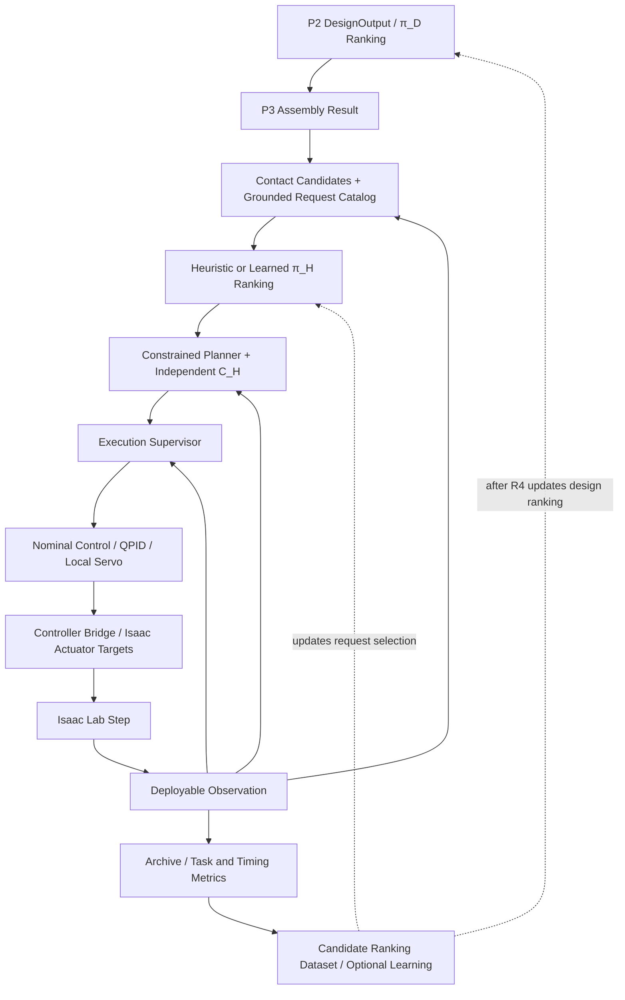

π_Lの再適用は標準経路とは別の比較実験とし、採用条件を満たすまでこの経路へ挿入しない。

#### 24.5.8 Order-9 staged learning and promoted C3 baseline

P4.3の実装済み学習系は、`configs/training/order9_learning_curriculum.yaml` の36 stagesで
管理する。最初の4 stagesは次である。

| Stage | Modules | Main purpose | Status at v0.5 |
| --- | ---: | --- | --- |
| C0 `c0_order8_teacher_collection` | 3 | deterministic Order-8 teacher data | accepted ancestor |
| C1 `c1_pi_l_bc_fixed_nominal` | 3 | phase-balanced complete-PolicyCommand BC | accepted ancestor |
| C2 `c2_pi_l_ppo_fixed_conservative` | 3 | conservative fixed-morphology PPO | promoted update 49 ancestor |
| C3 `c3_pi_l_ppo_arbitrary_morphology` | 2--8 | shared arbitrary-morphology π_L PPO | promoted update 18 |

C3 initializerはpromoted C2 representationからversioned migrationして作る。Retired C3
actor headを暗黙に継承したり、異なるaction contractのcheckpointをshapeが合うだけで
loadしてはならない。Initializer、generation、dataset、checkpoint、evaluationの各edgeは
parent hashとcontract identityをfail-closedに検証する。

C3のaccepted update sequenceは次である。

| PPO updates | Training module counts |
| --- | --- |
| 0--3 | 2--3 |
| 4--5 | 2--4 |
| 6--7 | 2--5 |
| 8--9 | 2--6 |
| 10--17 | 2--7 |
| 18 | 2--8 |

各拡張ではnew module countだけを学習して以前のcountを捨ててはならない。Fresh rolloutを
module-count/topologyでstratifyし、shared actorを同じoptimizer、reward、action adapter、
QPID、safety contractで更新する。Earlier countsのforgetting checkはreward、phase-success、
safety/QP metricsで行い、新規countはheld-out full continuous validationで確認する。Formal
promotionは全14 held-out bucketsをphase zeroから実行する。

Training distributionは、accepted static phase-reset bankによるphase coverageと、実際の
phase境界でphysical/recurrent stateを引き継ぐcontinuous rolloutを併用する。Phase-reset
bank admissionはhash、finite state、joint/collision/ground/support consistencyに限定し、
contact維持やQP successをreset生成時のdynamic gateにしてpolicy failureを隠してはならない。
Formal evaluationはphase-zero initial stateだけを用いる。

Nominal replayは全8 phasesのhash-bound trajectoryを50 Hz controller clockへ補間し、
`release`後は少なくとも300 mmのreview済みretreat clearanceを保持する。Terminal/resetで
一部environmentを再初期化するときは、未終了environmentを含むbatch全行へ同じstepで
nominal conditionを再適用し、generic targetへ一瞬戻してはならない。

Probe-derived supervisionはcontact-normal headのcausal bootstrapにだけ使う。Seven-module
lineageではPPO update 17の後にhead-only probe teacherを適用し、eight-module lineageでは
preload-deficit teacherをPPO update 18の前に適用した。いずれもPPOを置換せず、PPO update
indexを増やさない。Promotion contractとして別の順序を混在させる場合はnew lineageとする。

C3 formal promotion result:

```text
checkpoint update: 18
checkpoint SHA-256:
  6ea412ccdfe983cb2b030b3514bc8982424522673b49def188d547120984357b
held-out buckets: 14
episodes per bucket: 32
success: 448 / 448
safety failure: 0
fallback: 0
```

この結果はcommon v9 `pi_L`、conservative object family、および2--8-module morphology
coverageをpromoteする。Learned `pi_H`、learned `pi_D`、expanded object families、dynamic
assembly end-to-end、または別task familyをpromoteしない。

#### 24.5.9 R1--R4 and post-R4 curriculum

2026-09-15以降は、次の順序を標準とする。旧assignment BC → full-trajectory BC →
full-CWT PPOの系列は廃止する。C3は保護したまま、新runtime contractと専用設定で進める。

```text
contract / causal-input / same-plan execution checks
unlearned request selection + constrained planning + nominal contact feedback
small fixed-morphology full-task robustness and latency acceptance
R1--R4 cumulative object-condition expansion
optional π_H request-ranking learning with baseline comparison
post-R4 π_D learning and shared planner/controller verification
optional request-level RL / π_L only after measured need
held-out full-system evaluation
```

Rings:

```text
R1: object-relative reachable pose / yaw expansion, including object-only perturbations
R2: box size, aspect, density, mass, CoM, inertia expansion
R3: box / sphere / cylinder training primitives
R4: morphology x object-condition full training cross-product
```

R1では、支持台・障害物を固定して物体だけを10 mm動かす条件を含め、現在geometryから
再計画して評価する。場面全体の剛体移送による成功は座標変換の整合確認として別に報告し、
物体相対配置の汎化の証拠に代用しない。小規模baselineが通る前に全形態・全条件を展開しない。

各ringは固定したtrain/validation/test分割と累積分布で評価する。成功例だけを選んだ再生や
ケース別の手修正をオンライン計画の成功と数えない。失敗原因を切り分ける小規模実験、
試行回数・wall-clock上限、終了条件を事前に定め、同じ仮説のパラメータ調整を無制限に
連鎖させない。期限内に解けない場合は、その実行可能性／速度の未達を記録して止める。

π_Lは標準経路では無効とし、再適用には測定済みの改善、安全性非劣化、bounded correction、
新しいhash-bound学習系統が必要である。旧YAMLのπ_L stagesおよびfull-CWT学習stageの
存在を起動許可と解釈してはならない。この設計改訂ではYAML・コード・既存artifactを変更しない。

**以下は過去のR1較正記録であり、新設計の工程・達成状況を定義しない。**
各記録の採否とhashは当時のledgerに束縛される。後日の収集／変換前検査を含む履歴は
設計変更記録と各結果台帳を参照する。これらを新オンライン計画器の受入結果として使わない。

2026-08-25にR1名目較正v2を実行した結果、最小の10 mm/5度段階は不合格となった。
学習側22機体の最外側格子点を一次判定し、5モジュール機と7モジュール機の2件が、
衝突ではなく関節限界からの必須余裕1%を満たさなかった。格子点100%条件を達成
できないため、正式Isaac試験、第2--第4段階、未使用14機体での最終確認は実行せず、
採用範囲なしで停止した。教師軌道の正式収集と学習は未承認である。規範結果目録は
`for_codex/R1_NOMINAL_CALIBRATION_V2_RESULT_LEDGER.json`、SHA-256
`09fa797d7be267a59266c1df0258127a6723042855eb54b9a85a3b1ef8f07a4a`とする。
次は不合格2件の決定論的IKと把持姿勢における関節限界張り付きの原因確認である。
関節余裕条件の緩和、10 mm/5度未満への範囲縮小、教師軌道または把持姿勢の変更は、
別の設計判断と承認なしに行ってはならない。

2026-08-25の後続診断では、物理関節限界をIKの許容範囲として使う一方、一次判定が
その1%内側を別条件として要求していたため、物理限界上の可行解が後段で不合格に
なる境界不一致を確認した。R1専用の修正は、昇格済みC3の通常生成経路と既定値を
変更せず、完成済み軌道が1%余裕を欠く場合だけ、同じ1%内側の実効上下限で全対象
時刻をまとめて解き直す。通常解で把持点精度を回復できない場合に限り、複数の
決定論的初期姿勢を試し、関節余裕が最大で時間方向に最も滑らかな解を選ぶ。補正した
時刻は把持点位置・姿勢、物体・支持台・自己衝突、関節速度を再検査し、どれか一つでも
満たさなければ不合格とする。1%条件や把持点許容値を緩和してはならない。

読み取り検証では、通常合格の2モジュール例は追加判定`0.00194 s`で同一軌道を返した。
旧不合格の7モジュール例は既存生成`409.28 s`に対して追加`3.54 s`で、正規化最小
関節余裕`0.010000001`となり、Isaac前の一次判定を通過した。旧不合格の5モジュール例は
既存生成`96.22 s`に対して追加`3.38 s`だったが、複数初期姿勢後も把持点位置誤差
`0.0194142 m`が許容`0.011 m`を超え、安全側に不合格となった。したがってR1名目較正
v2の規範的不合格結果、採用範囲なし、正式収集・学習未承認は変更しない。次は5モジュール
例の教師軌道または接触姿勢を変更するか否かを別の設計判断として扱い、承認なしに
再較正へ進んではならない。

その後ユーザーは、R1補正後の把持点位置について、各軸独立の±30 mmではなく、
目標把持点からの三次元距離30 mm以内を許容値として承認した。この30 mmはR1専用で、
C3教師・C3昇格契約の`0.011 m`や、姿勢`0.10 rad`、衝突、関節速度、1%関節余裕を
変更しない。承認値で5モジュール例を再検査した結果、補正後の最大把持点距離
`0.0211487 m`は30 mm以内であり、最小正規化関節余裕`0.010000001`、衝突違反0、
最小衝突余裕`0.00480859 m`、関節速度余裕非負でIsaac前一次判定を通過した。
7モジュール例も同じ30 mm契約で、最小正規化関節余裕`0.010000001`、衝突違反0、
最小衝突余裕`0.00480358 m`、関節速度余裕非負となり、一次判定合格を維持した。
これはR1名目較正v2の正式再実行ではないため、既存結果目録を上書きせず、正式収集・
学習を承認しない。正式再較正には、30 mm三次元距離を明記して新しいhash-bound
追加契約と承認記録へ固定しなければならない。

2026-08-25に、三次元距離30 mmと1%関節余裕を固定したR1名目較正v3を正式実行した。
規範入力は`configs/training/order9_r1_nominal_calibration_protocol_v3.yaml`と
`for_codex/R1_NOMINAL_CALIBRATION_PROTOCOL_V3_APPROVAL.json`である。最小の
10 mm/5度段階は、学習側22機体について61件をIsaacなしで一次判定し、60件合格、
1件不合格となった。不合格は4モジュール機`train-000016-a9b26f370bba`の
`lattice_01`で、機体の最大傾き`1.5990674556 rad`が上限`1.0471975512 rad`
（60度）を超えた。把持姿勢には到達し、正規化最小関節余裕は
`0.010000000999999994`、衝突違反0、最小衝突余裕`0.00480956 m`、最大関節速度
`0.274444 rad/s`であった。したがって不合格理由は把持点距離、関節限界、衝突、
関節速度ではなく、一次判定が禁止する極端な機体姿勢である。

格子点100%条件が達成不能になったため、承認された実行順序に従って正式Isaac試験を
起動せず、第2--第4段階と未使用14機体での最終確認も実行しなかった。採用範囲はなく、
正式教師軌道収集と学習は引き続き未承認である。規範結果目録は
`for_codex/R1_NOMINAL_CALIBRATION_V3_RESULT_LEDGER.json`、SHA-256
`a967b68f06ac58265fc526e41b6d255edd82ae2bb9a53d3c91843bb6a2917264`とする。
v2結果は履歴として保持するが、30 mm/1%補正後の現在のR1較正判断にはv3結果を使う。
次はこの4モジュール機について、約91.6度の傾きを生む軌道区間と機体部位を診断する。
60度上限の緩和、教師軌道またはIK姿勢選択の変更は、別の設計判断と承認なしに行っては
ならない。

2026-08-26の後続処理では、個別の教師軌道作成失敗を学習手法の失敗として扱わず、
R1専用の決定論的な接触面候補と早期傾斜経路で一次判定682/682を通過させた。名目
較正v4はIsaac確認10回中8回成功で不合格となり、その結果を履歴として固定した。
さらに、10時間以内の完了条件に対し、一次判定済み軌道の幾何学的な形、終端関節姿勢、
接触点割当を変えず、時間配分だけを変更するv5追加契約を承認した。接近と接触獲得は
元の0.5倍、以後の各区間は0.1倍とし、変更後の関節速度を再検査する。同じ形である
ことを確認できない軌道へ既存の衝突判定を引き継いではならない。

R1名目較正v5の正式実行では、最小の10 mm/5度段階について学習側22機体の一次判定
682/682が合格した。続く格子点6件各2回、合計12回のIsaac確認は6回成功、安全違反6、
代替制御0だった。格子点100%かつ安全違反0の条件が回復不能になったため、第1段階の
残り、第2--第4段階、未使用14機体による最終確認を実行せず、不合格とした。全処理は
843.054秒で、36000秒上限以内だった。π_Lの仕組みとC3保護成果物は保持したが、
π_L由来の動作量は適用していない。名目押し込み、QPID/QP、局所サーボ、安全制限は
有効である。採用範囲はなく、正式教師軌道収集と学習は未承認である。現在の規範結果は
`for_codex/R1_NOMINAL_CALIBRATION_V5_RESULT_LEDGER.json`、SHA-256
`1fbb9b071d7c1ad5966a3a071c74e0ec0ec6d26030ec26a8b8be17d320131991`とする。

2026-08-26に、退避軌道、形態別時間配分、および完全軌道のIsaac前意味検査を固定した
R1名目較正v6を正式実行した。最小の10 mm/5度段階は、学習側22機体の一次判定
682/682が合格した。続くIsaac確認は25候補を各2回、合計50回実行し、48回成功した。
6モジュール機`train-000004-190f3a425b3e`の`lattice_02`は2回とも搬送段階で時間切れと
なった。安全違反と代替制御への切替は0であるが、格子点100%条件を満たさないため、
第1段階の残り、第2--第4段階、未使用14機体による最終確認を実行せず不合格とした。
全処理は12348.750秒で、36000秒上限以内だった。採用範囲はなく、正式教師軌道収集と
学習は未承認である。現在の規範結果は
`for_codex/R1_NOMINAL_CALIBRATION_V6_RESULT_LEDGER.json`、SHA-256
`1da48a4d10224773aeb86461ece665be40cc2cbc044bdbde2b751ceff04a4da9`とする。
v1--v5結果は履歴として保持するが、R1の現在判断にはv6結果を使う。

2026-08-28に、第1段階10 mm/5度を対象とするR1名目較正v9を正式実行した。学習側
22機体の各31軌道、合計682軌道を各2回Isaacで再生し、1364/1364成功、安全違反0、
代替制御0となった。π_Lの実装とC3昇格済みcheckpointは保持したが、π_L actor commandは
全実行で0とした。形態対応の名目押し込み、QPID/QP、local servo、および決定論的安全
制限は有効である。Isaac前には、生成途中の値ではなく、保存して実行器が読み込む軌道
そのものについて、全8段階、関節限界、物体・自己・支持台干渉、極端姿勢、押し込み後
衝突を再検査しなければならない。再開時は既存の単独または最大4候補の合格証拠を、
新規Isaac実行より先に検査・再利用する。

現在の第1段階の規範結果は`for_codex/R1_NOMINAL_CALIBRATION_V9_RESULT_LEDGER.json`、
SHA-256 `f162ca51cb6a996aba93877dd12d5e9b0c0c2b71a4ed46ede10d47c311e04556`
とする。v1--v8は履歴として保持する。この合格は第2--第4段階または未使用14機体の
最終確認を代替せず、正式教師軌道収集と学習を許可しない。次は同じ契約で第2段階
20 mm/10度を実行し、40 mm/20度までの段階選定後に未使用14機体で一度だけ最終確認
する。その合格後にのみ`r1_teacher_trajectory_collection`へ進む。

2026-08-29に、第1段階の合格を再計算せず、第2段階20 mm/10度から順に拡張する
R1学習側範囲選定v10を実行した。第2段階の最外側176格子点は、Isaacと制御器を
使わない完全追従の一次判定に全件合格した。続く最大4候補のIsaac確認では格子点に
安全不合格が生じ、2モジュール機`train-000000-5fecfad4f44f`の`lattice_02`を単独で
2回再確認して、成功0、安全不合格2、代替制御0を得た。格子点100%かつ安全不合格0の
条件は回復不能であるため、第2段階を不合格とし、第3段階30 mm/15度と第4段階
40 mm/20度は実行しなかった。連続して合格した最大範囲として第1段階10 mm/5度を
採用する。規範結果は`for_codex/R1_RANGE_SELECTION_V10_RESULT_LEDGER.json`、
SHA-256 `820f6ae76e7f021e82831b28f6ec3a580b25fdb510fd4a148ab6c150304bb253`
とする。π_Lの仕組みは保持するが動作量は0、名目押し込み、QPID/QP、local servo、
決定論的安全制限は有効である。この範囲選定証拠は学習データではなく、未使用14機体の
一度だけの最終確認、正式教師軌道収集、π_H模倣学習はいずれも未開始である。次の入口は
採用範囲10 mm/5度を未使用14機体で最終確認することであり、その合格前に正式収集へ
進んではならない。

2026-08-29に、上記v10不合格を読み取り診断し、当時の物体高さ約149 mmでは、把持中の
機体電池下面と固定支持台上面の高さがほぼ一致していたことを確認した。この小物体は
難条件として保存するが、補正後のR1名目範囲選定と正式教師収集には使用しない。
補正後の名目物体は、各C3由来寸法の高さを40 mm増やし、開始・目標の物体中心を20 mm
上げる。物体下面、平面内位置、向き、質量、運搬変位は維持し、密度と慣性を新寸法で
再計算する。側面把持点は最低20 mm上げる。

R1候補の支持台は、TaskSpec内の別定義を使用せず、hash-bound Order-8報告に記録された
Isaac支持台の寸法`0.55 x 0.36 x 0.15 m`と姿勢をTaskSpec、教師生成、事前検査、Isaacの
共通入力としなければならない。Isaac前には保存済み全8段階について、URDFが参照する
STL三角形と物体・支持台の実寸箱を用い、自己干渉、物体衝突、支持台衝突、関節可動域、
極端姿勢、把持点追従を検査する。自己干渉、物体、地面は実交差を禁止し、機体と支持台
には19.5 mm以上の距離を要求する。不合格時はIsaacと制御層を起動しない。

v10単独不合格候補をこの契約で代表確認した。元の小物体軌道はIsaac前の設置段階で、
電池と支持台の距離2.971268 mmにより不合格となった。補正後軌道は全8段階、458時点、
844件のSTL形状判定に合格し、その後のIsaac確認も2/2成功、安全不合格0、代替処理0、
物体落下0、時間切れ0、QP計算不能0だった。π_Lの仕組みは保持するが動作量は0、名目
押し込み、QPID/QP、local servoは有効である。規範的な代表結果目録は
`for_codex/R1_NOMINAL_GEOMETRY_V11_SMOKE_RESULT_LEDGER.json`、SHA-256
`57862dad9993af5e833850560dd5a91d56c6b7df76def4053eed7e3f9d98512f`とする。

これは代表1候補の修正確認であり、第2段階以降の正式範囲選定または未使用14機体の
最終確認を代替しない。名目物体契約が変わったため、小物体を用いたv10の採用範囲を
補正後物体へ流用してはならない。次の入口は、v11名目物体とSTL事前検査を用い、
学習側の第2段階20 mm/10度から第4段階40 mm/20度までの範囲選定を正式にやり直す
ことである。その後、採用範囲を未使用14機体で一度だけ最終確認し、合格後にのみ
`r1_teacher_trajectory_collection`へ進む。

2026-08-29に、このv11契約で22機体の範囲選定と未使用14機体の確認を正式実行した。
第2段階20 mm/10度は、6モジュール機`train-000004-190f3a425b3e`の格子点8で
回転余裕を持つ把持教師軌道を一次判定内に構成できず不合格となった。停止規則により
第3・第4段階は実行せず、親結果v9の第1段階10 mm/5度を未使用14機体へ適用した。
未使用5モジュール機`validation-000038-e6065f5b3c3e`の格子点0は、配置段階の時点24で
機体と固定支持台の間隔が18.085631664698426 mmとなり、19.5 mm条件を満たさなかった。
接触高さと物体高さの有限な教師修正も要求間隔を再現性よく回復しなかったため、
未使用側確認を不合格として完了した。どちらの不合格でもIsaacと制御層は起動していない。

したがって補正後名目物体について採用済みのR1範囲はなく、正式教師軌道収集とπ_H模倣
学習へ進んではならない。現在の規範結果は
`for_codex/R1_RANGE_SELECTION_V11_RESULT_LEDGER.json`、SHA-256
`5ca0d7cc1d2cc7fd3b6980cdf75e813b19adcafd177dbd0718983593b9f56393`とする。次の入口は
判定値の緩和ではなく、未使用5モジュール機の配置時支持台間隔を目的または制約へ直接
含める教師生成法の設計と、新しい承認済み契約による再確認である。

完了監査では、姿勢修正9候補の旧Isaac証拠のうち8候補が9候補同時配置であり、
v9の最大4候補条件を満たさないことを検出した。この旧証拠は正式合否に使用せず、
同じ修正済み軌道を現行実行器、3 m間隔、4・4・1候補の3場面で各2回再実行した。
18/18成功、安全違反0、代替制御0、π_L動作量0、QPID/QP・局所サーボ有効を確認し、
上記規範結果へ結合した。以後、最大4候補条件に適合する再確認台帳がない場合、v9の
最終集計は失敗しなければならない。

2026-08-29に、上記の次入口についてR1専用v12教師生成契約を承認・実装した。支持台
間隔の正式な合否値は19.5 mmのまま維持し、候補生成・選択時の目標値を30.0 mmとする。
両者の差10.5 mmを最低余裕として一つの設定から全8段階へ渡す。生成目標が合否値と
最低余裕の和を下回る設定は、軌道生成前に`E_R1_SUPPORT_CLEARANCE_BUFFER`で拒否する。

接近、接触獲得、持上げ、搬送、配置、解放、退避、静止の全8段階を候補選択中に
実形状で検査し、30.0 mm条件を満たした候補だけに生成証明書を付与する。従来のように
把持姿勢を配置へ写した後で19.5 mmだけを検査した軌道、またはこの証明書を持たない
保存済み軌道は`E_R1_UNCERTIFIED_RIGID_POSE_COPY`でIsaac前に拒否する。有限候補には
接触座標の上方移動を5 mm刻み、最大30 mmまで含められるが、元の決定論的逆運動学解を
剛体並進として保ち、全8段階の30.0 mm検査に改めて合格しなければ採用しない。これで
不足する場合は有限個の別接触組を同じ条件で選び直す。生成選択中はIsaac、π_L、
QPID/QP、局所サーボを起動しない。

v11で不合格だった未使用5モジュール機の格子点0を簡易再確認した。元候補と上方移動
15/20/25/30 mm候補は30.0 mm条件を満たさず不採用となったが、別接触組は全8段階、
2528時点、4444形状判定で最小支持台間隔30.0 mmとなり合格した。Isaacと制御層は
起動していない。この結果は機構確認であり、22機体の正式範囲選定および未使用14機体の
最終確認を代替しない。補正後名目物体の採用範囲、正式教師収集、π_H模倣学習は依然
未確定・未承認である。次の入口はv12契約をhash-boundな正式実行契約へ結合して、
22機体の範囲選定からやり直すことである。

R4後に `post_r4_pi_d_structured_bc`、`post_r4_pi_d_masked_ppo`、
`joint_object_task_ppo`、`held_out_full_system_evaluation` を実行する。π_Dはjoint angleや
runtime poseを出さず、masked graph editsを出す。Joint PPOでもdeterministic checker、
fallback separation、no-fallback-credit、hash-bound evidenceを維持する。

### 24.6 P5-P7 later tasks

P4 が動作した後に以下へ進む。

```text
P5 valve_operation
P6 perching_manipulation
P7 contact_mediated_locomotion
```

各phaseはtask-specific success metricsを持ち、同じIRG/Morphology/request/planner/
executor/nominal-control interfaceを使う。接近・接触確立・維持・荷重移行・解放・回復の
共通要素を組み合わせ、task固有の接触／物体運動モデルとguardを追加する。把持用phase列を
そのまま全タスクへ当てはめない。共有interfaceだけで新タスクが解けたと主張しない。

---

## 25. Data, Logging, and Dataset Schemas

### 25.1 EpisodeArchive

```python
class EpisodeArchive:
    episode_id: str
    task_spec: TaskSpec
    task_hash: str
    geometry_hashes: dict
    robot_model_hash: str
    config_hash: str
    irg: InteractionRequirementGraph
    interaction_envelope: InteractionEnvelope
    design_output: DesignOutput | None
    feasibility_result: FeasibilityResult | None
    assembly_plan: AssemblyPlan | None
    trajectory_records: list[ContactWrenchTrajectory]
    policy_commands: list[PolicyCommand]
    controller_commands: list[ControllerCommand]
    runtime_observations: list[RuntimeObservation]
    actuator_target_records: list[dict]
    rewards: list[dict]
    metrics: dict
    success: bool
    failure_reason: str | None
    rollout_artifacts: dict
    learning_artifacts: dict
```

`runtime_observations` と `actuator_target_records` は P4-control / Isaac-backed P4 で必須である。simplified P1-P4.0 archives では空 list でもよいが、Isaac rollout を P4 full completion の根拠にする場合は各 step の observation と actuator target conversion record を保存しなければならない。`learning_artifacts` は checkpoint、metrics、reward curve、rollout archive path などの reproducibility references を保存するために使う。

新runtimeは`rollout_artifacts`に版付きhigh-level decision recordへの参照を追加する。
Section 19のpre-decision観測・catalog・request、planと補間定義、C_H結果、実行中phase、
contact binding、guard評価、solver deadline/結果、再計画／回復、実行補正とその上限を
hashで結ぶ。既存CWTや`task_progress`へ異なる意味の値を詰め込んではならない。

### 25.2 Dataset types

```text
DesignDataset:
  TaskSpec, IRG, Envelope, DesignAction sequence, FeasibilityResult, task return

FeasibilityDataset:
  partial/full morphology, action, violation codes, margins, labels

ContactCandidateDataset:
  morphology, robot anchors, ContactSlots, ContactCandidateSet, unary scores, pairwise compatibility, group proposals, assignment feasibility results

HighLevelRequestDataset:
  pre-decision observation, execution state, finite catalog, selected/ranked request,
  planner/checker outcomes, actual execution outcome, candidate cost and provenance

InteractionTrajectoryDataset:
  planner-produced CWT + same whole-body/joint solution, feasibility and execution evidence
  legacy full-CWT teacher records remain under their original contract

LowLevelControlDataset:
  runtime obs, accepted plan, nominal/optional residual PolicyCommand, controller status, reward

LowLevelFlightDataset:
  Isaac single-module/fixed-morphology runtime obs, controller commands, actuator targets, pose errors, controller metrics

IsaacRolloutDataset:
  TaskSpec, morphology, assembly result, trajectories, runtime observations, actuator targets, rewards, success/drop/collision/QP metrics

GeometryCache:
  geometry_ref hash -> GeometryDescriptor

IRGCache:
  task_hash + geometry_hash -> IRG + Envelope
```

### 25.3 Reproducibility metadata

すべての run は以下を log しなければならない。

```text
git_commit or source hash
config_hash
robot_model_hash
URDF hash
thrust_model_hash
task_hash
geometry asset hashes
random seed
simulator version
```

### 25.4 Order-9 tensor lineage and artifact retention

新request policy、catalog features、plan/execution semanticsは新しいcontract identityを持つ。
旧full-CWT checkpoint/datasetをshape一致だけでloadしない。旧教師軌道は計画器検証用の
資料にできるが、新request教師にするにはpre-decision因果性、候補との対応、実行結果を
再構成して検査する。以下のπ_L tensor/PPO規則は保護C3と明示的な再適用に対する規則である。

Production `pi_L` PPOではreal-Isaac tensor rollout artifactをcanonical stochastic
transition payloadとする。Learning hot pathで全transitionをnested JSON recordへ展開して
再読込してはならない。BC、offline inspection、他policy familyのためのrecord/JSONL support
は維持してよい。

各fresh rollout generationはexactly one PPO updateにだけ使用する。Optimizer step前に
behavior checkpointでlog probability、value、recurrent-state chain、previous action、actor
feature semanticsをexact replayし、contract別toleranceを超えた場合はchild checkpointを
作らずfail closedとする。Trainとvalidation artifactは同じgeneration manifestへ含めるが、
gradientはtrain splitだけから計算する。

最低限、次をhash-bindする。

```text
source commit / source inventory
curriculum and resolved runtime config
parent and child checkpoint
policy/action/feature/controller/reward contracts
morphology graph and PhysicalModel
TaskSpec and object condition
accepted nominal component, timeline, collision admission, reset bank
train/validation split identity
raw tensor or its retained compact reproducibility record
evaluation and promotion manifest
```

Promoted releaseを保護するときは、runtime/promotion-critical sourceと軽量なregression test、
checkpoint chain、compact manifests、accepted nominal/bucket data、formal evaluationを保持する。
Superseded/failed raw rollout、duplicate tensor、reproducible intermediateは、transitive dependency
validatorとpre-deletion hash inventoryがpassした後に削除してよい。Protected releaseはread-only
とし、cleanup dry-runはsource copyとprotected copyの両方でnominal-set dependencyを検証する。

Order-9 C3のauthoritative retention inventoryは
`for_codex/C3_PROMOTED_UPDATE18_RELEASE_LEDGER.json`である。同ledgerに存在しないhistorical
diagnostic artifactを、promoted contractの必要条件と推定してはならない。

---

## 26. Codex Multi-Agent Implementation Plan

実装は agents または work packages に分解するべきである。

Agent boundaries below are normative for cross-module schema ownership. Codex may decompose tasks inside each agent, but must not redefine schema boundaries, rename core artifacts, or move source-of-truth responsibilities across agents without updating this specification.

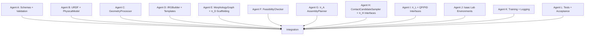

### 26.1 Agent A: Schemas and validation

新契約の所有対象: HighLevelRequest、有限catalog、execution context、plan/check record、
時間補間・版付きserialization。既存IRG IDとC3 action/schemaを暗黙に変更しない。

Deliverables:

```text
amsrr/schemas/task_spec.py
amsrr/schemas/geometry.py
amsrr/schemas/irg.py
amsrr/schemas/interaction_envelope.py
amsrr/schemas/morphology.py
amsrr/schemas/physical_model.py
amsrr/schemas/runtime.py
amsrr/schemas/policies.py
amsrr/schemas/feasibility.py
amsrr/schemas/workspace.py
amsrr/schemas/contact_candidates.py
schema serialization tests
```

### 26.2 Agent B: URDF / PhysicalModel

Deliverables:

```text
amsrr/robot_model/urdf_loader.py
amsrr/robot_model/thrust_model.py
amsrr/robot_model/physical_model_builder.py
tests parsing ./module_urdf/holon.urdf when present
```

### 26.3 Agent C: GeometryProcessor

Deliverables:

```text
amsrr/geometry/asset_resolver.py
amsrr/geometry/geometry_processor.py
amsrr/geometry/surface_patch_graph.py
amsrr/geometry/contact_region_extractor.py
primitive and mesh tests
```

### 26.4 Agent D: IRGBuilder

Deliverables:

```text
amsrr/irg/irg_builder.py
amsrr/irg/templates/*.py
amsrr/irg/envelope_extractor.py
amsrr/irg/validator.py
IRG examples for all task families
```

### 26.5 Agent E: MorphologyGraph + π_D scaffolding

Deliverables:

```text
amsrr/morphology/graph.py
amsrr/policies/design_policy_base.py
amsrr/policies/design_candidate_generator.py
amsrr/policies/design_teacher.py
```

### 26.6 Agent F: FeasibilityChecker

Deliverables:

```text
amsrr/feasibility/checker.py
amsrr/feasibility/checks/*.py
amsrr/feasibility/violation_codes.py
checker unit tests
```

### 26.7 Agent G: AssemblyPlanner

Deliverables:

```text
amsrr/assembly/graph_edit_planner.py
amsrr/assembly/construction_state.py
amsrr/assembly/control_handoff.py
amsrr/assembly/executor_interface.py
```

### 26.8 Agent H: ContactCandidateSampler + π_H + constrained planner

新契約の所有対象: 接触群・遷移・サブゴールのカタログ生成、heuristic／learned ranking、
有限予算の全身軌道計画、同一解からのCWT生成。独立C_HのauthorityはAgent Fと分離する。

Existing interface locations to migrate explicitly:

```text
amsrr/policies/contact_candidate_sampler.py
amsrr/policies/contact_candidate_set.py
amsrr/policies/contact_candidate_encoder.py
amsrr/policies/high_level_policy_base.py
amsrr/policies/contact_wrench_trajectory.py
```

### 26.9 Agent I: Nominal control + optional π_L + Controller interface

新契約の所有対象: 同一planの時間評価、contact/load推定feedback、bounded correction、
QPID/QPとlocal servo。C3 replayは保持し、新経路のπ_Lを既定で無効にする。

Deliverables:

```text
amsrr/policies/low_level_policy_base.py
amsrr/controllers/policy_command_builder.py
amsrr/controllers/controller_base.py
amsrr/controllers/qpid_controller.py
amsrr/controllers/qp_allocator_interface.py
amsrr/controllers/isaac_controller_bridge.py
amsrr/controllers/actuator_mapping.py
```

### 26.10 Agent J/K/L

Simulation、training、logging、tests は、schemas、geometry、IRGBuilder、robot model、feasibility checker の unit tests が pass した後に integrate すること。

P4 では以下を分けて ownership すること。

```text
Agent J:
  Isaac Lab backend
  Holon / assembled morphology / object / floor spawn
  reset / step / RuntimeObservation extraction
  execution supervisor, causal phase guards, deadline and recovery handling
  Isaac actuator target execution
  P4-control low-level flight validation environments

Agent K:
  P4.0 simplified full-pipeline runner
  P4-control rollout logging
  P4.1 / P4.2 Isaac rollout runners
  P4.3 baseline-first request ranking and optional learning
  candidate / plan / timeout / execution attribution and checkpoint logging

Agent L:
  P4.0 simplified acceptance
  P4-control acceptance
  P4 full acceptance
  archive completeness and no-mislabeling checks
  Section 27.4 causal / same-plan / robustness / latency acceptance
```

---

## 27. Implementation Order and Acceptance Tests

### 27.1 Implementation order

```text
1. schemas and enums
2. config loading and hashing
3. URDF parser and PhysicalModel builder
4. GeometryProcessor for primitives
5. GeometryProcessor for mesh
6. IRGBuilder and templates, including phase_label -> phase_type mapping
7. InteractionEnvelopeExtractor and InteractionEnvelopeEncoder
8. SharedInteractionWorkspace schema and query pooling contracts
9. MorphologyGraph and DesignOutput
10. FeasibilityChecker hard checks
11. deterministic design teacher and π_D scaffolding
12. π_A GraphEditAssemblyPlanner
13. ContactCandidateSampler and ContactCandidateSet compatibility schema
14. versioned request/catalog, constrained planner, same-plan C_H and execution supervisor
15. nominal command builder and contact feedback; preserve optional π_L contract
16. Desired Wrench / Pose / Joint Bias Builder
17. QP/PID controller interface
18. P4.0 simplified full-pipeline integration runner
19. P4.0 archive completeness and simplified acceptance
20. controller bridge / actuator mapping for Isaac
21. P4-control Isaac single-module hover
22. P4-control Isaac fixed-morphology hover and waypoint tracking
23. Isaac Lab backend smoke
24. Isaac deterministic full grasp & carry rollout
25. Isaac rollout datasets/logging
26. baseline-first P4.3 acceptance, then useful request-ranking / design learning
27. P4 full acceptance tests
28. measured-need request-level fine-tuning / optional π_L
```

### 27.2 P0 unit tests

```text
test_task_spec_parse_grasp_carry_yaml
test_geometry_processor_box_regions
test_geometry_processor_mesh_smoke
test_urdf_parse_holon_if_present
test_physical_model_total_mass_positive
test_irg_builder_grasp_carry_valid
test_irg_builder_all_task_families_smoke
test_interaction_envelope_extract
test_phase_label_to_phase_type_mapping
test_shared_interaction_workspace_tensor_shapes
test_contact_candidate_pairwise_conflict_matrix
test_assignment_level_qp_infeasible_case
test_policy_command_bias_builder
test_schema_roundtrip_json
test_padded_tensor_masks
```

### 27.3 Integration tests

以下は既存baseline/C3の試験名を含む。新契約では旧π_H trajectory headの存在を合格条件に
せず、対応するrequest→plan→execution試験をSection 27.4の条件で追加する。

```text
test_task_to_irg_to_envelope
test_task_to_design_teacher_to_feasibility
test_design_to_assembly_plan
test_design_to_contact_candidates
test_contact_candidates_to_group_proposals
test_piH_baseline_outputs_valid_trajectory
test_piH_selected_assignment_feasibility
test_piL_baseline_outputs_policy_command
test_policy_command_builder_outputs_qp_refs
test_controller_interface_accepts_policy_command
test_p4_0_uses_p2_selected_design_and_p3_assembly_result
test_p4_0_archive_contains_trajectory_policy_controller_rewards
test_controller_bridge_maps_controller_command_to_isaac_targets
test_isaac_single_module_hover_smoke
test_isaac_fixed_morphology_hover_smoke
test_isaac_fixed_morphology_waypoint_tracking
test_isaac_full_grasp_carry_rollout_archives_runtime_observations
test_p4_minimum_learning_run_writes_checkpoint_metrics_reward_curve
test_p4_full_acceptance_requires_isaac_rollout_and_learning_artifacts
```

---

### 27.4 New high-level contract acceptance

実装時に以下を検証する。本設計改訂そのものはこれらの試験を実行済みとは主張しない。

1. **因果性**: 同じ観測・実行状態に対して教師の次phase labelだけを変更しても、入力tensor
   が変わらない。未受理requestが`task_progress`やactive phaseを進めない。
2. **候補とID**: 無効な三つ組、空catalog、別snapshotのIDをrejectする。維持接触のbindingが
   再sampleで変わらず、合法なtransfer/releaseだけで更新される。
3. **同一解**: C_Hとexecutorのplan hashと時間評価が一致する。区間内collision／joint限界／
   速度・加速度／force feasibilityを検査し、検証後の別IKや無検査preload追加を検出する。
4. **接触閉ループ**: 小さい位置・摩擦・荷重ずれに対し、deployable推定とbounded feedbackで
   成立／不足を識別する。接触喪失、支持未成立、過大補正をguardが検出し、早過ぎるlift／
   releaseを禁止する。PhysX truthを抜いたruntimeでも同じ情報境界で動く。
5. **期限と失敗**: solver timeout、全候補不合格、古い観測、遅延plan、推定無効を注入し、
   deadline内の継続／停止／回復とarchiveへの正しい帰属を確認する。
6. **小規模頑健性**: 未学習baselineで物体だけを±10 mm移動、yaw変更、固定支持台との相対
   位置変更を含むfull taskを行う。全scene移送、teacher replay、手修正結果は別集計にする。
7. **有効性と費用**: heuristicとlearned rankingを同一予算・同一分割で比較し、第一候補／
   bounded search／緊急fallbackの成功、計画時間分布、timeout率、最低marginを報告する。
8. **移行と回帰**: 新旧action/feature/plan契約の誤loadをrejectする。C3保護artifact・
   replay・評価契約を変更せず、新checker profileの検証なしにshadow gateを解除しない。

受入用分布、success/safety閾値、latency上限、最大試行数、モデルの適用範囲は実験前に
設定へ固定する。未決定のまま大規模収集や学習を起動しない。失敗は原因と未達条件を記録し、
同じrun内で評価条件を変更して成功扱いしない。

---

## 28. Worked Example: Diverse Object Grasp & Carry

### 28.1 Input

Task: 1 kg の box を target pose へ移動する。

TaskSpec contains:

```text
object geometry_ref or primitive box parameters
object pose
object mass
object friction
goal object pose
robot module count limit
safety constraints
```

### 28.2 GeometryProcessor output

For a box object:

```text
GlobalShapeFeatures:
  bbox = [0.30, 0.20, 0.15]
  volume = 0.009 m^3
  principal axes = identity in object frame if axis-aligned

ContactRegionGraph:
  six face regions
  optional edge/rim regions
  opposite face edges for grasp relation
```

### 28.3 IRGBuilder output

IRG contains:

```text
TaskNode:
  object_grasp_carry

PhaseNodes:
  approach_object
  establish_object_contacts
  apply_grasp_wrench
  lift_object
  transport_object
  place_object
  release_contacts

ContactRegionNodes:
  box face regions

ContactSlotNodes:
  object_contact_slot_group, min=2, max=4, mode=grasp/support

WrenchRequirementNodes:
  inward_grasp_force
  no_slip_requirement
  payload_support_force

StateTargetNodes:
  object_lift_height
  object_goal_pose
  centroidal_stability

ConstraintNodes:
  friction_cone
  max_contact_force
  thrust_margin
  collision_margin
```

### 28.4 IRG cross edges

```text
approach_object -> establish_object_contacts: temporal_next
establish_object_contacts -> object_contact_slots: activates
box_face_regions -> object_contact_slots: allows
object_contact_slots -> inward_grasp_force: requires
inward_grasp_force -> no_slip_requirement: supports
lift_object -> payload_support_force: requires
transport_object -> object_goal_pose: requires
thrust_margin -> lift_object / transport_object: constrains
collision_margin -> all phases: constrains
```

### 28.5 InteractionEnvelope

```text
required_contact_count_range: [2, 4]
required_contact_modes: [grasp, support]
target_region_sets: box surface regions
wrench_space_requirements: inward force, support force, no-slip
precision_requirements: object pose tolerance
capability_requirements: grasp/support anchor force capability
```

### 28.6 π_D output

π_D produces:

```text
target MorphologyGraph:
  2-6 holon modules
  connected tree topology
  base module
  grasp/support robot anchors
  control groups

slot_anchor_binding_prior:
  ContactSlot 0 -> RobotAnchor left_grasp
  ContactSlot 1 -> RobotAnchor right_grasp
  optional ContactSlot 2 -> support_anchor
```

### 28.7 FeasibilityChecker

Checks:

```text
module count valid
ports compatible and unoccupied
graph connected and no closed loop
anchors cover required ContactSlots
coarse reachability to box face regions
thrust and payload margin
coarse collision safety
QP hover feasibility
```

### 28.8 π_A output

GraphEditAssemblyPlanner outputs steps:

```text
move module 1 to staging
align port A to base port B
dock
verify attach
repeat until target MorphologyGraph constructed
```

### 28.9 ContactCandidateSampler

target morphology が存在した後、candidates を sample する。

```text
for each object ContactSlot
  for each allowed ContactRegion
    for each compatible RobotAnchor
      sample anchor-conditioned points on box face ContactRegions
      apply unary screens: capability, reachability, approach direction, collision, friction plausibility
      build pairwise compatibility and grasp-pair group proposals
      build grounded request tuples; task feasibility requires planner and C_H validation
```

### 28.10 π_H request and planner output

π_Hは、例えば現在phaseからcontact establishmentへ進むIRG遷移、box両側面の接触群、
IRGに定義された接触確立subgoalの三つ組を選ぶ。IDは実際のcatalogを参照する。
力、CoM、関節角度、knot時刻は出力しない。

以下は計画器が扱う動作列の概念例であり、一回のπ_H出力ではない。実際のhorizonには
必要な部分を含め、短期計画と後段の見通しを更新する。段階遷移の確定は観測guardによる。

```text
Knot 0:
  approach selected box surface candidates
  COM target stable hover

Knot 1:
  attach/maintain two object contacts
  inward wrench bounds active

Knot 2:
  lift object
  payload support wrench active
  object lift target active

Knot 3:
  transport object toward goal pose
  centroidal stability target active

Knot 4:
  place and release
```

### 28.11 Nominal controller flow

```text
C_H accepts the planner's immutable body/joint/object/contact solution
Executor confirms observed guards and evaluates the same accepted plan
Nominal builder applies bounded deployable contact feedback; learned π_L residual = 0
QPID / rotor-vectoring QP and local joint servo produce actuator commands
Simulator / real system updates observations; executor continues, replans or recovers
```

---

## Appendix A. Complete Feature Layout Defaults

本付録は既存feature layoutの既定値を保持する。新π_Hのrequest catalog／headの容量と
paddingは版付きschemaで定義し、旧CWT headの寸法を暗黙に流用しない。

### A.1 Constants

```yaml
constants:
  MAX_MODULES: 8
  MAX_PORTS_PER_MODULE: 4
  MAX_PORTS: 32
  MAX_DOCK_EDGES: 16
  MAX_ROBOT_ANCHORS: 16
  MAX_OBJECTS: 8
  MAX_GEOMETRY_TOKENS: 256
  MAX_CONTACT_REGIONS: 64
  MAX_SURFACE_PATCHES: 512
  MAX_IRG_TASK_NODES: 1
  MAX_IRG_PHASE_NODES: 16
  MAX_IRG_CONTACT_REGION_NODES: 64
  MAX_IRG_CONTACT_SLOT_NODES: 32
  MAX_IRG_WRENCH_REQUIREMENT_NODES: 32
  MAX_IRG_STATE_TARGET_NODES: 32
  MAX_IRG_CONSTRAINT_NODES: 64
  MAX_IRG_CAPABILITY_REQUIREMENT_NODES: 32
  MAX_IRG_EDGES: 512
  MAX_CONTACT_CANDIDATES: 256
  MAX_CONTACT_GROUP_PROPOSALS: 64
  MAX_ASSEMBLY_STEPS: 64
  MAX_TRAJECTORY_KNOTS: 16
```

### A.2 Module feature layout

```text
module_features:
  module_id_norm
  module_type_id
  is_base
  role_id
  pose_design_xyz[3]
  pose_design_quat[4]
  aggregate_mass_norm
  aggregate_inertia_diag_norm[3]
  rotor_count_norm
  port_count_norm
  thrust_to_weight_ratio_est
  health
```

### A.3 Port feature layout

```text
port_features:
  module_id_norm
  port_local_id_norm
  port_type_id
  occupied_flag
  local_pose_xyz[3]
  local_pose_quat[4]
  compatible_type_mask[K]
```

### A.4 Dock edge feature layout

```text
dock_edge_features:
  src_module_id_norm
  src_port_id_norm
  dst_module_id_norm
  dst_port_id_norm
  relative_pose_xyz[3]
  relative_pose_quat[4]
  edge_role_id
  estimated_stiffness[6]
  latch_state_id
```

### A.5 Robot anchor feature layout

```text
robot_anchor_features:
  anchor_id_norm
  module_id_norm
  anchor_type_id
  local_pose_xyz[3]
  local_pose_quat[4]
  max_force_norm
  max_torque_norm
  pose_accuracy_norm
  associated_slot_mask[MAX_IRG_CONTACT_SLOT_NODES]
```

---

## Appendix B. Feasibility Equations

### B.1 Contact wrench composition

contact frame `c_k` における contact wrench について、object-frame wrench は次である。

```text
W_object = Σ_k Ad*_{object <- c_k} w_c_k
```

object generalized coordinate `q` については次である。

```text
τ_q = Σ_k J_c_k(q)^T w_c_k
```

### B.2 Vertical thrust ratio

```text
ρ_T = Σ_i F_thrust_i,z / (m_total * g)
```

contact-dominant locomotion では、config が次を要求してよい。

```text
ρ_T <= max_vertical_thrust_ratio
```

### B.3 Contact support ratio

```text
ρ_C = Σ_k F_contact_k,z / (m_total * g)
```

contact-mediated locomotion では、config が次を要求してよい。

```text
ρ_C >= min_contact_support_ratio
```

### B.4 QP residual

```text
qp_residual = || A u - w_des ||_2
```

### B.5 Actuator saturation penalty

```text
saturation_penalty = mean_i relu(|u_i - center_i| / range_i - saturation_threshold)
```

---

## Appendix C. Example Violation Codes

```text
E_SCHEMA_MISSING_FIELD
E_GEOMETRY_REF_NOT_FOUND
E_GEOMETRY_PROCESSING_FAILED
E_IRG_NO_PHASE_SEQUENCE
E_IRG_CONTACT_SLOT_WITHOUT_REGION
E_IRG_WRENCH_WITHOUT_TARGET
E_MODULE_COUNT_EXCEEDED
E_GRAPH_DISCONNECTED
E_PORT_OCCUPIED
E_PORT_INCOMPATIBLE
E_CLOSED_LOOP_REJECTED_V1
E_REQUIRED_SLOT_UNCOVERED
E_CONTACT_CANDIDATE_UNARY_INVALID
E_CONTACT_CANDIDATE_PAIR_CONFLICT
E_CONTACT_GROUP_INSUFFICIENT
E_ASSIGNMENT_WRENCH_INFEASIBLE
E_ASSIGNMENT_QP_INFEASIBLE
E_ANCHOR_CAPABILITY_INSUFFICIENT
E_COARSE_REACHABILITY_FAIL
E_COLLISION_MARGIN_FAIL
E_THRUST_MARGIN_FAIL
E_PAYLOAD_MARGIN_FAIL
E_QP_INFEASIBLE
E_ASSEMBLY_TIMEOUT
E_DOCK_VERIFY_FAIL
E_OBJECT_DROPPED
E_CONTACT_SLIP
E_TASK_TIMEOUT
```

---

## Appendix D. Prior-art Rationale for Implementers

この section は implementation context のためだけにある。システムは上記の schemas and interfaces によって定義される。

Automated robot design は歴史的に evolutionary または search-based morphology generation を使っており、physical fabrication を伴う場合もある。Soft and modular robot co-design benchmarks は、design and control を同時に optimize しなければならないこと、同時に search space が大きく evaluation が expensive であることを示している。Graph-based robot design methods は、robot morphology が graph として自然に表現でき、graph grammars によって search を feasible structures に制約できることを示している。Modular self-assembly work は morphology-aligned policies と dynamic graph policies を動機づける。A-MSRR-specific work は naive model switching ではなく、explicit contact wrench control、vectoring thrust、stable reconfiguration を動機づける。

この project では、そこから次の engineering rule を導く。

```text
Use explicit schemas and deterministic compilers/checkers for structure and safety.
Use learned policies for design ranking and grounded high-level request ranking.
Use deterministic constrained planning for trajectories; residual learning is optional.
Represent task interaction requirements as IRG.
Represent robot morphology as MorphologyGraph.
Keep exact physical models separate from NN feature tokens.
```

---

## Appendix E. Minimum Example Files

### E.1 configs/robot/robot_model.yaml

```yaml
robot_model:
  module_type: holon
  module_urdf_path: assets/robots/holon/holon.urdf
  thrust_model_path: configs/robot/thrust_model.yaml
  dock_port_detection:
    mode: name_pattern
    patterns:
      pitch: "pitch_dock"
      yaw: "yaw_dock"
  rotor_detection:
    mode: link_name_pattern
    patterns:
      thrust: "thrust_"
      rotor_joint: "rotor_"
      gimbal_joint: "gimbal_"
```

### E.2 configs/robot/thrust_model.yaml

```yaml
rotors:
  - rotor_id: thrust_1
    thrust_min_n: 0.0
    thrust_max_n: 20.0
    reaction_torque_coeff_nm_per_n: 0.0
  - rotor_id: thrust_2
    thrust_min_n: 0.0
    thrust_max_n: 20.0
    reaction_torque_coeff_nm_per_n: 0.0
  - rotor_id: thrust_3
    thrust_min_n: 0.0
    thrust_max_n: 20.0
    reaction_torque_coeff_nm_per_n: 0.0
  - rotor_id: thrust_4
    thrust_min_n: 0.0
    thrust_max_n: 20.0
    reaction_torque_coeff_nm_per_n: 0.0
```

### E.3 configs/training/p0_schema_tests.yaml

```yaml
phase: P0
run_tests:
  - test_task_spec_parse_grasp_carry_yaml
  - test_geometry_processor_box_regions
  - test_urdf_parse_holon_if_present
  - test_irg_builder_all_task_families_smoke
  - test_interaction_envelope_extract
```

---

## Appendix F. Order-9 C3 promoted artifact binding

Order-9 C3 の promoted artifact は次の byte identity に固定する。

```text
release_id = c3_pi_l_promoted_update18_v1
checkpoint_sha256 = 6ea412ccdfe983cb2b030b3514bc8982424522673b49def188d547120984357b
promotion_manifest_sha256 = 366ff7eeb32885db296d8ffbfc0aa61826ecbf93ef3404adc69f05baf33eb923
formal_result = 448 / 448 success, 0 safety failure, 0 fallback
c2_update_49_checkpoint_sha256 = 85474d9da96a6eb729e7f21fae5f7628fd0d9defc39488c74fe71e10476c6274
v9_initializer_sha256 = 080e4c50e2179a9a5bc7e2b1dc12c3cd2cf58506714c576d5639400e26262bc0
```

全 module count 2--8 で同一の v9 action/runtime contract を用いる。
module-count ごとの action mask、nominal preload rule、success rule の切替を
導入してはならない。Nominal contact lead は morphology/contact/load に依存して
計算し、1 mm 単位で切り上げ、最低値を 2 mm とする。固定 12 mm margin は
使用しない。Learned categorical contact-normal residual は nominal lead と別の
policy output として維持し、`[-20, +20] mm`を`0.5 mm`刻みの81 categoriesで表す。
Gaussianを物理層で丸める旧diagnostic adapterを有効化してはならない。

完全な update 0--18 lineage、teacher ordering、関連 source/test の区分、保持
dataset、および全 protected file hash は
`for_codex/C3_PROMOTED_UPDATE18_RELEASE_LEDGER.json` を正本とする。説明用記録は
`for_codex/C3_PROMOTED_UPDATE18_RELEASE.md` を参照する。

Protected copyは次であり、通常の学習継続やcleanupで上書きしてはならない。

```text
artifacts/p4_full/order9/releases/c3_pi_l_promoted_update18_v1
```

### F.1 Historical C3 records that do not define v0.5 runtime

次はdesign evolutionの証跡としてsource/testsを保持してよいが、現行promotion contractを
定義しない。

```text
module-count-dependent full/compression-only/joint-only masks
v5/v6 selected-joint or coordinated-compression action contracts
exact 6D wrench-range hard gate and non-zero wrench reward trials
deployable force-observer gate trials
contact-head extra optimizer pass and coordinate-credit-only failed children
continuous Gaussian followed by 0.5 mm physical rounding
seven-module-only categorical diagnostics and failed checkpoints
fixed 12 mm universal preload margin
controller-side load-integrating preload
actor-free nominal success used as promotion evidence
```

これらの存在は、v9のschema migration、regression comparison、またはdiagnostic reproductionの
ためであり、runtime selectorが自動的にfallbackするためではない。

## Appendix G. v0.5 integration ledger

`AMSRR_design_modification_by_codex.md` の内容は、本版で次のように扱う。

| Modification family | v0.5 treatment |
| --- | --- |
| P0 schema/serialization/asset supplements | applicable。該当schema本文へ統合、またはadditive implementation detailとして維持 |
| P1--P4 controller/backend/acceptance supplements | applicable。P4.0とIsaac-backed acceptanceを分離 |
| centroidal-only QPID and independent servo | normative。Section 20へ統合 |
| Orders 0--8 evidence | accepted ancestor evidence。後段claimへ自動拡張しない |
| Order-9 C0/C1/C2 replay and PPO corrections | normative for lineage/provenance。current config/ledgerを数値の正本とする |
| C3 nominal teacher, replay, reset, and boundary contracts | normative when compatible with promoted update 18 |
| C3 failed/diagnostic action and reward trials | historical evidence only |
| actuator-aware nominal preload + v9 categorical contact action | normative。Sections 20.9、24.5.8へ統合 |
| promoted common C3 update 18 | normative and hash-bound。Appendix Fを正本入口とする |
| approved deferred-π_L post-C3 rule | π_L適用延期を維持。新規工程はSection 24.5.9、旧v2較正手順は履歴として保持 |
| approved 2026-09-15 high-level redesign | normative design, not yet implemented。Sections 19、20、24、27を新規開発へ適用。C3は保持 |
| future recommendations in chronological log | non-normative until curriculum/config and acceptance are approved |

実装者はchronological logの後に書かれた項目を単に「新しいから採用」と判断してはならない。
`Promoted Common C3 Contract (Update 18)`、release ledger、および本v0.5の整合する組合せだけを
current C3 production contractとする。

---

## Final Implementation Rule

新規開発では次の責務順序を守る。完了済みの上流stageを再実装する指示ではない。

```text
Schemas -> Geometry / URDF / PhysicalModel -> IRG / Envelope -> Morphology / Feasibility
-> π_D / π_A -> ContactCandidateSampler -> Finite Request Catalog
-> Heuristic or π_H Request Selection -> Constrained Planner -> Independent C_H
-> Execution Supervisor -> Nominal Contact Feedback -> QPID/QP + Local Servo
-> Isaac Full-task / Robustness / Latency Acceptance -> Useful Request/Design Learning
```

2026-09-15の改訂は設計のみである。次の開発入口はSection 19のschema／責務境界の実装と
Section 27.4の小規模baseline検証であり、旧full-CWT教師変換・BC/PPOの継続ではない。
計画器・接触feedback・実行器が小さい条件変化と時間予算を満たさないまま、学習量や
対象タスクを増やして完了を目指してはならない。

C3 promoted update 18、既存R1の台帳・収集結果は元の契約で保持する。これらの実績から
新runtimeの頑健性、オンライン速度、learned π_D、複数タスク対応を達成済みとしない。
新しいruntime設定・schema migration・受入profileを揃えるまでは旧YAMLを新契約として
起動しない。π_Lは再適用条件を満たすまで標準経路で無効とする。
